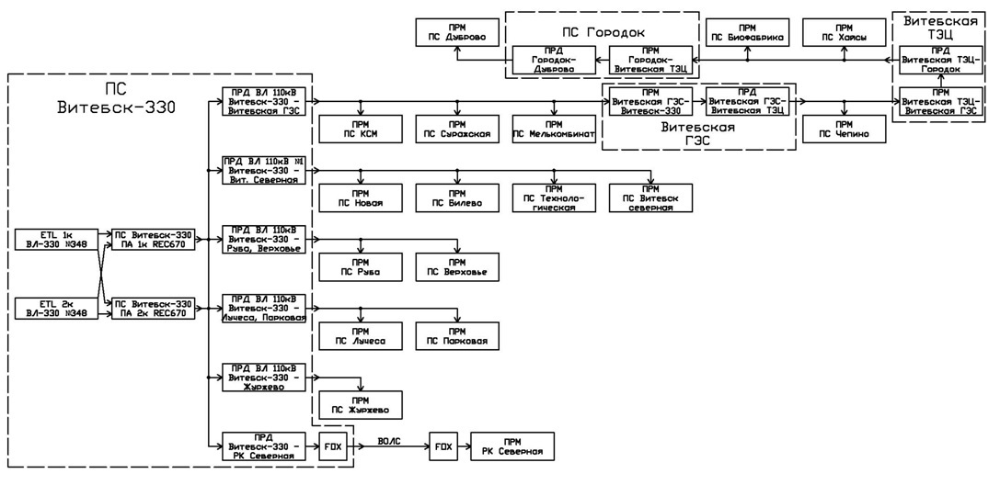
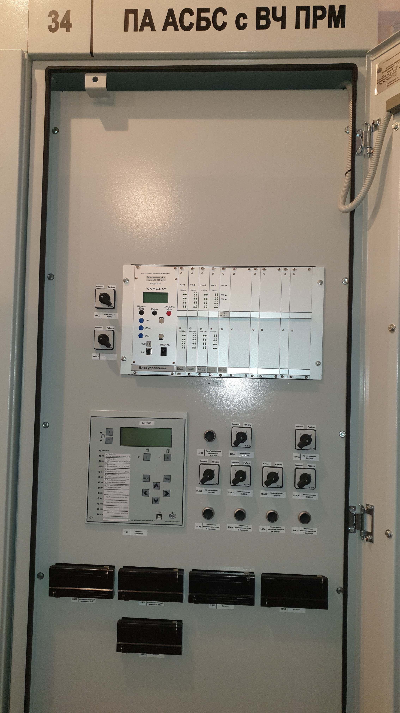

ПС Билево
=============

САОН АСБС
----------

На подстанции 750кВ «Белорусская» предусмотрена передача на подстанцию Витебск-330 команд четырех очередей отключения нагрузки (ОН1-ОН4) и включения отключенной нагрузки (ВОН). Работа ВЧ канала связи осуществляется по схеме «точка (передатчик (прд)) — многоточка (приёмники (прм))». Передача 5-ти команд ПА выполняется последовательно. Принятые команды действуют на отключение и включение нагрузки, подключенной к данной автоматике.

Автоматика САОН (Специальная автоматика отключения нагрузки) состоит из аппаратуры приёма данных и команд :ref:`АПДКЦ-01 «Стрела-М»` и микропроцессорного терминала автоматики :ref:`МР-761`, входящих в состав шкафа САОН. Аппаратура вышеназванных устройств размещена в ОПУ шкаф №34.

Передача команд на ПС Новая, ПС Билево, ПС Технологическая, ПС Витебск-Северная с ПС 330кВ Витебск предусматривается по ВЧ каналу связи, по проводам ВЛ-110кВ на участке: 

- ПС 330кВ Витебск (прд) — ПС Новая (прм), ПС Билево (прм) (ВЧ обход), ПС Технологическая (прм), ПС Витебск-Северная (прм) (канал № 222а, фаза В, частота передачи/приёма 692-696кГц).

Рисунок 1 – Лицевая сторона шкафа САОН

.. image:: media/САОН/Билево2.png
   :width: 2.2in
   :height: 4.0in

Рисунок 2 – Обратная сторона шкафа САОН

Специальная автоматика отключения нагрузки (САОН) 
......................................................

В логике терминала автоматики :ref:`МР-761` сигнал отключения соответствующей очереди нагрузки формируется при одновременном наличии сигнала ОН1-ОН4 и контрольного сигнала ВОН. Состояние выходного сигнала ОН1-ОН4 сохраняется при исчезновении оперативного тока. Запоминание реализовано использованием внешних двухпозиционных реле. 

Отключение нагрузки от САОН реализовано подачей постоянного сигнала отключения в шинки выходных цепей АЧР (срабатывание выходных двухпозиционных реле) и далее в цепи управления коммутационных аппаратов нагрузки.

Включение нагрузки может происходить оперативным персоналом или при приёме длительной команды ВОН. Для включения автоматика САОН на ПС 750кВ "Белорусская" отправляет команду ВОН длительностью 60 с. На подстанции контролируется длительность сигнала ВОН, и при достаточной длительности (более 4 секунд) и отсутствии сигналов отключения нагрузки производится включение очередей нагрузки, через заданную уставкой выдержку времени.

Включение нагрузки, отключенной от САОН, осуществляется снятием длительного выходного сигнала отключения (возвратом двухпозиционных реле) и срабатыванием своего устройства АПВ присоединения.

Включение нагрузки оперативным персоналом запрещается на 120 секунд после приёма команд отключения нагрузки.

- **Источник оперативного тока:** 
	- Шкаф САОН - ШУ ОПУ;
	- Выходные цепи - ШУ АЧР соответствующей секции;
	- Отключение/включение присоединений - ШУ присоединения.

- **Действует:** Отключение/включение присоединений в соответствии с таблицей уставок :ref:`САОН`

Аппаратура передачи данных и команд релейных защит и противоаварийной автоматики цифровая :ref:`АПДКЦ-01 «Стрела-М»` 
.........................................................................................................................

:ref:`АПДКЦ-01 «Стрела-М»` предназначена для организации канала приёма сигналов команд релейных защит и противоаварийной автоматики (РЗ и ПА) и их комбинаций по высокочастотному каналу.

В/ч канал образован по фазе "В" ВЛ-110кВ №1 "Витебск 330 – Витебск Северная". На ПС Билево организован ВЧ обход между ВЛ-110кВ №1 "Витебск 330 – Витебск Северная" на Витебск 330 и ВЛ-110кВ №1 "Витебск 330 – Витебск Северная" на Витебск Северную. Состоит из в/ч заградителей, конденсаторов связи с фильтрами присоединений.

Передатчик :ref:`АПДКЦ-01 «Стрела-М»` на ПС 330кВ Витебская в режиме ожидания непрерывно выдает в ВЧ-канал контрольный сигнал (КС). КС постоянно обрабатывается приёмниками на ПС Новая, ПС Билево, ПС Технологическая, ПС Витебск-Северная. В случае неудовлетворительного качества принимаемого сигнала (отношение сигнал/помеха или уровень сигнала) формируется сигнал неисправности и приёмник блокирует приём команд, пока не восстановится контрольный сигнал.

При приёме ВЧ команды:

- мгновенно срабатывает выходное реле соответствующее принятой команде. Создаётся запись в журнале событий;

- терминал автоматики :ref:`МР-761` принимает и обрабатывает команду;

- срабатывает сигнализация;

- проходит телесигнал "Работа САОН".

Список сигнализации
.....................

**ОПУ:**

**Шкаф №34 ПА АСБС с ВЧ ПРМ:** 

- **Терминал** :ref:`МР-761`

.. list-table:: Индикаторы терминала :ref:`МР-761`
   :class: longtable
   :widths: 10 10 30 30
   :header-rows: 1

   * - Индикатор
     - Цвет
     - Наименование
     - Значение
   * - Работа
     - Зелёный
     - -
     - Нормальная работа устройства
   * - Работа
     - Красный
     - -
     - Аппаратная неисправность устройства
   * - И1
     - Красный
     - Работа ОН-1
     - Срабатывание ОН-1 с действием на отключение
   * - И1
     - Зелёный
     - ПРМ команды ОН-1 от АПДКЦ
     - Приём команды ОН-1 от АПДКЦ
   * - И2
     - Красный
     - Работа ОН-2
     - Срабатывание ОН-1 с действием на отключение
   * - И2
     - Зелёный
     - ПРМ команды ОН-2 от АПДКЦ
     - Приём команды ОН-2 от АПДКЦ
   * - И3
     - Красный
     - Работа ОН-3
     - Срабатывание ОН-3 с действием на отключение
   * - И3
     - Зелёный
     - ПРМ команды ОН-3 от АПДКЦ
     - Приём команды ОН-3 от АПДКЦ
   * - И4
     - Красный
     - Работа ОН-4
     - Срабатывание ОН-4 с действием на отключение
   * - И4
     - Зелёный
     - ПРМ команды ОН-4 от АПДКЦ
     - Приём команды ОН-4 от АПДКЦ
   * - И5
     - Красный
     - Работа ВОН (1-4)
     - Срабатывание ВОН с действием на включение
   * - И5
     - Зелёный
     - ПРМ команды ВОН от АПДКЦ
     - Приём команды ВОН от АПДКЦ
   * - И6
     - Красный
     - Ручной ВОН заблокирован
     - Блокировка ручного ВОН в течении 120с после приёма ОН1-4
   * - И6
     - Зелёный
     - Команда ВОН достоверна
     - Команда ВОН длительностью более 4с
   * - И7
     - Красный
     - Нет опертока на шинках САОН
     - Снят оперток с выходных цепей (откл. автомат АЧР)
   * - И7
     - Зелёный
     - Снята крышка блока
     - Снята крышка испытательного блока 1SG1 - 1SG5
   * - И8
     - Красный
     - Выведен приём команд
     - Переключатель 1SAC1-5 находится в положении "Выведено"
   * - И9
     - Красный
     - Сработано выходное реле ОН-1
     - Команда отключения от 1 очереди ОН
   * - И10
     - Красный
     - Сработано выходное реле ОН-2
     - Команда отключения от 2 очереди ОН
   * - И11
     - Красный
     - Сработано выходное реле ОН-3
     - Команда отключения от 3 очереди ОН
   * - И12
     - Красный
     - Сработано выходное реле ОН-4
     - Команда отключения от 4 очереди ОН

.. list-table:: Список сигналов журнала аварий :ref:`МР-761`
   :class: longtable
   :widths: 10 20
   :header-rows: 1

   * - Сообщение
     - Причина работы
   * - Сигнализация Внеш.1
     - Приём команды ОН-1 от АПДКЦ
   * - Сигнализация Внеш.2
     - Приём команды ОН-2 от АПДКЦ
   * - Сигнализация Внеш.3
     - Приём команды ОН-3 от АПДКЦ
   * - Сигнализация Внеш.4
     - Приём команды ОН-4 от АПДКЦ
   * - Сигнализация Внеш.5
     - Приём команды ВОН от АПДКЦ
   * - Сигнализация Внеш.6
     - Ручное включение нагрузки

- **Приёмник** :ref:`АПДКЦ-01 «Стрела-М»`

.. list-table:: **блок БСД:**
   :class: longtable
   :widths: 10 30
   :header-rows: 1

   * - Индикатор
     - Значение
   * - РАБ
     - Нормальная работа блока
   * - Выход 1
     - Передача команды ОН-1 в схему автоматики
   * - Выход 2
     - Передача команды ОН-2 в схему автоматики
   * - Выход 3
     - Передача команды ОН-3 в схему автоматики
   * - Выход 4
     - Передача команды ОН-4 в схему автоматики
   * - Выход 5
     - Передача команды ВОН в схему автоматики

.. list-table:: **блок БЦОС:**
   :class: longtable
   :widths: 10 25
   :header-rows: 1

   * - Индикатор
     - Значение
   * - РАБ
     - Нормальная работа блока
   * - ПРМ
     - Приём ВЧ команды

.. list-table:: **блок управления:** журнал событий
   :class: longtable
   :widths: 10 15
   :header-rows: 1

   * - Принимаемая команда
     - Значение
   * - С1
     - ОН-4 (отключение нагрузки 4 очереди)
   * - С2
     - ОН-3 (отключение нагрузки 3 очереди)
   * - С3
     - ОН-2 (отключение нагрузки 2 очереди)
   * - С4
     - ОН-1 (отключение нагрузки 1 очереди)
   * - С5
     - ВОН (включение отключённой нагрузки)

- **Дверь шкафа №34 ПА АСБС с ВЧ ПРМ:**

	- Лампа "1HLR1" - Неисправность САОН.

	- Лампа "1HLY1" - Срабатывание САОН.

	- Лампа "2HLR1" - Неисправность АПДКЦ.

	- Лампа "2HLY1" - Приём команды ПА.

Список телесигналов 
......................

**ОПУ: Шкаф №34 ПА АСБС с ВЧ ПРМ:** 

- "Неисправность САОН" - Неисправность терминала :ref:`МР-761` и/или :ref:`АПДКЦ-01 «Стрела-М»`

- "Работа САОН" - Срабатывание терминала :ref:`МР-761` и/или :ref:`АПДКЦ-01 «Стрела-М»`

Список переключающих устройств
.................................

**ОПУ: Шкаф №34 ПА АСБС с ВЧ ПРМ:** 

.. list-table:: Переключатели в шкафу
   :class: longtable
   :widths: 10 20 20 30
   :header-rows: 1

   * - Переключатель
     - Наименование
     - Возможное положение
     - Назначение
   * - 2SA1
     - Сигнализация АПДКЦ
     - 1-«Выведено», **2-«Работа»**
     - Ввод-вывод сигнализации от :ref:`АПДКЦ-01 «Стрела-М»`
   * - 2SAC1
     - Резерв
     - **1-«Выведено»**, 2-«Работа»
     - -
   * - 1SA1
     - Сигнализация САОН АСБС
     - 1-«Выведено», **2-«Работа»**
     - Ввод-вывод сигнализации от терминала :ref:`МР-761`
   * - 1SAC1
     - Приём команды ПА (ОН1)
     - 1-«Выведено», **2-«Работа»**
     - Ввод-вывод приёма команды ОН-1
   * - 1SAC2
     - Приём команды ПА (ОН2)
     - 1-«Выведено», **2-«Работа»**
     - Ввод-вывод приёма команды ОН-2
   * - 1SAC3
     - Приём команды ПА (ОН3)
     - 1-«Выведено», **2-«Работа»**
     - Ввод-вывод приёма команды ОН-3
   * - 1SAC4
     - Приём команды ПА (ОН4)
     - 1-«Выведено», **2-«Работа»**
     - Ввод-вывод приёма команды ОН-4
   * - 1SAC5
     - Приём команды ПА (ВОН)
     - 1-«Выведено», **2-«Работа»**
     - Ввод-вывод приёма команды ВОН
   * - 1SB1
     - Сброс сигнализации САОН
     - -
     - Сброс индикации терминала МР-761
   * - 1SB2
     - Оперативное включение нагрузки 1-й очереди
     - -
     - Ручной возврат выходных реле 1-й очереди
   * - 1SB3
     - Оперативное включение нагрузки 2-й очереди
     - -
     - Ручной возврат выходных реле 2-й очереди
   * - 1SB4
     - Оперативное включение нагрузки 3-й очереди
     - -
     - Ручной возврат выходных реле 3-й очереди
   * - 1SB5
     - Оперативное включение нагрузки 4-й очереди
     - -
     - Ручной возврат выходных реле 4-й очереди

Список коммутационной аппаратуры
...................................

**ОПУ: Шкаф №34 ПА АСБС с ВЧ ПРМ:** :ref:`АПДКЦ-01 «Стрела-М»` **блок управления:**

- Выключатель "ПИТАНИЕ" - Питание устройства **Включен**

**ОПУ: Шкаф №34 ПА АСБС с ВЧ ПРМ:** 

- Испытательный блок 1SG1 "Действие на отключение нагрузки 1 и 3с-10кВ" - Ввод-вывод действия выходных цепей. **Вставлен**

- Испытательный блок 1SG2 "Действие на отключение нагрузки 2 и 4с-10кВ" - Ввод-вывод действия выходных цепей. **Вставлен**

- Автомат SF1 "Сервисные цепи ~230В" - Питание и защита освещения и розеток шкафа. **Включен**

- Автомат SF2 "Вентиляция" - Питание и защита цепей вентиляции шкафа. **Включен**

**ОПУ: Шкаф №30 ШРОТ:** 

- Автомат SF24 "Оперток САОН" - Питание и защита цепей САОН. **Включен**

**ОПУ: Шкаф №54 IСШ-0,4кВ:** 

- Автомат Q16 "Сервисные цепи РЗА" - Питание и защита сервисных цепей шкафов РЗА и вентиляции шкафа САОН. **Включен**

Указания оперативному персоналу
-----------------------------------

1. Ввод в работу САОН производится в следующей последовательности:

- ОПУ шкаф №34 ПА АСБС с ВЧ ПРМ: проверить положение «2 - Работа» переключателей 1SAC1 - 1SAC5;

- ОПУ шкаф №34 ПА АСБС с ВЧ ПРМ: проверить включенное положение выключателя "ПИТАНИЕ" на блоке управления :ref:`АПДКЦ-01 «Стрела-М»`

- ОПУ внутри шкафа №34 ПА АСБС с ВЧ ПРМ: проверить включенное положение автоматов: SF1 "Сервисные цепи ~230В", SF2 "Вентиляция";

- ОПУ Шкаф №30 ШРОТ: проверить включенное положение автомата SF24 "Оперток САОН"; 

- ОПУ Шкаф №54 IСШ-0,4кВ: проверить включенное положение автомата Q16 "Сервисные цепи РЗА";

- ОПУ шкаф №34 ПА АСБС с ВЧ ПРМ :ref:`АПДКЦ-01 «Стрела-М»` проверить состояние индикаторов РАБ на блоках БСД и БЦОС, и отсутствие сигнализации приёма/передачи команд;

- ОПУ шкаф №34 ПА АСБС с ВЧ ПРМ: перевести переключатель 2SA1 "Сигнализация АПДКЦ" в положение **2-«Работа»**

- ОПУ шкаф №34 ПА АСБС с ВЧ ПРМ терминал :ref:`МР-761` проверить отсутствие сигнализации срабатывания и неисправности;

- ОПУ шкаф №34 ПА АСБС с ВЧ ПРМ: вставить крышки испытательных блоков: 1SG1 "Действие на отключение очередей нагрузки 1 и 3с-10кВ", 1SG2 "Действие на отключение очередей нагрузки 2 и 4с-10кВ"

- ОПУ шкаф №34 ПА АСБС с ВЧ ПРМ: перевести переключатель 1SA1 "Сигнализация САОН АСБС" в положение **2-«Работа»**

2. Вывод из работы САОН производится в следующей последовательности:  
  
- ОПУ шкаф №34 ПА АСБС с ВЧ ПРМ: перевести переключатель 2SA1 "Сигнализация АПДКЦ" в положение **1-«Выведено»**

- ОПУ шкаф №34 ПА АСБС с ВЧ ПРМ: перевести переключатель 1SA1 "Сигнализация САОН АСБС" в положение **1-«Выведено»**

- ОПУ шкаф №34 ПА АСБС с ВЧ ПРМ: снять крышки испытательных блоков: 1SG1 "Действие на отключение очередей нагрузки 1 и 3с-10кВ", 1SG2 "Действие на отключение очередей нагрузки 2 и 4с-10кВ"

3. При работе сигнализации неисправности устройств САОН оперативный персонал должен:

- определить и записать: время поступления и вид неисправности (по журналу аварий/системы), кратковременная или постоянно действующая неисправность, после чего сбросить сигнализацию кнопкой 1SB1 и "Сигнализ. сброс" на приёмнике :ref:`АПДКЦ-01 «Стрела-М»` в шкафу №34;    

- если неисправность постоянно действующая, вывести САОН из работы.

4. При аварийном отключении автоматического выключателя оперативного тока - включить его, при повторном отключении вывести САОН из работы.

5. При работе САОН и приёме команд ПРМ :ref:`АПДКЦ-01 «Стрела-М»` оперативный персонал должен:

- по индикаторам на блоке БСД :ref:`АПДКЦ-01 «Стрела-М»` и по журналу записать номера принятых команд, время приёма;

- по индикаторам :ref:`МР-761` определить номера принятых и сработавших очередей САОН;

- по сигнализации, на устройствах защиты отходящих линий, определить отключившиеся от САОН и включившиеся от АПВ после САОН линии; 

- доложить вышестоящему оперативному звену; 

- сквитировать сигнализацию.

6. Иметь ввиду, что при установленных переносных заземлениях на участке ВЛ-110кВ №1 "Витебск 330 – Витебск Северная" от ПС Билево в сторону ПС В.Северная и ПС Технологическая, ВЧ-канал САОН на ПС В.Северная и ПС Технологическая работать не будет, а при установленных переносных заземлениях на участке от ПС Билево в сторону ПС Витебск 330 и ПС Новая, ВЧ-канал САОН работать не будет полностью.

7. Автоматические выключатели сервисных цепей всегда должны быть включены, в шкафу САОН и в распределении собственных нужд. От сервисных цепей запитан обдув шкафа, который включается автоматически при повышении температуры в шкафу.

8. Выходные цепи САОН запитаны от оперативного тока АЧР соответствующей секции. При выведенном устройстве АЧР, выходные цепи САОН данной секции работать не будут и сработает сигнализация потери опертока.