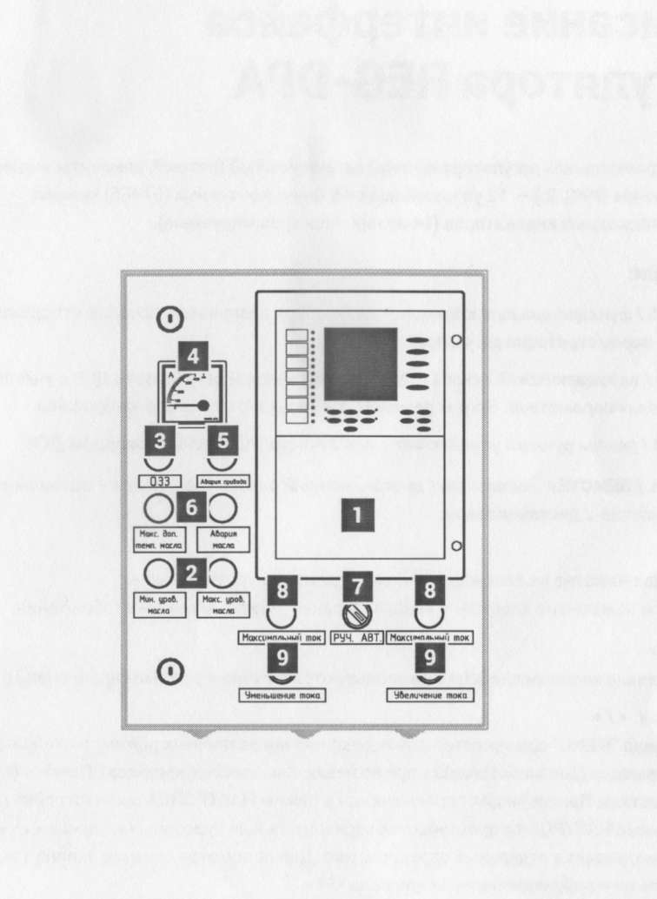
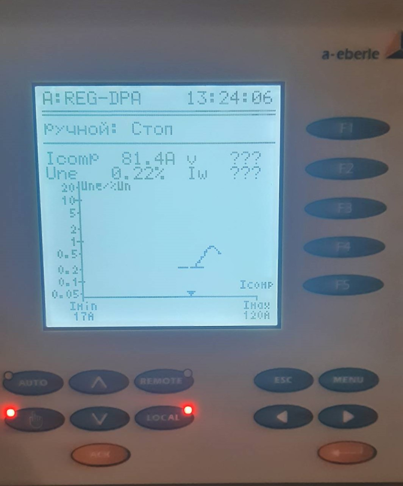

.. include:: ВерховьеЦДС.rst

Т-1(Т-2)
----------

Устройства РЗАИ (первый и второй комплект защит, далее К1 и К2) выполнены на базе микропроцессорнного терминала :ref:`МР-801` и термила дуговой защиты :ref:`МДО-1`.
Данные устройства расположены в ОПУ в шкафах №10(12) и в КРУН-10кВ в релейном отсеке ячейки ВВ-10кВ Т-1(Т-2) соответственно.
Резервная защита трансформатора выполнена на базе микропроцессорнного терминала :ref:`РЗТ-110` расположена на ОРУ-110кВ в шкафу РЗТ Т-1(Т-2). 
Сброс индикации с терминалов защит К1 и К2 осуществляется кнопками "Сброс индикации" на шкафу, с терминала РЗТ - кнопкой "Квитирование", а с терминала дуговой защиты - кнопкой "Квитация".
Управление ВЭ-110кВ осуществляется через К1, управление ВВ-10кВ Т-1(Т-2) - через К2 и блок управления выключателем :ref:`TER_CM_16_2`. Квитация мигания сигнальной лампы 
при аварийном отключении производиться при переводе ключа управления в положение "отключить".
Контроль нагрузки осуществляется по амперметру или по телеизмерению.
Автоматика обдува выполнена в шкафу объеденённом местном (ШОМ) расположенном на трансформаторе.

Список защит и функций 
...................................

Первый комплект (К1):
+++++++++++++++++++++++++

**Дифференциальная защита (ДЗТ) [Id>,Id>>]**

- **Источник оперативного тока:** Шинки управления, подключенные к АКБ

- **Измеряет:** Ток в зоне, ограниченной выносными ТТ-110кВ и ТТ-10кВ ячейки ввода

- **Работает:** При всех видах КЗ на стороне 110кВ и междуфазные КЗ на стороне 10кВ 

- **Действует:** Отключение трансформатора с пуском АВР-10кВ 

- **Блокируется:** 
	
	- при превышении установленного значения по 2-й и(или) 5-й гармонике в любой из контролируемых фаз; 

	- соответствующим ключом (см. список переключателей).

**Максимально токовая защита (МТЗ)**

- **1ая ступень [I>1] - МТЗ-110кВ**
 
	- **Источник оперативного тока:** Шинки управления, подключенные к АКБ

	- **Измеряет:** Ток выносных ТТ-110кВ 

	- **Работает:** при всех междуфазных КЗ на стороне 110кВ и 10кВ 

	- **Действует:** Отключение трансформатора с запретом АВР-10кВ 

- **2ая ступень [I>3] - МТЗ-10кВ**

	- **Источник оперативного тока:** Шинки управления, подключенные к АКБ

	- **Измеряет:** Ток ТТ-10кВ 

	- **Работает:** При всех междуфазных КЗ на стороне 10кВ

	- **Действует:** Отключение ввода 10кВ с запретом АВР-10кВ

**Газовая защита (ГЗ)**

- **Источник оперативного тока:** Шинки управления и сигнализации, подключенные к АКБ

- **Измеряет:** скорость движения масла в маслопроводе, соединяющий бак трансформатора с расширителем

- **Работает:** при внутренних повреждениях трансформатора, сопровождающихся выделение газов или снижение уровня масла ниже допустимого  
 
- **Действует:** 

	- 1ая ступень на сигнал [ВНЕШ.3]; 

	- 2ая ступень: 

		- на отключение трансформатора [ВНЕШ.1] 

		- на предупредительный сигнал [ВНЕШ.2] при положении соответствующего ключом (см. список переключателей) в положении "выведено".

- **Блокируется:** соответствующим ключом (см. список переключателей).

**Газовая защита РПН (ГЗ РПН) [ВНЕШ.4]**

- **Источник оперативного тока:** Шинки управления, подключенные к АКБ

- **Измеряет:** скорость движения масла в маслопроводе, соединяющий бак устройства РПН с расширителем

- **Работает:** при внутренних повреждениях РПН, сопровождающихся выделение газов или снижение уровня масла ниже допустимого в реле 

- **Действует:** на отключение трансформатора 

**Защита от повышения давления (Клапан) [ВНЕШ.5]**

- **Источник оперативного тока:** Шинки управления, подключенные к АКБ

- **Измеряет:** Давление внутри основного бака

- **Работает:** при превышении заданного значения с выпуском давления 

- **Действует:** на отключение трансформатора 

**Защита от перегрева**

- 1ая ступень [ВНЕШ.7],
 
	- **Источник оперативного тока:** Шинки сигнализации, подключенные к АКБ

	- **Измеряет:** температуру масла верхних слоёв

	- **Работает:** при температуре масла верхних слоёв 95\ :sup:`о`

	- **Действует:** на предупредительный сигнал 

- 2ая ступень [ВНЕШ.6]

	- **Источник оперативного тока:** Шинки управления, подключенные к АКБ

	- **Измеряет:** температуру масла верхних слоёв

	- **Работает:** при температуре масла верхних слоёв 105\ :sup:`о` 

	- **Действует:** на отключение трансформатора 

**Защита от дуговых замыканий (ЗДЗ)**

- **Блокируется:** Соответствующим ключом (см. список переключателей)

- 1ая ступень [ВНЕШ.13]

	- **Источник оперативного тока:** Шинки управления и дуговой защиты, подключенные к АКБ

	- **Измеряет:** 

		- состояние оптического датчика устройства дуговой защиты МДО-1 в ячейке ввода 10кВ: 

			- Датчик 2 - Отсек ВВ-10кВ;

			- Датчик 3 - Отсек ТТ-10кВ.

		- ток ТТ-110кВ.

	- **Работает:** срабтывание одного из датчиков МДО-1 с превышением током уставки пуска ЗДЗ

	- **Действует:** на отключение трансформатора и пуск АВР 

- 2ая ступень [ВНЕШ.14]

	- **Источник оперативного тока:** Шинки управления и дуговой защиты, подключенные к АКБ

	- **Измеряет:** 

		- состояние оптического датчика устройства дуговой защиты МДО-1 в ячейке ввода 10кВ: 

			- Датчик 1 - Отсек шин 10кВ.

		- ток ТТ-110кВ.

	- **Работает:** срабтывание датчика МДО-1 с превышением током уставки пуска ЗДЗ

	- **Действует:** на отключение ввода 10кВ с запретом АВР

**Отключение смежного комплекта [ВНЕШ.12]**

- **Источник оперативного тока:** Шинки управления, подключенные к АКБ

- **Измеряет:** сигнал от К2

- **Работает:** при работе на К2: ДЗТ, МТЗ-110кВ, УРОВ, ГЗ, ГЗ РПН, Клапан, 2ая ступень Перегрев, 2ая ступень ЗДЗ, 2ая ступень РУМ

- **Действует:** на отключение ввода 110кВ

- **Блокируется:** Соответствующим ключом (см. список переключателей)

**Защита по уровню масла**

- 1ая ступень на сигнал [ВНЕШ.16]

	- **Источник оперативного тока:** Шинки сигнализации, подключенные к АКБ

	- **Измеряет:** уровень масла в основном баке трансформатора и в баке устройства РПН 

	- **Работает:** при снижении уровня масла ниже допустимого

	- **Действует:** на предупредительный сигнал  

- 2ая ступень на отключение [ВНЕШ.15]

	- **Источник оперативного тока:** Шинки управления, подключенные к АКБ

	- **Измеряет:** уровень масла в основном баке трансформатора и в баке устройства РПН 

	- **Работает:** при снижении уровня масла ниже допустимого

	- **Действует:** на отключение трансформатора с разрешением АВР 

**Защита от перегрузки 110кВ [I>2]**

- **Источник оперативного тока:** Шинки сигнализации, подключенные к АКБ

- **Измеряет:** Ток выносных ТТ-110кВ 

- **Работает:** при перегрузке силового трансформатора по стороне 110кВ 

- **Действует:** на предупредительный сигнал  

**Блокировка АРН по току нагрузки**

- **Источник оперативного тока:** Шинки управления, подключенные к АКБ

- **Измеряет:** Ток выносных ТТ-110кВ

- **Работает:** превышении допустимого тока переключения устройством РПН трансформатора 

- **Действует:** на блокировку дистанционного переключения РПН трансформатора 

- **Блокируется:** Соответствующим ключом (см. список переключателей)

**Сигнализация АРН**

- **Источник оперативного тока:** Шинки сигнализации, подключенные к АКБ

- **Измеряет:** сигнал с терминала А3 (АРН)

- **Работает:** при неисправности АРН (см. в разделе АРН) 

- **Действует:** на предупредительный сигнал

**Неисправность трансформатора [ВНЕШ.8]**

- **Источник оперативного тока:** Шинки сигнализации, подключенные к АКБ

- **Измеряет:** сигнал со шкафа ШОМ

- **Работает:** 

	- неисправность системы охлождения; 

	- неисправность цепи сигнализации; 

	- неисправность воздухосушителя РПН или трансформатора;

	- отключен основной или резервный источник питания (см. список коммутационной аппаратуры).

- **Действует:** на предупредительный сигнал

**Неисправность привода [ВНЕШ.11]**

- **Источник оперативного тока:** Шинки сигнализации, подключенные к АКБ

- **Измеряет:** сигнал с привода ВЭ-110кВ

- **Работает:** при невзведенном положении пружин ВЭ-110кВ 

- **Действует:** на предупредительный сигнал

**Неисправность элегаза**

- **Источник оперативного тока:** Шинки сигнализации, подключенные к АКБ

- **Измеряет:** сигнал с привода ВЭ-110кВ

- **Работает:** при снижении давления элегаза 

- **Действует:** 

	- 1ая ступень [ВНЕШ.9] на предупредительный сигнал

	- 2ая ступень [ВНЕШ.10] на предупредительный сигнал и блокировку управления

**Неисправность цепей ЭВ [ССЛ1], ЭО1 [ССЛ2], ЭО2 [ССЛ3]**

- **Источник оперативного тока:** Шинки сигнализации, подключенные к АКБ

- **Измеряет:** 

	- при включенном положении выключателя исправность цепей первого и второго электромагнита отключения; 
 
	- при отключенном положении выключателя исправность цепей электромагнита включения. 

- **Работает:** при неисправности цепи

- **Действует:** на предупредительный сигнал

**Неисправность устройства**

- **Источник оперативного тока:** Шинки сигнализации, подключенные к АКБ

- **Измеряет:** внутреннее состояние терминала и подключенных к нему цепей тока

- **Работает:** при неисправности МР-801 [Неиспр.] или цепей тока [I*>1, I*>2] 

- **Действует:** на предупредительный сигнал

**Управление**

- **Источник оперативного тока:** Шинки сигнализации, подключенные к АКБ

- **Измеряет:** положение ВЭ-110кВ

- **Работает:** По ТУ, от ключа управления, а также с терминала МР801

- **Действует:** на катушку включения и отключения ВЭ-110кВ

- **Блокируется:** при работе 2ой ступени неисправности элегаза

Второй комплект (К2):
+++++++++++++++++++++++++

Дифференциальная защита, МТЗ, ЗДЗ, газовая защита, защита от повышения давления, защита от перегрева, защита по уровню масла, отключение 
от смежного комплекта, неисправность трансформатора, неисправность цепей ЭВ, ЭО1, ЭО2, блокировка АРН по току нагрузки, неисправность устройств (в К2 дополнительно контролируется неисправность цепей напряжения стороны 10кВ [U<2], 110кВ [U<3]) 
работают аналогично защитам и неисправностям К1

**Логическая защита шин (ЛЗШ)**

- **Источник оперативного тока:** Шинки ЛЗШ и управления, подключенные к АКБ

- **Измеряет:** Ток ТТ-10кВ 

- **Работает:** При всех междуфазных КЗ на стороне 10кВ

- **Действует:** Отключение ввода 10кВ с запретом АВР-10кВ

- **Блокируется:** по факту пуска (превышения током уставки без выдержки времени) МТЗ отходящих линий 10кВ или срабатывания блокирующего органа СВВ-10кВ, а так же при неисправности опертока

**Контроль УРОВ [ВНЕШ.11]**

- **Источник оперативного тока:** Шинки УРОВ и управления, подключенные к АКБ

- **Измеряет:** сигнал УРОВ (факт отказа ВВ-10кВ) от отходящих линий 10кВ или СВВ-10кВ

- **Работает:** При получении сигнала УРОВ и наличии тока через ТТ-10кВ. 

- **Действует:** Отключение ввода 10кВ с запретом АВР-10кВ

**УРОВ [Работа УРОВ 2]**

- **Источник оперативного тока:** Шинки управления, подключенные к АКБ

- **Работает:** При работе защит с пуском УРОВ и наличии тока через ТТ-10кВ выше заданной уставки. 

- **Действует:** Отключение ввода 110кВ 

- **Блокируется:** Соответствующим ключом (см. список переключателей)

**ЗМН [U<1]**

- **Источник оперативного тока:** Шинки управления, подключенные к АКБ

- **Измеряет:** напряжение ТН-10кВ и ТН-110кВ

- **Работает:** При снижении напряжения ТН-10 и ТН-110кВ ниже заданной уставки. 

- **Действует:** Отключение ввода 10кВ с пуском АВР-10кВ

- **Блокируется:** Соответствующим ключом SAC2 "АВР" (панель №11) и(или) при отсутствии напряжения на смежной секции

**Пуск по току в ЗДЗ [ВНЕШ.9]** 

- **Источник оперативного тока:** Шинки дуговой защиты, подключенные к АКБ

- **Измеряет:** ток ТТ-10кВ

- **Работает:** пуск МТЗ-10кВ 

- **Действует:** на разрешение работы ЗДЗ отходящих линий 10кВ

**Неисправность ЦУ [ВНЕШ.9]**

- **Источник оперативного тока:** Шинки сигнализации, подключенные к АКБ

- **Работает:** 
	
	- отключен соответствующий автома (см. список коммутационной аппаратуры); 

	- при одной из неисправностей БУ (см. описание работы в Приложении 1).

- **Действует:** на предупредительный сигнал

**Неисправность ЗДЗ [ВНЕШ.9]**

- **Источник оперативного тока:** Шинки сигнализации, подключенные к АКБ

- **Работает:** 

	- при работе МДО (при длительной засветке) без пуска по току; 
	
	- выведен ключ питания ЗДЗ (см. список переключающих устройств);

	- отключен автомат или неисправность опертока (см. список коммутационной аппаратуры).

- **Действует:** на предупредительный сигнал

**Неисправность ЛЗШ,УРОВ**

- **Источник оперативного тока:** Шинки сигнализации, подключенные к АКБ

- **Работает:** 

	- отключен автомат или неисправность опертока (см. список коммутационной аппаратуры);
	
	- длительная блокировка ЛЗШ от СВ или отходящих линий (не вернулся исполнительный оргон МТЗ).

- **Действует:** на предупредительный сигнал

**Управление**

- **Источник оперативного тока:** Шинки управления, подключенные к АКБ

- **Измеряет:** Готовность блока управления

- **Работает:** По ТУ, от ключа управления, а также с терминала МР801

- **Действует:** на катушку включения и отключения ВВ-10кВ

- **Блокируется:** при вкаченном положении тележки и включенных ножах

Резервная защита (РЗТ):
++++++++++++++++++++++++++

Резервная независимая токовая защита трансформатора предназначена для предотвращения тяжелых повреждений трансформаторов 110 кВ в случае отказа основного и резервного комплекта защит.
В состав входят конденсаторы (накопительные ёмкости) для питания катушек отключения выключателя, что обеспечивает работу защиты независимо от системы оперативного питания подстанции. 

- **Источник оперативного тока:** ТТ-110кВ встроенные в трансформатор и конденсаторы 

- **Измеряет:** ток ТТ-110кВ встроенных в трансформатор

- **Работает:** при всех междуфазных КЗ на стороне 110кВ и 10кВ

- **Действует:** на 2ЭО ВЭ-110кВ через диодную развязку

- **Блокируется:** Соответствующим испытательным блоком (см. список переключателей)

Шкаф объеденённый местный (ШОМ)
++++++++++++++++++++++++++++++++++

В шкафу собираются вторичные и силовые цепи трансформатора. В шкафу осуществляется управление обдувом и мониторинг температуры масла.

Обдув может работать в следующих режимах:

- Дистанционный. Даный режим служит для опробования обдува. Включение производится кнопкой 1SB2 "Пуск обдува" в ОПУ шкаф 10(12), при этом ключ выбора режима управления системой охлаждения должен находится в положении 1-Дистанционное. Включение без фиксации.

- Ручной. Режим предназначен для ручного управления обдувом. Управление производится кнопками START/STOP, при этом ключ выбора режима управления системой охлаждения должен находится в положении 2-Ручное.

- Автоматический. Основной режим работы. Ключ выбора режима управления системой охлаждения должен находится в положении 3-Автоматическое. Включение обдува осуществляется: 

	- При достижении тока нагрузки по стороне 110кВ номинального;

	- При достижении температуры масла верхних слоёв 55\ :sup:`о` С. Останов при температуре 50\ :sup:`о` С.

Температура масла контролируется датчиком на крышке бака трансформатора, который подключен к прибору мониторинга температуры трансформатора ТМТ2.
Прибор на дисплее отображает: дату, время и температуру масла. На лицевой стороне расположены светодиоды соответствующих сигналов. 
При температуре масла верхних слоёв 55\ :sup:`о` С выдаёт сигнал *Вентиляторы* с пуском обдува. Останов при температуре 50\ :sup:`о` С.
При температуре масла верхних слоёв 95\ :sup:`о` С выдаёт сигнал *Предупреждение*, а при 105\ :sup:`о` С - "Перегрев" с действием на отключение трансформатора.
При обрыве цепи датчика температуры выдаёт сигнал *Неисправность*.
При нормальном режиме работы горит светодиод "Питание".

Список сигнализации
........................................

**ОПУ: шкаф защит №10(12):**

- Лампа сигнальная HLR "Неисправность" - работа защит или неисправностей Т-1(Т-2) на сигнал 

- Лампа сигнальная HLW "Авария" - работа защит на отключение ВЭ-110кВ или(и) ВВ-10кВ Т-1(Т-2)

- Лампа сигнальная HLR1 "В-110кВ включен" 

- Лампа сигнальная HLG1 "В-110кВ отключен" 

- Лампа сигнальная HLR2 "В-10кВ включен" 

- Лампа сигнальная HLG2 "В-10кВ отключен" 

Первый комплект (K1): терминал МР-801:

- Индикатор 1 (красный) "ДЗТ" - работа "ДЗТ"

- Индикатор 1 (зеленый) "МТЗ"- работа 1ой или 2ой ступени "МТЗ"

- Индикатор 2 (красный) "ГЗ на отключение" - работа 2ой ступени "ГЗ"

- Индикатор 2 (зеленый) "ГЗ на сигнал"- работа 1ой или 2ой ступеней "ГЗ"

- Индикатор 3 (красный) "ГЗ РПН" - работа "ГЗ РПН"

- Индикатор 3 (зеленый) "Клапан" - работа "клапана"

- Индикатор 4 (красный) "Перегрев на отключение" - работа 2ой ступени "защиты от перегрева"

- Индикатор 4 (зеленый) "Перегрев на сигнал" - работа 1ой ступени "защиты от перегрева"

- Индикатор 5 (красный) "ЗДЗ" - работа 1ой или 2ой ступени "ЗДЗ"

- Индикатор 5 (зеленый) "Отключение от К2" - работа "защит смежного комплекта"

- Индикатор 6 (красный) "Уровень масла на отключение" - работа 2ой ступени "защиты по уровню масла"

- Индикатор 6 (зеленый) "Уровень масла на сигнал" - работа 1ой ступени "защиты по уровню масла"

- Индикатор 7 (красный) "Перегрузка" - работа "защиты от перегрузки 110кВ"

- Индикатор 7 (зеленый) "Сигнализация АРН" - работа "сигнализации АРН"

- Индикатор 8 (красный) "Неисправность трансформатора" - работа "неисправности трансформатора"

- Индикатор 8 (зеленый) "Привод не готов" - работа "неисправность привода"

- Индикатор 9 (красный) "SF6 блокировка" - работа 2ой ступени "неисправность элегаза"

- Индикатор 9 (зеленый) "SF6 сигнал" - работа 1ой ступени "неисправность элегаза"

- Индикатор 10 (красный) "Неисправность цепей ЭВ, ЭО1" - работа "неисправность цепей ЭВ, ЭО1"

- Индикатор 10 (зеленый) "Неисправность цепи ЭО2" - работа "неисправность цепи ЭО2"

- Индикатор 11 (красный) "ДЗТ выведена" - соответствующий ключ выведен (см. список переключающий устройств)

- Индикатор 11 (зеленый) "ГЗ выведена" - соответствующий ключ выведен (см. список переключающий устройств)

- Индикатор 12 (красный) "Ключи выведены" - соответствующий ключ выведен (см. список переключающий устройств)

- Индикатор 12 (зеленый) "Неисправность устройств" - работа "неисправность устройств"

Второй комплект (K1): терминал МР-801:

- Индикатор 1 (красный) "ДЗТ" - работа "ДЗТ"

- Индикатор 1 (зеленый) "МТЗ"- работа 1ой или 2ой ступени "МТЗ" или "ЛЗШ"

- Индикатор 2 (красный) "ГЗ на отключение" - работа 2ой ступени "ГЗ"

- Индикатор 2 (зеленый) "ГЗ на сигнал"- работа 1ой или 2ой ступеней "ГЗ"

- Индикатор 3 (красный) "ГЗ РПН" - работа "ГЗ РПН"

- Индикатор 3 (зеленый) "Клапан" - работа "клапана"

- Индикатор 4 (красный) "Перегрев на отключение" - работа 2ой ступени "защиты от перегрева"

- Индикатор 4 (зеленый) "Перегрев на сигнал" - работа 1ой ступени "защиты от перегрева"

- Индикатор 5 (красный) "ЗДЗ" - работа 1ой или 2ой ступени "ЗДЗ"

- Индикатор 5 (зеленый) "Отключение от К2" - работа "защит смежного комплекта"

- Индикатор 6 (красный) "Уровень масла на отключение" - работа 2ой ступени "защиты по уровню масла"

- Индикатор 6 (зеленый) "Уровень масла на сигнал" - работа 1ой ступени "защиты по уровню масла"

- Индикатор 7 (красный) "Контроль УРОВ" - работа "Контроь УРОВ"

- Индикатор 7 (зеленый) "УРОВ" - работа "УРОВ"

- Индикатор 8 (красный) "Неисправность трансформатора" - работа "неисправности трансформатора"

- Индикатор 8 (зеленый) "ЗМН" - работа "ЗМН"

- Индикатор 9 (красный) "Неисправность ячейки ввода (ЦУ, ЗДЗ, ЛЗШ, УРОВ)" - работа "неисправность ЦУ" или "неисправность ЗДЗ" или "неисправность ЛЗШ,УРОВ"

- Индикатор 9 (зеленый) РЕЗЕРВ

- Индикатор 10 (красный) "Неисправность цепей ЭВ, ЭО1" - работа "неисправность цепей ЭВ, ЭО1"

- Индикатор 10 (зеленый) "Неисправность цепи ЭО2" - работа "неисправность цепи ЭО2"

- Индикатор 11 (красный) "ДЗТ выведена" - соответствующий ключ выведен (см. список переключающий устройств)

- Индикатор 11 (зеленый) "ГЗ выведена" - соответствующий ключ выведен (см. список переключающий устройств)

- Индикатор 12 (красный) "Ключи выведены" - соответствующий ключ выведен (см. список переключающий устройств)

- Индикатор 12 (зеленый) "Неисправность устройств" - работа "неисправность устройств"

**ОПУ: панель №1 (ЦС):**

- Табло №5(9) "Неисправность устройства" - работа "неисправность устройств"

- Табло №6(10) "Неисправность цепей управления" - работа "неисправность цепей ЭВ, ЭО1", или "неисправность цепей ЭО2" или "неисправность привода" или 1ой, 2ой ступеней "неисправность элегаза"

- Табло №7(11) "Неисправность трансформатора" - работа "защиты от перегрузки 110кВ", или 1ой или 2ой ступеней "ГЗ", или 1ой ступени "защиты от перегрева" или 1ой ступени "защиты по уровню масла", или "неисправности трансформатора"

- Табло №8(12) "Авария трансформатора" - работа защит на отключение ВЭ-110кВ Т-1(Т-2)

**КРУН-10кВ: ячейка ВВ-10кВ Т-1(Т-2):**

- Лампа сигнальная HL1 "В-10кВ включен" 

- Лампа сигнальная HL2 "В-10кВ отключен" 

терминал МДО-1:

- Светодиод 1 - работа ЗДЗ отсека шин 10кВ;

- Светодиод 2 - работа ЗДЗ отсека ВВ-10кВ;

- Светодиод 3 - работа ЗДЗ отсека ТТ-10кВ.

**ОРУ-110кВ: шкаф РЗТ Т-1(Т-2):**

- Блинкер КН1 "Действие на отключение КЗ-110кВ" - работа защиты на отключение ВЭ-110кВ Т-1(Т-2)

терминал РЗТ-110:

- Светодиод Авария - работа защиты;

- Светодиод Неисправность цепей отключения - неисправность цепи отключения ВЭ-110кВ Т-1(Т-2);

- Светодиод Работа - нормальная работа устройства;

- Светодиод Неисправность - неисправность устройства.

**ОРУ-110кВ: ШОМ Т-1(Т-2):**

- Лампа Перегрев сигнал - Срабатывание ступени температуры 95\ :sup:`о` С;

- Лампа Перегрев авария - Срабатывание ступени температуры 105\ :sup:`о` С;

- Лампа Устройство сброса давления авария - Срабатывание клапана сроса давления.

Список телесигналов
........................................

**ОПУ: шкаф №10(12):**

- Работа 1-го комплеска ДЗТ (работает при любой работе защит или неисправности) - выходное реле Р28 терминала защит А1 

- Работа газовой защиты - выходное реле Р29 терминала защит А1

- МТЗ-110кВ - выходное реле Р30 терминала защит А1

- Перегрев масла - выходное реле Р31 терминала защит А1

- Перегруз - выходное реле Р32 терминала защит А1

- Положение ВЭ-110кВ - блок-контакты привода ВЭ-110кВ

- МТЗ-10кВ - выходное реле Р28 терминала защит А2

- Отключение от АВР (ЗМН) - выходное реле Р29 терминала защит А2 

- Отключение от УРОВ и ЛЗШ - выходное реле Р30 терминала защит А2

- Работа 2-го комплеска ДЗТ (работает при любой работе защит или неисправности) - выходное реле Р31 терминала защит А2 

- Работа дуговой защиты - выходное реле Р32 терминала защит А2

- Работа газовой защиты - выходное реле Р33 терминала защит А2

- Перегрев масла - выходное реле Р34 терминала защит А2

- Положение ВВ-10кВ - блок-контакты привода ВВ-10кВ

Список переключающих устройств
........................................

**ОПУ: шкаф №10(12):**

- испытательный блок 1SG1 "Цепи тока РЗА 1к ст 110" - **вставлен**

- испытательный блок 1SG2 "Цепи тока РЗА 1к ст 10" - **вставлен**

- испытательный блок 1SG3 "Цепи напряжения РЗА 1к" - **вставлен**

- испытательный блок 1SG4 "Цепи СВ и СО1 В-110" - **вставлен**

- испытательный блок 1SG5 "Цепи СО2 В-110" - **вставлен**

- испытательный блок 1SG6 "Цепи отключения В-10 от 1к" - **вставлен**

- испытательный блок 2SG1 "Цепи тока РЗА 2к ст 110" - **вставлен**

- испытательный блок 2SG2 "Цепи тока РЗА 2к ст 10" - **вставлен**

- испытательный блок 2SG3 "Цепи напряжения РЗА 2к" - **вставлен**

- испытательный блок 2SG4 "Цепи СВ и СО1 В-10" - **вставлен**

- испытательный блок 2SG5 "Цепи СО2 В-10" - **вставлен**

- испытательный блок 2SG6 "Цепи отключения В-110 от 2к" - **вставлен**

- Переключатель 1SА1 "Действие 1к на 2к" - **вправо «Ввод»**, влево «Вывод»

- Переключатель 1SА2 "Блокировка АРН от 1к" - **вправо «Ввод»**, влево «Вывод»

- Переключатель 1SА3 "УРОВ 1к на ВЛ-110" (РЕЗЕРВ) - **вправо «Ввод»**, влево «Вывод»

- Переключатель 1SА4 "УРОВ 1к на ВЛ-110" (РЕЗЕРВ) - **вправо «Ввод»**, влево «Вывод»

- Переключатель 1SА5 "Режим управления В-110кВ" - **вправо «Дист.»**, влево «Местный»

- Переключатель 1SА6 "РЕЗЕРВ" (РЕЗЕРВ) - **вправо «Ввод»**, влево «Вывод»

- Переключатель 1SА7 "Запрет АВР" - **вправо «Ввод»**, влево «Вывод»

- Переключатель 1SА8 "Сигнализация 1к" - **вправо «Ввод»**, влево «Вывод»

- Переключатель 1SАС1 "ДЗТ 1к" - **вправо «Ввод»**, влево «Вывод»

- Переключатель 1SАС2 "Перевод ГЗ на сигнал в 1к" - вправо «Ввод», **влево «Вывод»**

- Переключатель 1SАС3 "Группа уставок 1к" (РЕЗЕРВ) - **влево «1к»**, влево 45гр «2к», вверх «АСУ»

- Переключатель 2SА1 "РЕЗЕРВ" (РЕЗЕРВ) - **вправо «Ввод»**, влево «Вывод»

- Переключатель 2SА2 "Блокировка АРН от 2к" - **вправо «Ввод»**, влево «Вывод»

- Переключатель 2SА3 "Режим управления В-10кВ" - **вправо «Дист.»**, влево «Местный» 

- Переключатель 2SА4 "УРОВ 1к на 2к" - **вправо «Ввод»**, влево «Вывод»

- Переключатель 2SА5 "Пуск по току в ЗДЗ" - **вправо «Ввод»**, влево «Вывод»

- Переключатель 2SА6 "Сигналы в схему АВР" - **вправо «Ввод»**, влево «Вывод»

- Переключатель 2SА7 "Сигнализация 1к" - **вправо «Ввод»**, влево «Вывод»

- Переключатель 2SАС1 "ДЗТ 2к" - **вправо «Ввод»**, влево «Вывод»

- Переключатель 2SАС2 "Перевод ГЗ на сигнал в 2к" - вправо «Ввод», **влево «Вывод»**

- Переключатель 2SАС3 "УРОВ 2к" - **вправо «Ввод»**, влево «Вывод»

- Переключатель 2SАС3 "Группа уставок 2к" (РЕЗЕРВ) - **влево «1к»**, влево 45гр «2к», вверх «АСУ»

- Переключатель SАС1 "Управление В-110кВ" - вправо «Включить», влево «Отключить»

- Переключатель SАС2 "Управление В-10кВ" - вправо «Включить», влево «Отключить»

- Кнопка 1SB1 "Сброс сигнализации 1к"

- Кнопка 1SB2 "Сброс сигнализации 2к"

**ОПУ: шкаф №10(12) обратная сторона:**

- Переключатель SАF1 "Выбор опертока 1к ДЗТ" - **вниз «1с»**, посередине «отключено», вверх «2с»

- Переключатель SАF2 "Выбор опертока СВ и СО1 В-110" - **вниз «1с»**, посередине «отключено», вверх «2с»

- Переключатель SАF3 "Выбор опертока СО2 В-110" - вниз «1с», посередине «отключено», **вверх «2с»**

- Переключатель SАF4 "Выбор опертока технол. защит" - **вниз «1с»**, посередине «отключено», вверх «2с»

- Переключатель SАF5 "Выбор опертока 2к ДЗТ" - вниз «1с», посередине «отключено», **вверх «2с»**

- Переключатель SАF6 "Выбор опертока СВ и СО1 В-10" - вниз «1с», посередине «отключено», **вверх «2с»**

**КРУН-10кВ: ячейка ВВ-10кВ Т-1(Т-2):**

- Переключатель SА1 "Питание ЗДЗ" (питание МДО ВВ-10кВ) - **вправо «Введено»**, влево «выведено»

**ОРУ-110кВ: шкаф РЗТ Т-1(Т-2):**

- испытательный блок SG1 "Цепи отключения ВЭ-110кВ" - **вставлен**

- испытательный блок SG2 "Цепи тока" - **вставлен**

**ОРУ-110кВ: ШОМ Т-1(Т-2):**

- Переключатель "Выбор режима питания" - 1-Основной, **2-Автоматический**, 3-Резервный

- Переключатель "Выбор режима управления системой охлаждения" - 1-Дистанционное, 2-Ручное, **3-Автоматическое**

Список коммутационной аппаратуры
........................................

**ОПУ: шкаф №10(12) обратная сторона:**

- Автомат SF0 "Сервисные цепи" - Питание и защита сервисных цепей 220В **Включен**

- Автомат SF1 "Оперток 1к ДЗТ" - Питание и защита цепей опертока 1к **Включен**

- Автомат SF2 "Оперток СВ и СО1 В-110" - Питание и защита цепей опертока СВ и СО1 ВЭ-110кВ Т-1(Т-2) **Включен**

- Автомат SF3 "Оперток СО2 В-110" - Питание и защита цепей опертока СО2 В-110 ВЭ-110кВ Т-1(Т-2) **Включен**

- Автомат SF4 "Оперток технол. защит" - Питание и защита цепей опертока технологических защит Т-1(Т-2) **Включен**

- Автомат SF5 "Оперток 2к ДЗТ" - Питание и защита цепей опертока 2к **Включен**

- Автомат SF6 "Оперток СВ и СО1 В-10" - Питание и защита цепей опертока СВ и СО1 ВВ-10кВ Т-1(Т-2) **Включен**

**КРУН-10кВ: ячейка ВВ-10кВ Т-1(Т-2):**

- Автомат SF1 "БП ВВ-10кВ Т-1(Т-2)" - Питание и защита цепей управления ВВ-10кВ **Включен**

- Автомат SF2 "ЛЗШ, УРОВ" - Питание и защита цепей ЛЗШ, УРОВ 1(2)с **Включен**

- Автомат SF3 "Дуговая защита" - Питание и защита дуговой защиты 1(2)с **Включен**

**ОРУ-110кВ: шкаф РЗТ Т-1(Т-2):**

- Автомат SF1 "Сервисные цепи" - Питание и защита сервисных цепей 220В **Включен**

- Автомат SF2 "Резервное питание РЗТ" - Питание и защита резервных цепей питания РЗТ **Отключен**

**ОРУ-110кВ: ШОМ Т-1(Т-2):**

- Автомат QF1 "Ввод основного питания" - Питание и защита силовый цепей 0,4кВ **Включен**

- Автомат QF2 "Ввод резервного питания" - Питание и защита силовый цепей 0,4кВ **Включен**

- Автомат QF3 "Схема контроля основного питания" - Питание и защита схемы контроля напряжения **Включен**

- Автомат QF4 "Схема контроля резервного питания" - Питание и защита схемы контроля напряжения **Включен**

- Автомат QF5 "Обогрев" - Питание и защита схемы обгрева ШОМ **Включен**

- Автомат QF6 "Резерв"

- Автомат QF7 "Резерв"

- Автомат QF8 "Воздухоосушитель бака трансформатора" - Питание и защита схемы воздухоосушителя бака трансформатора **Включен**

- Автомат QF9 "Воздухоосушитель бака РПН" - Питание и защита схемы воздухоосушителя бака РПН **Включен**

- Автомат QF10 "Розетка" - Питание и защита розетки 230В **Включен**

- Автомат QF11 "Оперативный ток ШОМ" - Питание и защита оперативных цепей **Включен**

- Автомат QF12 "Оперативный ток системы охлаждения" - Питание и защита цепей системы охлаждения **Включен**

- Автомат QF13 "Оперативный ток технологических защит" - Питание и защита цепей выходных реле **Включен**

- Автомат QF14 "Оперативный ток световой сигнализации" - Питание и защита цепей световой сигнализации **Включен**

- Автомат QF15 "Оперативный ток цифровой сигнализации" - Питание и защита цепей цифровой сигнализации **Отключен**

- Автомат QF21 "Двигатель обдува М1" - Питание и защита двигателя обдува **Включен**

- Автомат QF22 "Двигатель обдува М2" - Питание и защита двигателя обдува **Включен**

**КРУН-10кВ: П3СН:**

- Автомат SF25(22) "Резервное питание ШОМ Т-1(Т-2)" - Резервное питание ШОМ

- Автомат SF26(23) "Основное питание ШОМ Т-1(Т-2)" - Основное питание ШОМ

АРН Т-1(Т-2)
-------------

Электропотребители в системах электроснабжения могут эффективно работать только при установленном качестве электрической энергии, одним из показателей которого является уровень напряжения. В реальных режимах работы системы электроснабжения напряжение обычно отличается от номинального значения. Увеличение или уменьшение нагрузки, а также изменение напряжения 110кВ в энергосистеме приводят к изменению уровней напряжения 10кВ. Данные отклонения компенсируется за счет изменения коэффициента трансформации трансформатора. 

Регулирование коэффициента трансформации происходит путём изменения числа витков обмотки высшего напряжения. С этой целью обмотка трансформатора выполнятся с ответвлениями. Для переключения ответвлений используется электромеханическое устройство регулятора под напряжением (далее – РПН), позволяющее выполнять переключение под нагрузкой. 

Для управления переключающими устройствами РПН применяют приводные механизмы.

Управление РПН трансформатора
.................................

Управление РПН реализовано в автоматическом, дистанционном и местном режимах. Аппаратура схемы автоматического управления РПН Т-1(Т-2) расположена в ОПУ шкаф №10(12). Дистанционное управление РПН выполняется с лицевой панели шкафа №10(12) ОПУ. Местное управление выполняется командами с привода РПН на трансформаторе. 

Питание цепей управления приводного механизма РПН выполнено от схемы распределения собственных нужд 0,4кВ. Питание схемы автоматического управления РПН выполняется постоянным оперативным током от ШПТ.

**Дистанционное управление** РПН Т-1(Т-2) выполняется с лицевой шкафа №10(12) ОПУ, кратковременным воздействием на ключ 3SA1 «Управление АРН» в сторону «прибавить» при необходимости увеличить напряжение (или в сторону «убавить» - если необходимо уменьшить напряжение), при этом ключ 3SA2 «Режим работы АРН» необходимо перевести в положение "Дистанционное". 

Контроль за работой РПН и процессом переключения необходимо осуществлять по: 

- вольтметру, измеряющему напряжение 1с-10кВ;

- индикатору «Переключение» на лицевой панели терминала :ref:`МР-851`;

- указателю положений РПН Т-1(Т-2) в шкафу №10 ОПУ.

**Местное управление РПН**

Для управления переключающим устройством РПН используется приводной механизм типа CMA7. Привод допускает местное и дистанционное управление. Для проверки предусмотрено местное управление. 

Привод оборудован трехфазным электродвигателем, который обеспечивает переключение на одну ступень в течение 5с. 

Каждый прерванный цикл переключения РПН из-за исчезновения напряжения в цепях управления привода заканчивается автоматически после восстановления питания. При неисправности цепей управления привода РПН необходимо вывести из работы трансформатор и перейти на ручное управление приводным механизмом РПН.

Контроль ступеней РПН трансформатора осуществляется по цифровому указателю на панели индикации в приводе РПН . Стрелка и счетчик переключений приводятся в действие механическим способом и отображают процесс переключения и рабочие положения моторного привода.

*Внимание!!! Переключать устройство РПН с помощью рукоятки или местного управления на трансформаторе, находящемся под напряжением, запрещается!!!*

**Автоматическое управление РПН (АРН)**
..............................................

Терминал автоматики :ref:`МР-851` выполняет контроль уровня напряжения на шинах 10кВ в соответствии с заданной уставкой (напряжением поддержания Uпод, кВ) в пределах от Uпод - ЗНЧ/2 до Uпод + ЗНЧ/2 (где ЗНЧ, % - уставка зоны нечувствительности). При длительном отклонении напряжения на шинах от заданных пределов через установленную выдержку времени подается команда в приводной механизм на переключение РПН трансформатора.

**Цепи контроля АРН**

В процессе работы на измерительные входа терминала поступают напряжения от ТН-10кВ 1с для Т-1 и от ТН-10кВ 2с для Т-2. При работе терминал АРН :ref:`МР-851` выполняет контроль напряжения соответствующей секции 10кВ. В случае отключения ввода 10кВ выполняется блокировка работы терминала.

Для блокировки работы схемы управления АРН при перегрузке трансформатора выполнен контроль тока от встроенных ТТ-110кВ и от выносных ТТ-110кВ через комплекты защит.  

**Сигнализация АРН**

Сигнал в схему предупредительной сигнализации подстанции формируется при:

- неисправности приводного механизма РПН;

- ошибках управления;

- неисправности терминала;

- блокировке по Uпред;

- блокировке по Umin;

- блокировке по току при перегрузке.

Сброс сигнализации выполняется кнопкой 3SB1 «Сброс сигнализации А3».

Блокировка схемы управления РПН
..............................................

**Блокировка схемы автоматического управления РПН**

Работа схемы автоматического управления РПН блокируется при наличии одного из следующих факторов:

- в контролируемой секции действующее значение напряжения меньше минимально допустимого Umin. ЗВыполняется блокировка канала «Убавить», формируется длительный сигнал «Блокировка» и проходит предупредительный сигнал на панель ЦС. При повышении напряжения выше 1,02Umin сбрасывается сигнал «Блокировка», разрешается регулирование;

- в контролируемой секции действующее значение напряжения больше предельно допустимого Umax. Выполняется блокировка канала «Прибавить», формируется длительный сигнал «Блокировка» и проходит предупредительный сигнал. Запускается программа на отработку перенапряжения, т.е. команда «Убавить» будет выдаваться через 5 сек после завершения очередного цикла переключения, пока напряжение не опустится до напряжения поддержания. Сигнал «Бло-кировка» пропадает при напряжении меньше 0,95Uпред. 

- неисправность в цепях ТН-10кВ. Если в контролируемой секции напряжение обратной последовательности U2 превышает уставку - регулирование запрещается, формируется сигнал «Блокировка». При снижении напряжения ниже 98% порогового значения U2 пропадает сигнал «Блокировка», разрешается регулирование; 

- отключенное положение ввода 10кВ. Запрещается регулирование, формируется сигнал «Блокировка». При включении ввода 10кВ пропадает сигнал «Блокировка», разрешается регулирование;

- неисправность приводного механизма РПН. При регулировании в приводной механизм РПН от терминала поступают команды управления. Во время цикла переключения на :ref:`МР-851` поступают сигналы о работе привода.

Если была сформирована команда «Убавить» или «Прибавить» запускается подсчет времени проверки реакции привода на команду управления. Проверяется сигнал «Переключение»:

- если сигнал о начале переключения РПН не пришел, то формируются сигналы «Блокировка» и «Привод не пошел», проходит предупредительный сигнал. 

- если появился сигнал о начале переключения РПН, то включается светодиод «Переключение», запускается подсчет времени проверки завершения переключения. При затягивании цикла переключения РПН на время более 6сек. формируется сигнал «Привод застрял», загорается светодиод «Блокировка», проходит предупредительный сигнал.

- если при отсутствии команд управления «Прибавить» или «Убавить» обнаружен сигнал «Переключение», то запрещается регулирование напряжения. Формируются сигналы «Привод побежал», «Блокировка». После окончания цикла переключения РПН выполняется отключение автомата питания в приводе РПН и проходит предупредительный сигнал.

При возникновении одной из неисправностей привода: «Привод не пошел», «Привод застрял» выполняется фиксация блокировки управления РПН. **Сброс блокировки можно осуществить, перейдя в дистанционный режим и подав сигнал «сброс блокировки».**

- при достижении устройством РПН крайних положений. Если обнаружен сигнал от нижнего или верхнего концевых выключателей приводного механизма РПН, то запрещается выдача соответствующих команд управления. При снятии сигнала от концевого выключателя снимается сигнал «Блокировка»;

- при перегрузке трансформатора. При превышении тока нагрузки встроенных ТТ-110кВ трансформатора больше допустимого Imax, при котором разрешается работа РПН, выполняется блокировка схемы автоматического управления РПН, формируется сигнал «Блокировка», с выдержкой времени формируется длительный сигнал «Перегрузка», проходит предупредительный сигнал.  
При снижении величины тока ниже 0,95Imax сигналы «Блокировка» и «Перегрузка» сбрасываются, разрешается автоматическое управление РПН.

При превышении тока нагрузки выностных ТТ-110кВ трансформатора больше допустимого Iвн max, при котором разрешается работа РПН, выполняется внешняя блокировка схемы автоматического управления РПН. При снижении величины тока ниже 0,95Iвн max разрешается работа схемы АРН.

- при снижении температуры масла в баке РПН ниже -25С°;

- при местном управлении РПН;

- при неправильном направлении вращения двигателя.

**Блокировка схемы дистанционного управления РПН**

Работа схемы дистанционного управления РПН блокируется при наличии одного из следующих факторов:

- перегрузке трансформатора. При превышении тока нагрузки встроенных ТТ-110кВ трансформатора больше допустимого Iвн max, при котором разрешается работа РПН, выполняется внешняя блокировка схемы управления РПН. При снижении величины тока ниже 0,95Iвн max разрешается работа схемы управления;

- в контролируемой секции действующее значение напряжения меньше минимально допустимого Umin. В дистанционном режиме управления при снижении действующего напряжения регулируемой секции меньше Umin (р+д), запрещается формирование команды «Убавить». При повышении напряжения выше 1,02Umin сбрасывается сигнал «Блокировка», разрешается формирование команды «Убавить»;

- в контролируемой секции действующее значение напряжения больше предельно допустимого Umax. В дистанционном режиме управления при увеличении действующего напряжения регулируемой секции больше Umax, запрещается формирование команды «Прибавить». Сигнал «Блокировка» исчезает при напряжении меньше 0,95Uпред. 

- при достижении приводным механизмом РПН крайних положений;

- при местном управлении;

- при снижении температуры масла в баке РПН ниже -25С°;

- при неправильном направлении вращения двигателя.

Список сигнализации
........................................

**ОПУ: шкаф защит №10(12):**

- Лампа сигнальная HLR "Неисправность" - работа защит или неисправностей Т-1(Т-2) на сигнал 

Первый комплект (K1): терминал МР-801:

- Индикатор 7 (зеленый) "Сигнализация АРН" - работа "сигнализации АРН"

**ОПУ: панель №1 (ЦС):**

- Табло №5(9) "Неисправность устройства (панель №10(12))" - работа "неисправность устройств"

**ОРУ-110кВ: шкаф РПН Т-1(Т-2):**

- Кнопка Аварийная остановка - действие на отключение автомата двигателя РПН;

Список телесигналов
........................................

**ОПУ: шкаф №10(12):**

- Работа 1-го комплеска ДЗТ (работает при любой работе защит или неисправности) - выходное реле Р28 терминала защит А1 

Список переключающих устройств
........................................

**ОПУ: шкаф №10(12):**

- испытательный блок 3SG1 "Цепи тока АРН" - **вставлен**

- испытательный блок 3SG2 "Цепи напряжения АРН" - **вставлен**

- Переключатель 3SА1 "Управление АРН" - 1-Влево «Убавить», 2-Вправо «Прибавить»

- Переключатель 3SА2 "Режим работы АРН" - **1-Влево «Автоматическое»**, 3-Вправо «Дистанционное»

- Кнопка 3SB1 "Сброс сигнализации А3" - Сброс сигнализации и блокировки РПН

**ОПУ: шкаф №10(12) обратная сторона:**

- Переключатель SАF7 "Выбор опертока АРН" - вниз «1с», посередине «отключено», **вверх «2с»**

**ОРУ-110кВ: привод РПН Т-1(Т-2):**

- Переключатель S38 "Режим работы РПН" - **Remote-Влево «Дистанционное»**, Off-Вверх «Отключено», Local-Вправо «Местное»

- Кнопка Аварийная остановка - действие на отключение автомата двигателя РПН;

- Кнопка 1-N - комманда прибавить в местном управлении;

- Кнопка N-1 - комманда убавить в местном управлении;

Список коммутационной аппаратуры
........................................

**ОПУ: шкаф №10(12) обратная сторона:**

- Автомат SF7 "Оперток АРН" - Питание и защита цепей опертока РПН **Включен**

**КРУН-10кВ: п.1 ПСН:**

- Автомат SF3 "РПН Т-1" - Питание и защита цепей привода РПН Т-1 **Включен**

- Автомат SF15 "РПН Т-2" - Питание и защита цепей привода РПН Т-2 **Включен**

**ОРУ-110кВ: привод РПН Т-1(Т-2):**

- Автомат Q1 "Питание двигателя" - Питание и защита двигателя РПН **Включен**

- Автомат Q2 "Цепи управления" - Питание и защита цепей управления РПН **Включен**

- Автомат Q3 "Обогрев привода" - Питание и защита обогрева шкафа РПН **Включен**

- Автомат F1 "Розетка" - Питание и защита розетки 230В **Включен**

ВВ-10кВ КЛ-845, КЛ-850 (РЕЗЕРВ), КЛ-851, ВЛ-860, КЛ-882 (РЕЗЕРВ), ДГК-10кВ 1,2с (РЕЗЕРВ)
------------------------------------------------------------------------------------------

Устройства РЗАИ выполнены на базе микропроцессорнного терминала :ref:`МР5_ПО50` и термила дуговой защиты :ref:`МДО-1`.
Сброс индикации осуществляется кнопкой с термнала защит в меню "Сброс индикации", а термила дуговой защиты кнопкой "Квитация".
Управление ВВ-10кВ осуществляется через блок управления выключателем :ref:`TER_CM_16_2`.
Контроль нагрузки осуществляется по амперметру или по телеизмерению. Данные устройства расположены в релейных отсеках ячеек в КРУН-10кВ.

Список защит и функций
......................................................

**Токовая отсечка (ТО) [I>СРАБ]**

- **Источник оперативного тока:** Шинки управления, подключенные к АКБ

- **Измеряет:** Ток ТТ-10кВ

- **Работает:** Междуфазные КЗ

- **Действует:** Отключение ВВ-10кВ

**Максимально токовая защита 10кВ (МТЗ-10кВ) [I>>СРАБ]**

- **Источник оперативного тока:** Шинки управления, подключенные к АКБ

- **Измеряет:** Ток ТТ-10кВ

- **Работает:** Междуфазные КЗ

- **Действует:** Отключение ВВ-10кВ с выдержкой времени

**Защита от однофазных замыканий на землю (ОЗЗ) [In>СРАБ]**

- **Источник оперативного тока:** Шинки управления, подключенные к АКБ

- **Измеряет:** Ток нулевой последовательности ТТНП

- **Работает:** При однофазных замыканиях на землю

- **Действует:** Предупредительный сигнал с выдержкой времени

**Защита от дуговых замыаний (ЗДЗ) [ВЗ1 СРАБ]**

- **Источник оперативного тока:** Шинки дуговой защиты, подключенные к АКБ

- **Измеряет:**

	- состояние оптического датчика устройства дуговой защиты МДО-1:

		- Датчик 1 - Отсек шин 10кВ;

		- Датчик 2 - Отсек ВВ-10кВ;

		- Датчик 3 - Отсек ТТ-10кВ;

	- ток ВВ-10кВ трансформатора или СВВ-10кВ.

- **Работает:** Срабтывание одного из датчиков МДО-1 с превышением током уставки пуска ЗДЗ.

- **Действует:**

	- На отключение ВВ-10кВ без выдержки времени при дуговом замыкании в отсеке ТТ-10кВ с пуском тока от ВВ-10кВ трансформатора или СВВ-10кВ [ВЗ1 СРАБ];

	- Выдача сигнала "Работа ЗДЗ секции" на ВВ-10кВ трансформатора или СВВ-10кВ при дуговом замыкании в отсеках ВВ-10кВ и шин 10кВ.

**Устройство резервирования отказа выключателя (УРОВ) [Работа УРОВ]**

- **Источник оперативного тока:** Шинки управления, подключенные к АКБ

- **Измеряет:** Ток ТТ-10кВ

- **Работает:** при отказе ВВ-10кВ или его привода в отключении по факту неснижения тока ниже 10% номинального тока ТТ-10кВ после работы МТЗ, ТО, ЗДЗ на отлючение в течение выдержки времени УРОВ.

- **Действует:** Выдача сигнала "Рабта УРОВ" на ВВ-10кВ трансформатора и СВВ-10кВ

**Автоматичская частотная разгрузка (АЧР) [ВЗ3 СРАБ (АЧР откл. - для КЛ-851, КЛ-860)]**

- **Источник оперативного тока:** Шинки ШУ, подключенные к АКБ

- **Измеряет:** Входой сигнал "Работа АЧР" с терминала МР-600 ячейки ТН-10кВ своей секции.

- **Работает:** При снижении частоты в сети меньше заданой уставки.

- **Действует:** Отключение ВВ-10кВ с выдержкой времени.

**Частотное автоматичское повторне включение (ЧАПВ) [ВЗ3инв СРАБ (ЧАПВ вкл. - для КЛ-851, КЛ-860)]**

- **Источник оперативного тока:** Шинки ШУ, подключенные к АКБ

- **Измеряет:** Отсутствие входного сигнала "Работа АЧР" с терминала МР-600 ячейки ТН-10кВ своей секции.

- **Работает:** При восстанвление частоты в сети выше заданой уставки.

- **Действует:** Включение ВВ-10кВ с выдержкой времени.

**Неисправность ЗДЗ [ВЗ2 СРАБ]**

- **Источник оперативного тока:** Шинки сигнализации, подключенные к АКБ.

- **Измеряет:** Состояние оптического датчика устройства дуговой защиты МДО-1.

- **Работает:** Срабтывание одного из датчиков МДО-1 без наличия тока КЗ.

- **Действует:** Предупредительный сигнал с выдержкой времени.

**Неисправность терминала МР5**

- **Источник оперативного тока:** Шинки сигнализации, подключенные к АКБ

- **Измеряет:** Состояние терминала МР5

- **Работает:** Внутренняя неисправность терминала МР5

- **Действует:** Предупредительный сигнал с выдержкой времени

**Неисправность терминала МДО-1**

- **Источник оперативного тока:** Шинки сигнализации, подключенные к АКБ

- **Измеряет:** Состояние терминала МДО-1

- **Работает:** Внутренняя неисправность терминала МДО-1

- **Действует:** Предупредительный сигнал с выдержкой времени

**Неисправность блока управления TER_CM_16_2**

- **Источник оперативного тока:** Шинки сигнализации, подключенные к АКБ

- **Измеряет:** Состояние блока и цепей управления

- **Работает:** При одной из неисправностей (см. описание работы в Приложении 1)

- **Действует:** Предупредительный сигнал с выдержкой времени

**Отключен автомат**

- **Источник оперативного тока:** Шинки сигнализации, подключенные к АКБ

- **Измеряет:** Состояние блок-контакта автомата

- **Работает:** Отключение автомата

- **Действует:** Предупредительный сигнал с выдержкой времени

**Управление ВВ-10кВ**

- **Источник оперативного тока:** Шинки управления, подключенные к АКБ

- **Измеряет:** Готовность блока управления

- **Работает:** По ТУ или от кнопок(ключа) управления при нахождении переключателя SАС1 "Режим управления" в положении «ТУ» или «местное» соответственно, а также с терминала МР5

- **Действует:** На катушку включения и отключения ВВ-10кВ

Список сигнализации
........................................

КРУН-10кВ: ячейка ВВ-10кВ КЛ-845, КЛ-850 (РЕЗЕРВ), КЛ-851, ВЛ-860, КЛ-882 (РЕЗЕРВ), ДГК-10кВ 1,2с (РЕЗЕРВ):

- **терминал МР5:**

	- Светодиод 1 "ТО" - работа ТО

	- Светодиод 2 "МТЗ" - работа МТЗ

	- Светодиод 3 "ОЗЗ" - работа ТЗНП

	- Светодиод 4 "Дуговая защита" - работа ЗДЗ

	- Светодиод 5 "УРОВ" - работа УРОВ

	- Светодиод 6 "АЧР" - работа АЧР

	- Светодиод 7 "ЧАПВ" - работа ЧАПВ

	- Светодиод 8 "Неисправность" - работа ОЗЗ, отключен автомат, неисправность терминала МДО-1 (только для КЛ-851, ВЛ-860) или датчика, термила защит, блока управления

- **терминал МДО-1:**

	- Светодиод 1 - работа ЗДЗ отсека шин 10кВ;

	- Светодиод 2 - работа ЗДЗ отсека ВВ-10кВ;

	- Светодиод 3 - работа ЗДЗ отсека ТТ-10кВ;

- **Релейный отсек:**

	- Блинкер КН1 "Неисправность" (только для КЛ-851, ВЛ-860) - Неисправность терминала МР5, МДО-1, блока управления TER_CM_16_2, отключен автомат SF1

	- Лампа сигнальная HLR1 "ВВ-10кВ включен"

	- Лампа сигнальная HLG1 "ВВ-10к отключен"

Список телесигналов
........................................

КРУН-10кВ: ячейка ВВ-10кВ КЛ-851, КЛ-860:

- ЦУ - контакты блинкера КН1

- АО - реле Р8 терминала защит (функция аварийного отключения)

- ВВ-10кВ - блок-контакт ВВ-10кВ

КРУН-10кВ: ячейка ВВ-10кВ КЛ-845, КЛ-882 (РЕЗЕРВ), ДГК-10кВ 2с (РЕЗЕРВ):

- ЦУ - реле Р8 терминала защит, блок-контакт автомата

- АО - реле Р1 терминала защит (функция аварийного отключения)

- ВВ-10кВ - блок-контакт ВВ-10кВ

КРУН-10кВ: ячейка ВВ-10кВ КЛ-850 (РЕЗЕРВ), ДГК-10кВ 1с (РЕЗЕРВ):

- ЦУ - реле Р7 терминала защит, блок-контакт автомата

- АО - реле Р8 терминала защит (функция аварийного отключения)

- ВВ-10кВ - блок-контакт ВВ-10кВ

Список переключающих устройств
........................................

КРУН-10кВ: ячейка ВВ-10кВ КЛ-851, КЛ-860:

- Переключатель SАС1 "Режим управления ВВ-10кВ" - **вправо «ТУ»**, влево «местное»

- Переключатель SА1 "Питание блока управления" - **вправо «Рабочее»**, влево «от ручного генератора»

- Переключатель SА2 "Дуговая защита" - **вправо "Введено"**, влево "Выведено"

- Переключатель SА3 "ЛЗШ" - не используется (резерв)

- Переключатель SА4 "УРОВ" - **вправо "Введено"**, влево "Выведено"

- Переключатель SА5 "Освещение 220В" - вправо "Введено", влево "Выведено"

- Кнопка SB1 "Включение ВВ-10кВ"

- Кнопка SB2 "Отключение ВВ-10кВ"

КРУН-10кВ: ячейка ВВ-10кВ КЛ-845, КЛ-882 (РЕЗЕРВ), ДГК-10кВ 2с (РЕЗЕРВ):

- Переключатель SАС1 "Режим управления ВВ-10кВ" - **вправо «ТУ»**, влево «местное»

- Переключатель SАС2 "УРОВ" - **вправо "Введено"**, влево "Выведено"

- Переключатель SА1 "Управление ВВ-10кВ" - вправо «Включить»**, влево «Отключить»

- Переключатель SА2 "АПВ" - вправо "Введено"**, **влево "Выведено"**

- Переключатель SА3 "Дуговая защита" - **вправо "Введено"**, влево "Выведено"

КРУН-10кВ: ячейка ВВ-10кВ КЛ-850 (РЕЗЕРВ), ДГК-10кВ 1с (РЕЗЕРВ):

- Переключатель SАС1 "Режим управления ВВ-10кВ" - **вправо «Дистанц.**, влево «местное»

- Переключатель SАС2 "Дуговая защита" - **вправо "Введено"**, влево "Выведено"

- Переключатель SАС3 "УРОВ" - **вправо "Введено"**, влево "Выведено"

- Переключатель SАС4 "АПВ" - вправо "Введено"**, **влево "Выведено"**

- Переключатель SА1 "Управление ВВ-10кВ" - вправо «Включить»**, влево «Отключить»

Список коммутационной аппаратуры
........................................

КРУН-10кВ: ячейка ВВ-10кВ КЛ-851, КЛ-860:

- Автомат SF1 "Цепи управления" - Питание и защита цепей управления ВВ-10кВ **Включен**

КРУН-10кВ: ячейка ВВ-10кВ КЛ-845, КЛ-882 (РЕЗЕРВ), ДГК-10кВ 2с (РЕЗЕРВ):

- Автомат SF1 "Цепи управления" - Питание и защита терминала защит ВВ-10кВ **Включен**

- Автомат SF2 "Цепи питния" - Питание и защита цепей управления ВВ-10кВ **Включен**

- Автомат SF3 "Цепи измерения" - Питание и защита приборов измерения ВВ-10кВ **Включен**

КРУН-10кВ: ячейка ВВ-10кВ КЛ-850 (РЕЗЕРВ), ДГК-10кВ 2с (РЕЗЕРВ):

- Автомат SF1 "Цепи управления" - Питание и защита цепей управления ВВ-10кВ **Включен**

- Автомат SF2 "Цепи защит" - Питание и защита терминала защит ВВ-10кВ **Включен**

- Автомат SF3 "Цепи дуговой защиты" - Питание и защита цепей ЗДЗ ВВ-10кВ **Включен**

- Автомат SF4 "Цепи преобразователя" - Питание и защита прибора измерения ВВ-10кВ **Включен**

ДГК 1,2с 10кВ
--------------

Оборудование ДГК состоит из катушки ДГК (распологаемой на ОРУ) и шкафа автоматики (распологаемым в КРУН 10кВ).

Данные для настройки ДГК в резонанс (напряжение нулевой последовательности) мультиконтроллер получает с сигнальной обмотки ДГК.
Для обеспечения безопасности при выполнении операций с разъдинителем РДГК предусмотрена электромагнитная блокировка РДГК при однофозном замыкании на землю (далее ОЗЗ) .

Автоматика ДГК 1,2с.10кВ выполнена на базе мультиконтроллера :ref:`REG-DP`.

**Описание интерфейса шкафа управления**

1 защитная дверь;
2 индикаторы уровня масла;
3 индикатор сигнализации режима ОЗЗ;
4 амперметр для индикации тока компенсации ДГР;
5 индикатор сигнализации "Авария привода" неисправности привода ДГР;
6 индикаторы температуры масла;
7 переключатель режимов ручной/автоматический;
8 индикаторы сигнализации крайних положений плунжера ДГР;
9 кнопки ручного управления привода ДГР.

Питание шкафа автоматики REG-DPA осуществляется через автоматический выключатель SF1 (КРУН 10кВ).
Питание привода ДГК осуществлякется  через автоматический выключатель SF1 (ОРУ шкаф ДГК 1,2с10кВ).

**Управление в автоматичесом режиме**

Перевод в автоматический режим осуществляется как ключем управления режимами SAC1 (Ручн/Авт) в режим "Авт" или клавишами на лицевой стороне мультиконтроллера(hend/auto) в режим "auto".

**Управление в ручном режиме с панели мультиконтроллера**

Для перевода автоматики ДГК в ручной режим необходимо нажать клавишу hend, после этого управление реактором производится клавишами (вверх/вниз)тем самым увеличивая ток ДГК или уменьшая его.
Положение ключа SAC1 в этом случае необходимо перевести в автоматический.

.. image:: media/REG-DP/4.jpg

**Управление в ручном режиме с лицевой стороны шкафа автоматики**

При переводе ключа SAC1 в ручной режим, осуществляется блокировка ручного управления с панели мультиконтроллера и управление реактором возможно только с лицевой стороны шкафа автоматики.
Переведя ключ управления с автоматического режима в ручной, управление реактором осуществляется кнопками SB1 "Уменьшение тока" и SB2 "Увеличение тока".
При достижении крайнего верхнего положения загорается лампа "Максимальный ток", при достижении крайнего нижнего положения загорается лампа "Минимальный ток".

Для настройки ДГК в резонанс в ручном режиме управлиния необходимо прогнать ДГК во всем диапазоне регулирования и оставить на максимальном значении Un (текущее значение напряжения U0).

Список сигнализации
........................................

**ОПУ: шкаф центральной сигнализации №1:**

- Блинкер KH1 "Отключен автоматический выключатель SF1" - действие на предупредительную сигнализацию при отключении автомата.

Список коммутационной аппаратуры
........................................

**КРУН-10кВ: шкаф автоматики ДГК:**

- Автоматический выключатель SF1 "Питание шкафа автоматики" **включён**;
- Автоматический выключатель SF2 "Сервисные цепи" **включён**.

**ОРУ-110кВ: шкаф ДГК 1,2с 10кВ:**

- Автоматический выключатель SF1 "Питание привода ДГК" **включён**;
- Автоматический выключатель SF2 "Обогрев шкафа" **включён**;
- Автоматический выключатель SF3 "Обогрев привода" **включён**;
- Автоматический выключатель SF4 "Питание регулятора температуры" **включён**;