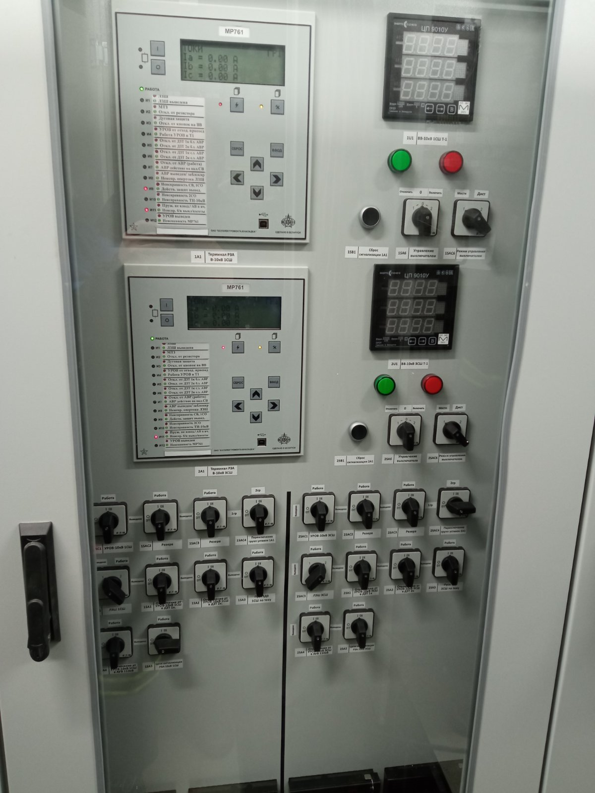
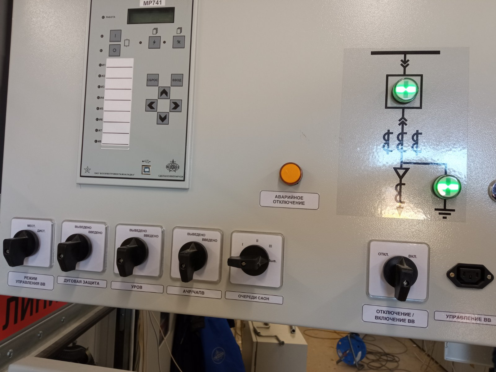

ПС Журжево
=============

Т-1, Т-2 (для изучения, оборудование будет введено распоряжением)
>>>>>>>>>>>>>>>>>>>>>>>>>>>>>>>>>>>>>>>>>>>>>>>>>>>>>>>>>>>>>>>>>>>>>>>>>>>>>>>>>>>>>>>>

ВВ-10кВ Т-1 на 1(3)с-10кВ и Т-2 на 2(4)с-10кВ
--------------------------------------------------

Рисунок 1 - Лицевая сторона шкаф №12(13) 

Рисунок 2 - Лицевая сторона релейного отсека ячейки ВВ-10кВ 

Устройства РЗАИ выполнены на базе микропроцессорнного терминала :ref:`МР-761` и термила дуговой защиты :ref:`ТЭЗ-24`.  
Сброс индикации с терминала защит осуществляется кнопкой 1(2)SB1 "Сброс индикации" или при переводе ключа управления 1(2)SA6 в положение "Отключить", а стермила дуговой защиты кнопкой 
"Квитация". Терминал :ref:`МР-761` включает в себя следующие функции защит (при их работе на терминале загорается соответствующий индикатор, происходит запись в журнал аварии, на двери 
шкафа загорается соответствующая сигнальная лампа, на центральную сигнализацию отправляется аварийный или предупредительный сигнал):

Список защит и функций
......................................................

**Логическая защита шин (ЛЗШ) [I> 1 СРАБ]** 

- **Источник оперативного тока:** Шинки управления, подключенные к АКБ

- **Измеряет:** Ток ТТ-10кВ

- **Работает:** Междуфазные КЗ на шинах 10кВ или в отсеках ячеек отходящих линий до ТТ-10кВ при отсутствии блокирующего сигнала

- **Блокируется:** По факту пуска (превышения током уставки без выдержки времени) МТЗ отходящих линий 10кВ или СВВ-10кВ (при КЗ за ТТ-10кВ), или соответствующим ключом 
(см. список переключающих устройств)

- **Действует:** Отключение ВВ-10кВ с запретом АВР-10кВ.

**Максимально токовая защита (МТЗ) [I> 2 СРАБ]** 

- **Источник оперативного тока:** Шинки управления, подключенные к АКБ

- **Измеряет:** Ток ТТ-10кВ

- **Работает:** Междуфазные КЗ на шинах 10кВ или в отсеках ячеек отходящих линий до ТТ-10кВ 

- **Действует:** Отключение ВВ-10кВ с запретом АВР-10кВ.

**Токовая защита нулевой последовательности (ТЗНП) [I*> 1 СРАБ]** 

- **Источник оперативного тока:** Шинки управления, подключенные к АКБ

- **Измеряет:** Ток ТТ-35кВ РЗН-10кВ 

- **Работает:** Однофазные замыкания на землю на секции шин 10кВ и резервирует ТЗНП отходящих линий 10кВ, РЗН 10кВ

- **Действует:** Отключение ВВ-10кВ с запретом АВР-10кВ.

**Защита от дуговых замыаний (ЗДЗ) [ВЗ1 СРАБ]**

- **Источник оперативного тока:** Шинки управления, подключенные к АКБ

- **Работает:** при дуговых замыканиях отсеков ВВ-10кВ и шин ячеек 1(3) или 2(4)с 10кВ или отсека шин ячеек ввода ВВ-10кВ Т-1(Т-2) 
и при условии превышения током через ТТ-10кВ ячейки ввода 10кВ Т-1(Т-2) уставки пуска «ЗДЗ шин» 

- **Блокируется:** соответствующим ключом (см. список переключающих устройств)

- **Действует:** Отключение ВВ-10кВ с запретом АВР-10кВ.

**Отключение от кнопок ВВ-10кВ [ССЛ3]** 
 
- **Работает:** при нажатии кнопки "отключить" на приводе ВВ-10кВ

- **Действует:** Отключение ВВ-10кВ без запрета АВР-10кВ.

**Устройство резервирования отказа выключателя 10кВ трансформатора (УРОВ ввода 10кВ) [УРОВ 2]** 

- **Источник оперативного тока:** Шинки управления, подключенные к АКБ

- **Измеряет:** работу защит и отказ в отключении ВВ-10кВ (при этом формируется команда УРОВ2)  

- **Работает:** при наличии команды УРОВ и тока через ТТ-10кВ выше уставки

- **Блокируется:** соответствующим ключом (см. список переключающих устройств)

- **Действует:** Отключение ВВ-10кВ с запретом АВР-10кВ.

**Контроль УРОВ [ВЗ4 СРАБ]** 

- **Источник оперативного тока:** Шинки управления, подключенные к АКБ

- **Измеряет:** сигнала УРОВ (факт отказа ВВ-10кВ) от отходящих линий 10кВ или СВВ-10кВ  

- **Работает:** при наличии сигнала УРОВ и тока через ТТ-10кВ выше уставки 

- **Блокируется:** соответствующим ключом (см. список переключающих устройств)

- **Действует:** Отключение ВВ-10кВ с запретом АВР-10кВ.

Список сигнализации 
........................................

ОПУ: шкаф №12(13): 

- **терминал МР-761:**

	- И1 КРАСНЫЙ "ЛЗШ" - работа ЛЗШ

        - И1 ЗЕЛЕНЫЙ "ЛЗШ выведена" - ключ 1SAC5 "ЛЗШ" в положении "выведена"

        - И2 КРАСНЫЙ "МТЗ" - работа МТЗ-10кВ

        - И2 ЗЕЛЕНЫЙ "Откл. от резистора" - работа ТЗНП

	- И3 КРАСНЫЙ "Дуговая защита" - работа ЗДЗ

	- И3 ЗЕЛЕНЫЙ "Откл. от кнопок на ВВ" - работа ТЗНП

        - И4 КРАСНЫЙ "УРОВ от отход. присоединений" - работа контроль УРОВ

        - И4 ЗЕЛЕНЫЙ "Работа УРОВ в Т1" - работа УРОВ

Список телесигналов 
........................................

ОПУ: шкаф №12(13): по МЭК-61850 (по оптике): 
 
ЛЗШ, МТЗ, ТЗНП, ЗДЗ, ВЗ4 (УРОВ секции), УРОВ 2 (УРОВ трансформатора)

Список переключающих устройств
........................................
  
ОПУ: шкаф №12: 

- Переключатель 1(2)SАC1 "УРОВ-10кВ 1(3)СШ" - **вверх "Работа"**, влево "Выведено"

- Переключатель 1(2)SАC5 "ЛЗШ 1(3)с" - **вправо 45гр "Работа"**, влево "Выведено"

- Переключатель 1(2)SА4 "Отключение от УРОВ-10кВ 1(3)СШ в АУВ-110кВ" - **вверх "Работа"**, влево "Выведено"

ОПУ: шкаф №13: 

- Переключатель 1(2)SАC1 "УРОВ-10кВ 2(4)СШ" - **вверх "Работа"**, влево "Выведено"

- Переключатель 1(2)SАC5 "ЛЗШ 2(4)с" - **вправо 45гр "Работа"**, влево "Выведено"

- Переключатель 1(2)SА4 "Отключение от УРОВ-10кВ 2(4)СШ в АУВ-110кВ" - **вверх "Работа"**, влево "Выведено"

ЗРУ-10кВ: ячейка ВВ-10кВ Т-1 1(3)с и ВВ-10кВ Т-2 2(4)с: 

- Переключатель SАC2 "Дуговая защита" - **вправо 45гр "Введено"**, вверх "Выведено"

Список коммутационной аппаратуры
........................................

ОПУ: ЩПТ-1(2). Распределение АБ-1(2):

- Автомат SF22 "Защита 1В-10 кВ Т-1(Т-2)" - Питание и защита оперативных цепей ВВ-10кВ Т-1(Т-2) на 1(2)с **Включен**

- Автомат SF23 "УРОВ,ЛЗШ 1В-10 кВ Т-1(Т-2)" - Питание и защита УРОВ,ЛЗШ ВВ-10кВ Т-1(Т-2) на 1(2)с **Включен**

- Автомат SF24 "Упр. 1В-10 (СВ,1СО) Т-1(Т-2)" - Питание и защита цепей управления (СВ,1СО) ВВ-10кВ Т-1(Т-2) на 1(2)с **Включен**

- Автомат SF25 "Упр. 2В-10 (2СО) Т-2(Т-1)" - Питание и защита цепей управления (2СО) ВВ-10кВ Т-2(Т-1) на 2(1)с **Включен**

- Автомат SF26 "Защита 1В-10 кВ Т-1(Т-2)" - Питание и защита оперативных цепей ВВ-10кВ Т-1(Т-2) на 3(4)с **Включен**

- Автомат SF27 "УРОВ,ЛЗШ 1В-10 кВ Т-1(Т-2)" - Питание и защита УРОВ,ЛЗШ ВВ-10кВ Т-1 на 3с **Включен**

- Автомат SF28 "Упр. 1В-10 (СВ,1СО) Т-1(Т-2)" - Питание и защита цепей управления (СВ,1СО) ВВ-10кВ Т-1(Т-2) на 3(4)с **Включен**

- Автомат SF29 "Упр. 2В-10 (2СО) Т-2(Т-1)" - Питание и защита цепей управления (2СО) ВВ-10кВ Т-2(Т-1) на 4(3)с **Включен**

СЛЕДИТЕ ЗА ОБНОВЛЕНИЯМИ! СКОРО БУДЕТ ДОПОЛНЕНО!