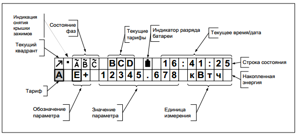
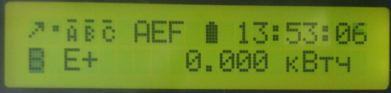
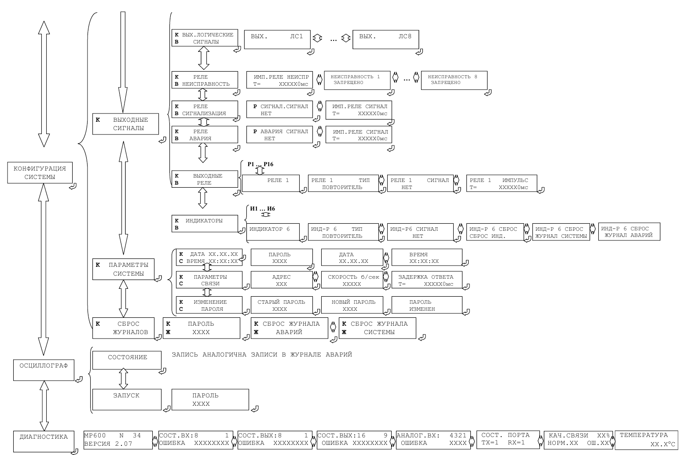
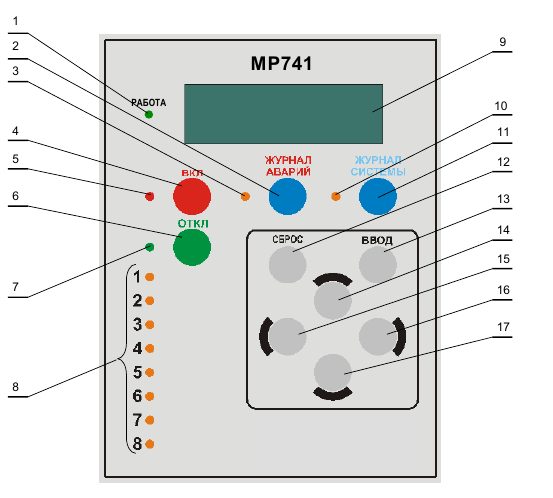
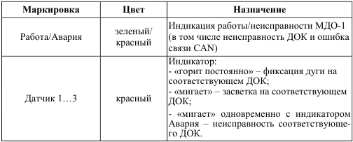

Описание порядка использования типовых устройств и блоков РЗА
===================================================================

.. _СС-301:

Счётчик электроэнергии CC-301
-----------------------------

**Общая часть.**

Настоящая инструкция по эксплуатации содержит сведения о счётчиках
электрической энергии переменного тока «ГРАН-ЭЛЕКТРО СС-301» необходимые
для обеспечения полного использования их технических возможностей,
правильной эксплуатации и технического обслуживания.

Рисунок 1 – внешний вид счетчика электроэнергии

**Эксплуатационные ограничения.**

Напряжение, подводимое к параллельным цепям счётчика, не должно
превышать номинальных значений более чем на 15 % (в 1,15 раза).

Ток в последовательной цепи счётчика не должен превышать номинального
значения в 1,5 раза.

Значения допустимых напряжений и токов приведены в таблице 1.

Таблица 1 – Максимальные допустимые значения напряжения и тока в цепях
счетчика электроэнергии.

+-----------+--------------+-------------+-------------+-------------+
| И         | Номинальное  | Максимально | Номинальный | М           |
| сполнение | напряжение,  | допустимое  | ток, А      | аксимальный |
| счётчика  | В            | напряжение, |             | ток, А      |
|           |              | В           |             |             |
|           | (фазн        |             |             |             |
|           | ое/линейное) | (фазно      |             |             |
|           |              | е/линейное) |             |             |
+===========+==============+=============+=============+=============+
| С         | 3×57,7 / 100 | 3×66,4 /    | 5           | 7,5         |
| С-301-5.1 |              | 115         |             |             |
+-----------+--------------+-------------+-------------+-------------+
| СС-       | 3×127 / 220  | 3×146/253   | 5           | 7,5         |
| 301-5.1/Y |              |             |             |             |
+-----------+--------------+-------------+-------------+-------------+

**Управление индикацией.**

1. Выбор режима индикации счётчика осуществляется с помощью трёх
кнопок **«Меню»**, **«Маркер»**, **«Ввод»**.

Нарушить работу счётчика нажимая данные кнопки нельзя.

.. image:: media/СС301/image5.jpeg
   :alt: кнопки 3
   :width: 2.78125in
   :height: 1.33333in

2. При нажатии на кнопку **«Меню»** поочередно выводится на ЖКИ
дисплей меню индикации. Перечень и последовательность вывода меню на
дисплей приведены в таблице 2.

В меню с несколькими подменю, подменю будут отображаться во второй
строчке дисплея.

3. Сегмент дисплея |image1|, в котором находится маркер, мигает.

4. Выбор подменю обеспечивается нажатием на кнопку **«Ввод»**.

Просмотр параметров в выбранном меню/подменю осуществляется кнопкой
**«Ввод»**.

Для возвращения в предыдущее меню необходимо нажать кнопку **«Меню»**.

5. Если в течение 10 минут не было нажатий на любую кнопку, то счётчик
автоматически переходит в меню **«Основное окно индикации»**.

6. При отсутствии индикации на дисплее необходимо нажать кнопку
**«Ввод»** и удерживать её в нажатом состоянии в течение 5 секунд.

.. table:: **Перечень и последовательность вывода меню на дисплей счетчика электроэнергии**
    :class: longtable

    +-------------------+--------------+-----------------------------------+
    | Типы меню         | Типы подменю | Индицируемые параметры            |
    | индикации         |              |                                   |
    +===================+==============+===================================+
    | Основное окно     | Строка       | *- текущий квадрант*              |
    | индикации         | состояния    |                                   |
    |                   |              | *- индикатор снятия крышки        |
    |                   |              | зажимов*                          |
    |                   |              |                                   |
    |                   |              | *- текущее состояние фаз*         |
    |                   |              |                                   |
    |                   |              | *- текущие тарифы (до 3-х)*       |
    |                   |              |                                   |
    |                   |              | *- символ передачи данных*        |
    |                   |              |                                   |
    |                   |              | *- разряд батареи*                |
    |                   |              |                                   |
    |                   |              | *- текущие время/дата*            |
    +-------------------+--------------+-----------------------------------+
    |                   | Накопленная  | *- тариф*                         |
    |                   | энергия      |                                   |
    |                   |              | *- тип параметра значение*        |
    |                   |              | *параметра:*\ накопленное         |
    |                   |              | значение параметров: E+, E-, R+,  |
    |                   |              | R-, всего «*» и с разбивкой по    |
    |                   |              | 8-ми тарифным зонам (**А-Н**)     |
    |                   |              |                                   |
    |                   |              | *- единицы измерения*             |
    +-------------------+--------------+-----------------------------------+
    | Энергия           | За сутки     | значение параметров: E+, E-, R+,  |
    | приращенная       |              | R-, всего «*» и с разбивкой по    |
    |                   |              | 8-ми тарифным зонам (**А-Н**)     |
    | (разница          |              |                                   |
    | показаний         |              | *- за текущие сутки и 30          |
    | счетчика)         |              | предыдущих суток*                 |
    +-------------------+--------------+-----------------------------------+
    |                   | За месяц     | значение параметров: E+, E-, R+,  |
    |                   |              | R-, всего «*» и с разбивкой по    |
    |                   |              | 8-ми тарифным зонам (**А-Н**)     |
    |                   |              |                                   |
    |                   |              | *- за текущий месяц и 23          |
    |                   |              | предыдущих месяцев*               |
    +-------------------+--------------+-----------------------------------+
    |                   | За год       | значение параметров: E+, E-, R+,  |
    |                   |              | R-, всего «*» и с разбивкой по    |
    |                   |              | 8-ми тарифным зонам (**А-Н**)     |
    |                   |              |                                   |
    |                   |              | *- за текущий год и 7 предыдущих  |
    |                   |              | лет*                              |
    +-------------------+--------------+-----------------------------------+
    | Энергия           | На начало    | значение параметров: E+, E-, R+,  |
    | накопленная       | суток        | R-, всего «*» и с разбивкой по    |
    |                   |              | 8-ми тарифным зонам (**А-Н**) на  |
    | (показания        |              | начало суток всех дней текущего   |
    | счетчика)         |              | месяца                            |
    +-------------------+--------------+-----------------------------------+
    |                   | На начало    | значение параметров: E+, E-, R+,  |
    |                   | месяца       | R-, всего «*» и с разбивкой по    |
    |                   |              | 8-ми тарифным зонам (**А-Н**) на  |
    |                   |              | начало текущего месяца и 11       |
    |                   |              | предыдущих месяцев                |
    +-------------------+--------------+-----------------------------------+
    |                   | На начало    | значение параметров: E+, E-, R+,  |
    |                   | года         | R-, всего «*» и с разбивкой по    |
    |                   |              | 8-ми тарифным зонам (**А-Н**) на  |
    |                   |              | начало текущего года и 7          |
    |                   |              | предыдущих лет                    |
    +-------------------+--------------+-----------------------------------+
    | Мощность          | 3 мин        | значения параметров: P+, P-, Q+,  |
    |                   |              | Q-                                |
    |                   |              |                                   |
    |                   |              | *- за текущий и 10 предыдущих     |
    |                   |              | интервалов усреднения мощности    |
    |                   |              | для счётчиков*                    |
    +-------------------+--------------+-----------------------------------+
    |                   | 30 мин       | значения параметров: P+, P-, Q+,  |
    |                   |              | Q-                                |
    |                   |              |                                   |
    |                   |              | *- за текущий и предыдущий        |
    |                   |              | интервал усреднения мощности*     |
    +-------------------+--------------+-----------------------------------+
    |                   | Макс         | максимальное значение мощности за |
    |                   |              | месяц: P+, P-, Q+, Q- за 30       |
    |                   |              | минутный интервал усреднения с    |
    |                   |              | привязкой даты и времени всего    |
    |                   |              | «*» и с разбивкой по 8-ми         |
    |                   |              | тарифным зонам (**А-Н**)          |
    |                   |              |                                   |
    |                   |              | *- за текущий месяц и 11          |
    |                   |              | предыдущих месяцев*               |
    +-------------------+--------------+-----------------------------------+
    | Мгновенные        |              | текущие значения параметров:      |
    | значения          |              |                                   |
    |                   |              | - активная мощность:              |
    |                   |              |                                   |
    |                   |              | P\ :sub:`\*` (всего), Pa, Pb, Pc; |
    |                   |              |                                   |
    |                   |              | - реактивная мощность:            |
    |                   |              |                                   |
    |                   |              | Q\ :sub:`\*` (всего), Qa, Qb, Qc; |
    |                   |              |                                   |
    |                   |              | - фазное напряжение:              |
    |                   |              |                                   |
    |                   |              | Ua, Ub, Uc;                       |
    |                   |              |                                   |
    |                   |              | - ток: Ia, Ib, Ic;                |
    |                   |              |                                   |
    |                   |              | - cos Fi: Ka, Kb, Kc;             |
    |                   |              |                                   |
    |                   |              | - частота: f                      |
    +-------------------+--------------+-----------------------------------+
    | Константы         |              | *- тип счетчика*                  |
    |                   |              |                                   |
    |                   |              | *- заводской №*                   |
    |                   |              |                                   |
    |                   |              | *- дата изготовления*             |
    |                   |              |                                   |
    |                   |              | *- версия ПО*                     |
    |                   |              |                                   |
    |                   |              | *- сетевой адрес*                 |
    |                   |              |                                   |
    |                   |              | *- ID пользователя*               |
    |                   |              |                                   |
    |                   |              | *- параметры порта*               |
    |                   |              |                                   |
    |                   |              | *- параметры телеметрии*          |
    |                   |              |                                   |
    |                   |              | *- коэффициент трансформации      |
    |                   |              | трансформатора тока K\ ТТ*        |
    |                   |              |                                   |
    |                   |              | *- коэффициент трансформации      |
    |                   |              | трансформатора напряжения K\ ТН*  |
    +-------------------+--------------+-----------------------------------+
    | Модуль расширения |              | *- код модуля расширения;*        |
    |                   |              |                                   |
    | (отображается     |              | *- тип модуля расширения;*        |
    | только у          |              |                                   |
    | счётчиков с       |              | *- параметры порта 1;*            |
    | дополнительным    |              |                                   |
    | интерфейсом)      |              | *-параметры порта 2;*             |
    |                   |              |                                   |
    |                   |              | *- реле*                          |
    +-------------------+--------------+-----------------------------------+
    | События           | Фазы         | Архив состояния фаз с датой и     |
    |                   |              | временем последних 32 изменений   |
    +-------------------+--------------+-----------------------------------+
    |                   | Ошибки       | Архив кодов ошибок с датой и      |
    |                   |              | временем возникновения последних  |
    |                   |              | 32 ошибок                         |
    +-------------------+--------------+-----------------------------------+
    |                   | Коррекция    | Архив корректировок параметров    |
    |                   |              | счетчика с датой и временем       |
    |                   |              | последних 32 изменений            |
    +-------------------+--------------+-----------------------------------+
    | Календарь         | Сезоны       | Дата и время начала:              |
    |                   |              |                                   |
    |                   |              | *- сезона лето;*                  |
    |                   |              |                                   |
    |                   |              | *- сезона зима*                   |
    +-------------------+--------------+-----------------------------------+
    |                   | Выходные     | Перечень выходных и праздничных   |
    |                   |              | дней для 12 тарифных месяцев      |
    +-------------------+--------------+-----------------------------------+
    | Тарифы            | Основные     | Для каждого получаса рабочих и    |
    |                   |              | выходных дней определены тарифные |
    |                   |              | зоны                              |
    +-------------------+--------------+-----------------------------------+
    |                   | Резервные    |                                   |
    +-------------------+--------------+-----------------------------------+

**Меню «Основное окно индикации». Сигнализация о нарушении в работе
счетчика электроэнергии.**

1. Формат вывода информации на дисплей в меню **«Основное окно
индикации»** приведён на рисунке 2.

2. В первой строчке дисплея индицируется **«Строка состояния»**
счётчика, во второй строчке – параметры **«Накопленная энергия»**.

|image2| - маркер. Мигающий прямоугольник, во второй строке, обозначает,
какое подменю или параметр сейчас выбран.

.. image:: media/СС301/image8.jpeg
   :alt: DSC_0272
   :width: 3.19792in
   :height: 0.73958in

Рисунок 2 – меню «основное окно индикации» счетчика электроэнергии.

3. В строчке **«Накопленная энергия»** на дисплей выводится следующая
информация:

3.1. **«Тариф»** - обозначение тарифной зоны (**A**, **B**, **C**,
**D**, **E**, **F**, **G**, **H**), по которой выводится на дисплей
значение накопленной энергии.

Символ |image3| (всего) указывает, что на дисплей выводится значение
суммарной накопленной энергии.

Переключение тарифов производится кнопкой **«Ввод»**:

1) |DSC_0272| 2) |DSC_0277|

3) |DSC_0278| 4) |DSC_0279|

3.2. **«Тип параметра»** - обозначение выводимого на дисплей
параметра.

Назначение параметров **Е+**, **Е-**, **R+**, **R-** для каждого
счетчика электроэнергии приведены в Приложении А.

+-----------------+----------------+-----------------+----------------+
| **Обозначение** | **Вид          | **Обозначение** | **Вид          |
|                 | энергии**      |                 | энергии**      |
+=================+================+=================+================+
| **E+**          | активная       | **R+**          | реактивная     |
|                 | энергия        |                 | энергия        |
+-----------------+----------------+-----------------+----------------+
| **E-**          | активная       | **R-**          | реактивная     |
|                 | энергия        |                 | энергия        |
+-----------------+----------------+-----------------+----------------+

3.3. **«Значение параметра»** - числовое значение параметра;

3.4. **«Единицы измерения»** - буквенное обозначение единицы измерения
текущего параметра (кВтч, кварч)

4. В строчке **«Строка состояния»** содержится следующая информация:

4.1. **«Текущий квадрант»** - |image4| обозначение текущего режима
учёта электроэнергии, в котором работает счётчик:

|image5| соответствует Е+, R+;

|image6| соответствует Е-, R-;

|image7| соответствует Е-, R+;

|image8| соответствует Е+, R-.

4.2. **«Состояние фаз»** - обозначает наличие фаз (буквы **A**, **B**,
**C**)

.. image:: media/СС301/image8.jpeg
   :alt: DSC_0272
   :width: 3.19792in
   :height: 0.73958in

4.2.1. Если отсутствуют одна, две или все три фазы, то буквы,
соответствующие отсутствующим фазам мигают на дисплее.

|DSC_0281| |DSC_0286|

а) *отсутствует одна фаза (С)* б) *отсутствует две фазы (В и С)*

4.2.2. Если последовательность (чередование) фаз неправильная –
происходит циклический сдвиг на индикаторе букв, обозначающих фазы.

|DSC_0229| |DSC_0228|

4.2.3. Если направление мощности по одной из фаз не совпадает с
направлением мощности по другим двум фазам, происходит периодическое
изменение размера буквы, обозначающей эту фазу.

*Например: по одной фазе счётчик считает электроэнергию на отдачу, а по
двум другим фазам на приём*.

4.3. **«Текущие тарифы»** - обозначение текущих тарифных зон (**A**,
**B**, **C**, **D**, **E**, **F**, **G**, **H**). На дисплее может
индицироваться одновременно не более трёх тарифных зон.

*Например: AEF*

4.4. **«Заряд батареи»**:

Символ |image9| индикации заряда батареи питания соответствует полностью
заряженной батарее.

Символ |image10| соответствует полностью разряженной батарее.

При полностью разряженной батарее, после отключения счетчика, происходит
сброс даты (календаря) и времени счетчика, при этом на дисплее счетчика
высвечивается надпись "! ! ! **Сбой часов**"

4.5. **«Дата/Время»** - индикация текущих значений времени и даты.
Текущее время и дата отображаются поочерёдно.

|DSC_0229| |DSC_0228|

4.6. О выявлении случаев описанных в пунктах 4.4.2.1-4.4.2.3, 4.4.4.
необходимо поставить в известность персонал службы РЗАИ для организации
работ по их устранению.

**Показания счётчика электроэнергии. Накопленная энергия. Приращённая
энергия.**

**Текущие показания счётчика.**

В меню **«Основное окно индикации»** счётчик отображает текущие
показания активной энергии Е+.

Для просмотра текущих показаний Е-, R+, R- необходимо 1 раз нажать
кнопку **«Маркер»**, а затем нажать кнопку **«Ввод»**. При этом
необходимо записывать показания с символом |image11| (всего).

1) |image12| 3) |DSC_0242|

2) |DSC_0241| 4) |DSC_0243|

**Показания на первое число. Накопленная энергия.**

Вход в меню **«Энергия»** из меню **«Основное окно индикации»**
осуществляется нажатием кнопки **«Меню»**.

Для просмотра показаний счётчика на 00 часов 00 минут первого
числа месяца необходимо выбрать подменю **«Накопленная энергия»** нажав
1 раз кнопку **«Маркер»**,

а затем 1 раз нажать кнопку **«Ввод»**.

Выбрать подменю **«Месяц»**, нажав 1 раз кнопку **«Маркер»** и 1 раз
кнопку **«Ввод»**

Для просмотра показаний счётчика на первое число **текущего**
**месяца** необходимо 1 раз нажать кнопку **«Ввод»**

Для просмотра показаний Е-, R+, R- необходимо 1 раз нажать кнопку
**«Маркер»**, а затем нажать кнопку **«Ввод»** аналогично действиям в
пункте 5.1. При этом необходимо записывать показания с символом
|image13| (всего).

Для возврата в предыдущее подменю необходимо 1 раз нажать кнопку
**«Меню».**

Для просмотра показаний на первое число **предыдущих месяцев**
необходимо кнопкой **«Маркер»** выбрать нужный месяц.

и нажать кнопку «Ввод»

Для просмотра показаний Е-, R+, R- необходимо 1 раз нажать кнопку
**«Маркер»**, а затем нажать кнопку **«Ввод»** аналогично действиям в
пункте 5.1. При этом необходимо записывать показания с символом
|image14| (всего).

Просмотр показаний счётчика **на начало суток, года**
производится аналогично действиям, описанным в пунктах 5.2.2.-5.2.5.

**Разность показаний счетчика электроэнергии. Приращённая
энергия.**

1. Приращённая энергия представляет собой разность показаний
счётчика за интервал времени (сутки, месяц, год).

При входе в подменю на индикатор выводится наименование подменю
**«Энергия»** и наименование интервала времени (сутки, месяц, год), за
которое можно просмотреть приращение энергии.

Для просмотра приращения энергии за месяц необходимо:

2. В меню **«Энергия»** выбрать подменю **«Месяц»** нажав 1 раз
кнопку **«Маркер»**

и нажать 1 раз кнопку **«Ввод»**

3. Выбрать кнопкой **«Маркер»** приращённую энергию за нужный месяц,
нажав 1 раз кнопку **«Ввод»** и записать значение.

Для просмотра показаний приращённой энергии Е-, R+, R- необходимо 1 раз
нажать кнопку **«Маркер»**, а затем нажать кнопку **«Ввод»** аналогично
действиям в пункте 5.1. При этом необходимо записывать показания с
символом |image15| (всего).

4. Для возврата в предыдущее подменю необходимо 1 раз нажать кнопку
**«Меню».**

5. Для просмотра приращенной энергии за другие месяцы необходимо
кнопкой **«Маркер»** выбрать нужный месяц и нажать кнопку **«Ввод»**.
Аналогично действиям, описанным в пунктах 5.2.4-5.2.5.

6. Просмотр приращённой энергии **за сутки, год** производится
аналогично действиям, описанным в пунктах 5.3.2.-5.3.5.

**Меню «Мгновенные» значения.**

1. Вход в меню **«Мгновенные»** осуществляется нажатием кнопки
**«Меню»** (несколько раз).

2. При входе в меню на дисплей выводится наименование меню
**«Мгновенные»** в первой строчке и во второй строчке – тип и значение
параметра.

3. Переключение параметров **P**, **Q**, **U**, **I**, **K**, **f**
производится кнопкой **«Ввод»**.

4. Для переключения фаз **a**, **b**, **c** параметров **P**, **Q**,
**U**, **I**, **K** необходимо нажать кнопку **«Маркер»**, а затем
нажать кнопку **«Ввод»**.

1) Текущая активная мощность всего (*), по фазам А, В, С

|DSC_0244| |DSC_0245|

Для просмотра мощности по фазам, **1 раз** нажать кнопку **«Маркер»** и
нажимать кнопку **«Ввод»**

Для просмотра других параметров, **1 раз** нажать кнопку **«Маркер»** и
нажимать кнопку **«Ввод»**

2) Текущая реактивная мощность всего (*), по фазам А, В, С. Для
просмотра мощности по фазам **1 раз** нажать кнопку **«Маркер»** и
нажимать кнопку **«Ввод»**

3) Напряжение по фазам А, В, С. Для просмотра напряжения по фазам,
**1 раз** нажать кнопку **«Маркер»** и нажимать кнопку **«Ввод»**

4) Ток нагрузки по фазам А, В, С. Для просмотра тока нагрузки по фазам,
**1 раз** нажать кнопку **«Маркер»** и нажимать кнопку **«Ввод».**

5) Косинус угла Fi (cos Fi). Для просмотра cos Fi по фазам, нажать кнопку
**«Ввод».**

6) Частота.

**Отображение параметров P, Q, U, I с учётом коэффициентов
трансформации.**

1. Счётчик отображает параметры **P, Q, U, I** с учётом коэффициента
трансформации, когда коэффициент трансформации трансформатора тока
K\ :sub:`ТТ` и коэффициент трансформации трансформатора напряжения
K\ :sub:`ТН` внесены в счётчик.

2. Если в счётчик внесен коэффициент трансформации трансформатора
тока K\ :sub:`ТТ` то счётчик отображает первичный ток **Ia**, **Ib**,
**Ic** в линии. Значение тока, как правило, отображается в амперах (А),
но в зависимости от параметров программирования счётчика может
отображаться и в килоамперах (кА)

|image16| |DSC_0259|

3. Если в счётчик внесён коэффициент трансформации трансформатора
напряжения K\ :sub:`ТН`, то счётчик отображает действительное значение
**фазного** напряжения **Ua**, **Ub**, **Uc** в киловольтах (кВ).

для линий 6 кВ

|DSC_0268| |DSC_0265|

для линий 10 кВ

|DSC_0247| |DSC_0256|

для линий 110 кВ

|DSC_0273| |image17|

4. Также счётчик отображает действительное значение потребляемой
активной (**P\ \***, **Pa**, **Pb**, **Pc)** и реактивной **(Q\ \***,
**Qa**, **Qb**, **Qc)** мощности. Значение мощности, как правило,
отображается в мегаваттах, мегаварах (МВт, Мвар)

|DSC_0248| |DSC_0252|

5. Энергия **E+**, **E-**, **R+**, **R-** при внесении коэффициентов
трансформации в счётчик отображается в мегаватт-час, мегавар-час (МВт·ч,
Мвар·ч)

При этом, чем больше коэффициенты трансформации тем меньше знаков после
запятой отображает счётчик, что обусловлено параметрами счётчика.

**Меню «Константы».**

1. Вход в меню «Константы» осуществляется нажатием кнопки **«Меню»**
(несколько раз).

2. При входе в меню на дисплей выводится наименование меню
**«Константы»** в первой строчке и во второй строчке – тип и значение
параметра.

3. Переключение параметров производится кнопкой **«Ввод»**:

*- тип счётчика*

*- заводской №*

.. image:: media/СС301/image71.jpeg
   :alt: DSC_0231
   :width: 3.11458in
   :height: 0.73958in

*- дата изготовления*

*- версия программного обеспечения (ПО)*

*- сетевой адрес*

*- ID пользователя*

*- параметры порта*

*- параметры телеметрии*

*- коэффициент трансформации трансформатора тока K\ ТТ*

*- коэффициент трансформации трансформатора напряжения K\ ТН*

**Техническое обслуживание.**

1. Техническое обслуживание счетчиков электроэнергии заключается в
проверке степени разряда батареи питания встроенного таймера и
отсутствия ошибок работы счётчиков.

2. Проверка степени разряда батареи и отсутствия ошибок в работе
счётчика производят путем визуального считывания информации с дисплея
счётчика или считывания информации со счётчика через интерфейс RS-232/
RS-485 или оптический порт, с применением внешнего компьютера.

При визуальном считывании данных со счётчика на дисплее не должно
периодически появляться сообщение об ошибках. Перечень возможных
сообщений приведен в таблице:

+-----------------------------------+-----------------------------------+
| Сообщения об ошибках,             | Описание ошибки                   |
|                                   |                                   |
| выводимые на дисплей счётчика     |                                   |
+===================================+===================================+
| !!! Ошибка (0000 0001)            | Аппаратная ошибка счётчика        |
+-----------------------------------+-----------------------------------+
| !!! Сбой часов                    | Сбой часов текущего времени       |
+-----------------------------------+-----------------------------------+
| !!! Нет калибровки                | В счётчик не записан              |
|                                   | калибровочный файл                |
+-----------------------------------+-----------------------------------+

Символ |image18| соответствует полностью заряженной батарее, символ
|image19| соответствует полностью разряженной батарее.

3. При индикации на дисплее ошибок, приведенных в таблице, или
полностью разряженной батареи счётчик подлежит замене.

4. Замену счётчиков осуществляет персонал службы РЗАИ совместно с
персоналом филиала «Энергосбыт».

.. |image12| image:: media/СС301/image28.jpeg
   :width: 3.13542in
   :height: 0.71875in

.. |DSC_0245| image:: media/СС301/image44.jpeg
   :width: 3.36458in
   :height: 0.73958in
.. |image16| image:: media/СС301/image59.jpeg
   :width: 3.14583in
   :height: 0.72917in

Реле газовое РГЧЗ-66 
-------------------------------

Газовое реле РГЧЗ-66 (реле газовое чашечковое разработки 1966 г.) выпускалось Запорожским трансформаторным заводом взамен газового реле ПГЗ-22. 
Реле выполнено в соответствии с ГОСТ 10472-71 «Трансформаторы (и автотрансформаторы) силовые. Реле газовые. 
Общие технические требования». Реле РГЧЗ-66  имеет герметически закрытый корпус, практически мало отличающийся от корпуса реле ПГЗ-22. 
Фланцы реле рассчитаны на установку его в трубопроводах с внутренним диаметром 80 мм. 
В верхней части реле, с его противоположных сторон, имеются два смотровых стекла с делениями, 
позволяющими определить объем скопившегося в реле газа. Завод поставляет реле с заглушками на фланцах и крышками на смотровых стеклах, как показано на рисунке: 

.. image:: media/image137.png
   :width: 4.07in
   :height: 4.0025in

а — общий вид; б — верхний (сигнальный) элемент; в — нижний (отключающий) элемент

На крышке корпуса реле установлены кран для отбора пробы газа и выпуска его из реле, а также коробка зажимов 
для подключения контрольного кабеля к сигнальному и отключающему контактам. 
На крышке реле нанесена стрелка, указывающая направление движения масла (от трансформатора к расширителю) и 
предназначенная для правильной установки выемной части реле, связанной с крышкой.

В дне коробки с зажимами имеется отверстие для стока собирающейся в ней влаги. В дне корпуса реле имеется 
пробка с резьбой для спуска влаги и грязного масла, скопившегося в нижней части реле.

На крышке корпуса с помощью стоек крепится выемная часть реле с сигнальным и отключающим элементами. 
Сигнальный элемент представляет собой плоскодонную чашку с установленным внутри нее подвижным контактом. 
Чашка с помощью изоляционной стойки поворачивается на оси, втулка которой вмонтирована в держатель чашки. 
Концы оси устанавливаются в стойках, прикрепленных к сборочному кольцу. Неподвижный контакт установлен на изолированной пластине сборочного кольца. 
Для удерживания чашки в верхнем положении, при котором сигнальный контакт разомкнут, служит спиральная пружинка, прикрепленная к держателю, установленному на сборочном кольце.

Чашка и неподвижный контакт нижнего элемента крепятся таким же способом, как и чашка и неподвижный контакт верхнего элемента реле, 
но отключающий элемент конструктивно отличается от сигнального тем, что с его чашкой связана пластина, которая должна реагировать 
на скорость потока масла в реле. Пластина и подвижный контакт нижнего элемента жестко крепятся к изоляционной стойке, к ней же крепится 
рычаг спиральной пружинки. У сигнального и отключающего элементов между сборочными кольцами и держателями спиральных пружинок имеются прокладки. 
Ось вращения пластины закреплена в скобообразной стойке, прикрепленной к дну чашки.

Для предотвращения износа алюминиевого края обеих чашек в местах касания ими упора, ограничивающего их ход, края чашек выполнены отогнутыми, 
а в месте касания каждой чашки прикреплены пластины. Без выполнения указанных мероприятий край чашки вырабатывался бы в месте касания чашкой 
упора под воздействием вибрации трансформатора и реле, что имело место в реле первых выпусков, у которых эти пластины отсутствовали. Чашка и 
пластина отключающего элемента имеют отдельные оси вращения, и при повороте вокруг своих осей и чашка и пластина действуют на замыкание отключающего контакта.

При повороте пластины вокруг своей оси чашка может и не поворачиваться, но при повороте чашки пластина поворачивается всегда, так как стенка чашки 
надавливает на выступ стойки пластины. Ход обеих чашек вниз ограничивается упорами, чем предотвращается заскакивание сигнального и отключающего контактов реле.

Оба элемента реле закрыты со стороны входного фланца реле цилиндрическими полуэкранами для защиты от механических повреждений сильным потоком масла. 
В случае замыкания отключающих или сигнальных контактов реле через имеющиеся в масле шлам или мелкие механические частицы произошла бы излишняя работа газовой защиты. 
Поэтому над чашкой сигнального элемента установлен экран для ограничения попадания в нее шлама и других механических частиц; с этой же целью над чашкой отключающего 
элемента установлен экран, в котором имеется прорезь для перемещения пластины.

В нормальных условиях работы трансформатора, когда газовое реле полностью заполнено маслом, верхняя и нижняя чашки реле удерживаются в верхнем положении так, 
что дно чашек имеет незначительный (на 5—10%) подъем со стороны расширителя. При этом оба контакта газового реле разомкнуты. Незначительное перетекание масла 
из бака трансформатора в расширитель и обратно, происходящее в процессе эксплуатации, не приводит к изменению положения сигнального и отключающего элементов реле.

При повреждении трансформатора, сопровождающемся слабым газообразованием, газ, проходящий из бака трансформатора в трубопровод расширителя, 
скапливается в верхней части корпуса реле, вытесняя масло. Когда объем газа в реле достигает 400 см3±20%, уровень масла в реле окажется ниже дна чашки сигнального элемента. 
Под воздействием силы тяжести чашки, наполненной маслом, она опускается, поворачиваясь вокруг своей оси и сигнальный контакт реле замыкается. 
Отключающий элемент реле продолжает оставаться в масле, поэтому его контакты остаются разомкнутыми. При повреждении трансформатора, 
приводящего к большим динамическим усилиям в его частях и бурному газообразованию, давление в баке резко возрастает и происходит бросок масла или смеси масла 
с газом из трансформатора в расширитель. Под воздействием потока масла (если его скорость равна или выше скорости срабатывания отключающего элемента реле) 
пластина поворачивается и отключающий контакт замыкается.

Выбор скорости срабатывания производится установкой в реле одной из трех пластин, откалиброванных на скорости 0,6; 0,9 и 1,2 м/с.

При описании конструкции указывалось, что пластина поворачивается вокруг своей оси, не приводя в движение чашку. 
Этим обстоятельством, а также расположением пластины против входного отверстия реле со стороны трансформатора достигаются 
быстрый поворот пластины вокруг своей оси и замыкание отключающего контакта реле.

Время замыкания отключающего контакта реле составляет при скорости потока масла более 1,5 его уставки 0,1—0,15 с, 
а при скорости потока масла 1,25 его уставки срабатывания не превышает 0,2 с. Время замкнутого состояния контакта при этом не менее 0,05 с, 
что позволяет осуществить надежную цепь на отключение трансформатора, хотя отключающий контакт газового реле может замыкаться и прерывисто в начальный момент повреждения трансформатора.

При описанном повреждении трансформатора сигнальный элемент реле может работать одновременно с отключающим или несколько позже, когда газ заполнит верхнюю часть корпуса реле.

При аварийной быстрой утечке масла трубопровод, соединяющий бак трансформатора с расширителем, 
и газовое реле оказываются без масла и оба элемента реле опускаются под воздействием силы тяжести чашек, 
а контакты реле действуют на отключение трансформатора и на сигнал практически одновременно.

При сквозных к. з. вблизи трансформатора происходит его сотрясение под воздействием больших токов, проходящих в его обмотках. 
Переток масла из бака трансформатора в расширитель при таких к.з. не приводит, однако, к работе газовой защиты, 
поскольку скорость потока масла не достигает скорости срабатывания реле. Следует отметить, 
что реле РГЧЗ-66 более устойчивы к вибрациям трансформатора и к сквозным к.з., чем реле ПГЗ-22. 
В соответствии с названным выше ГОСТ контакты реле РГЧЗ-66 не должны замыкаться при его значительных вибрациях (с ускорением до 5 g в диапазоне частот 20—100 Гц). 
У реле ПГЗ-22 отмечались замыкания контактов (при неизменном положении отключающего или сигнального элементов) за счет того, 
что при значительных вибрациях трансформатора или внешних механических воздействиях ртуть в контактных колбочках реле также колебалась. 
Таким образом, основными преимуществами реле РГЧЗ-66 перед реле ПГЗ-22 являются быстродействие и виброустойчивость.

BF-80/Q (Реле газовое Бухгольца)
-----------------------------------

Газовое реле Бухгольца BF-80 является важным устройством защиты и контроля для трансформаторов с жидким диэлектриком и расширителем.
Реле устанавливается в контур охлаждения контролируемого устройства и реагирует на такие нарушения, как газообразование, потери и усиление потока жидкого диэлектрика.

 
Газовые реле Бухгольца  BF-80 имеет сигнальный и два отключающих элемента. 
Сигнальный элемент управляется шарообразным пластмассовым поплавком. 
Отключающий элемент, кроме такого же поплавка, содержит пластину , установленную поперек потока масла и маслогазовой смеси. 
Контактная система сигнального и отключающего элементов выполнена при помощи магнитоуправляемых герконов, 
замыкание которых происходит при воздействии на них постоянных магнитов, перемещаемых поплавками и поворотной пластиной. 
В отключающем элементе постоянный магнит можно установить в одном из трех положений, соответствующих уставкам скорости срабатывания 0,65-1-1,5 м/с. 
Время срабатывания реле зависит от кратности действительной скорости потока масла по отношению к уставке. 
При кратности 1,25 время срабатывания не превышает 0,15 с; при кратности 1,5 - не более 0,1 с. 

РЗТ-25 струйное реле
---------------------------------------

Реле защиты трансформатора РЗТ-25 является защитным реле для изолированных или охлаждаемых жидкостью аппаратов с расширительным сосудом 
(трансформаторы, многоступенчатые переключатели, конденсаторы, дроссельные катушки и т.д.) и монтируется на соединительном трубопроводе между корпусом и расширительным сосудом.
Струйное реле типа РЗТ-25 предназначено для коммутации сигнала «ОТКЛЮЧЕНИЕ» в случае превышения скорости жидкости в соединительном трубопроводе выше заданного порогового значения. 
Реле имеет механический фиксатор замкнутого состояния контактов.

Работоспособность реле проверяется нажатием контрольной кнопки, которая при движении вниз утапливает последовательно верхний, а потом нижний поплавки, 
вызывая принудительную коммутацию сигналов «Предупреждение» и «Отключение». После отпуская кнопки под действием пружины система возвращается в исходное состояние. 
У реле РЗТ–25 фиксатор-защелка срабатывает в момент коммутации в сигнале «ОТКЛЮЧЕНИЕ» и не позволяет системе вернуться в исходное состояние. 
Для сброса сигнала «ОТКЛЮЧЕНИЕ» необходимо повторное нажатие на контрольную кнопку.

Аналогами реле РЗТ-25 являются реле типа: РСТ-25, РГТ-25, URF-25 (реле Бухгольца).

Реле РЗТ поставляется потребителю с установленным, в соответствии с заказом, порогом срабатывания по скорости потока масла и замыкающимися контактами. 
При отсутствии в заказе указаний о пороге срабатывания реле поставляется с настройкой 1 м/с.

При необходимости изменения порога срабатывания по скорости потока масла, реле вскрывается, и установка порога срабатывания производится за счет изменения 
положения подвижной шторки, частично перекрывающей проходное окно в экране.

Накладка НКР-1
-------------------------------

Накладка НКР-3 предназначена для неавтоматических переключений без тока 
цепей защиты станций и подстанций с номинальным током до 10А и 
номинальным напряжением до 380 В переменного тока 50 Гц и до 220 В 
постоянного тока. Используются в цепях релейной защиты и автоматики в 
качестве вспомогательного устройства. Конструкция Накладки НКР-3 позволяет 
организовать точку подключения электрической схемы с видимым разрывом, 
что значительно облегчает обслуживание и наладку оперативных цепей. 

.. image:: media/image128.png
   :width: 1.95833in
   :height: 1.0625in

Накладка НКР-3 позволяет осуществлять переключение электрических цепей 
и имеет 3 фиксированных положения. Основной частью изделия является 
корпус на котором смонтированы три неподвижныч вывода. На лицевой стороне корпуса 
напротив левого контакта нанесена рельефная надпись "Сигн.", напротив 
правого -"Откл.". Центральный контакт не маркирован.

Все переключения между контактами из одного положения в другое производятся 
только при отключенном токе и осуществляются в следующей 
последовательности: ручка отвинчивается против часовой стелки до упора, 
при этом пружина разводит зажим и контакт, между этими деталями образуется зазор 
около  3 мм. Далее удерживая за ручку проворачиваем ее в положение 
"Сигн". Для соединения подвижного узла вращаем ручку по часовой стрелке, зажим и 
контакт стягиваются и зажимают своими контактными поверхностями 
отогнутую полку вывода с одной стороны. Переключение между выводами в положение 
"Откл." производятся в такой же последовательности. 

Реле указательное РУ-1
------------------------

Реле указательные РУ-1 предназначены для сигнализации аварийного состояния в цепях 
постоянного и переменного тока. 
Реле РУ-1 представляет собой реле блинкерного типа с электромагнитным приводом и 
ручным возвратом. В исходное положение реле устанавливается нажатием кнопки указателя 
срабатывания. При этом окно индикации реле РУ-1 имеет серебристо-белый цвет,  
замыкающие контакты разомкнуты, а размыкающие - замкнуты.
При подаче на обмотку реле РУ-1 питающего напряжения (тока) указатель срабатывания 
изменяет цвет окна индикации на красный, являющийся индикатором срабатывания реле. 
При снятии питания с обмотки реле указатель срабатывания и контакты остаются в том же положении.

Реле указательное РЭУ-11
-------------------------

Реле указательные РЭУ-11 предназначены для сигнализации аварийного состояния в цепях постоянного 
и переменного тока.В исходное положение реле РЭУ-11 устанавливается нажатием кнопки указателя срабатывания. 
При этом окно индикации реле РЭУ-11 имеет серебристо-белый цвет.При подаче на обмотку напряжения (тока) якорь 
притягивается к электромагниту, освобождая фиксатор, кнопка перемещается под действием пружины, пластины кнопки 
индикации входят в пазы между призмами крышки индикатора, засвечивая окна индикации в красный цвет.
При снятии питания с обмотки указатель срабатывания и контакты без самовозврата остаются в том же положении.

+------------------------------------+
| .. image:: media/image132.png      |
|    :width: 1.99833in               |
|    :height: 3.0625in               |
+------------------------------------+

Реле указательное РУ-21
------------------------

Реле указательные серии РУ-21 предназначены для использования в схемах устройств
релейной защиты и автоматики энергетических систем в цепях постоянного и переменного 
тока частоты 50 Гц в качестве указателя действия. Реле   облегчают анализ действия 
защит и, тем самым, способствуют ускорению ликвидации повреждений.

+------------------------------------+------------------------------------+
| .. image:: media/image129.png      | .. image:: media/image130.jpg      |
|    :width: 3.35833in               |    :width: 3.05833in               |
|    :height: 3.0625in               |    :height: 3.0625in               |
+------------------------------------+------------------------------------+

Общий вид реле РУ-21 приведен на рисунке 3. Действие реле серии РУ-21 основано на
электромагнитном принципе. При подаче напряжения или   тока (в зависимости от исполнения)
на катушку, якорь притягивается к сердечнику и освобождает упор флажка. Флажок имеет 
чередующиеся белые и черные сектора. При освобождении упора флажок поворачивается под
действием грузика и белые сектора появляются в смотровых окнах скобы, окрашенной в черный
цвет. Одновременно с поворотом флажка поворачивается  сблокированный с ним  изоляционный 
барабанчик с контактными мостиками, которые замыкают (или размыкают) неподвижные контакты. 
При обесточивании катушки якорь возвращается в исходное положение под действием возвратной
пружины, а флажок с контактными мостиками остается в сработанном положении.

.. _МР-300:

МР-300
--------------

При подаче питания на МР-300 загорается жидкокристаллический индикатор
(ЖКИ) и появляется первый кадр меню.

Основным элементом отображения является жидкокристаллический
буквенно-цифровой индикатор ЖКИ (дисплей), содержащий две строки по 16
символов. Информация, которую можно вывести на дисплей, разбита на кадры
с фиксированным содержанием. Поочередный просмотр кадров осуществляется
с помощью кнопок. Очередность смены кадров на дисплее определяется
главным меню и подменю (см. приложение 1).

В "дежурном" режиме работы подсветка ЖКИ погашена и отображается первый
кадр меню. При нажатии на любую кнопку подсветка включается. Если ни
одна кнопка не нажимается в течение 3 мин., подсветка гаснет и
устройство переходит в "дежурный" режим.

Дополнительно на пяти единичных индикаторах (в дальнейшем - светодиодах)
индицируется:

"ЗАЩИТА" – произошло срабатывание защиты;

"ЗЕМЛЯ" – произошло срабатывание защиты от замыканий на землю;

"ВКЛ" – выключатель включен;

"ОТКЛ" – выключатель отключен;

"КОНТР" – неисправность устройства или выключателя.

Кнопки управления, расположенные на терминале защит, выполняют следующие
функции:

+-----------------------------+-------------------------------------------+
|.. image:: media/image2.png  |- перемещение по окнам меню **вверх**      |
|  :width: 0.65417in          |  или увеличение значения уставки;         |
|  :height: 0.65625in         |                                           |
+-----------------------------+-------------------------------------------+
|.. image:: media/image3.png  |- перемещение по окнам меню **вниз**       |
|  :width: 0.60417in          |  или уменьшение значения уставки;         |
|  :height: 0.65625in         |                                           |
+-----------------------------+-------------------------------------------+
|.. image:: media/image4.png  |- перемещение по окнам меню **влево**      |
|  :width: 0.60417in          |  или перемещение курсоравлево;            |
|  :height: 0.65625in         |                                           |
+-----------------------------+-------------------------------------------+
|.. image:: media/image5.png  |- перемещение по окнам меню **вправо**     |
|  :width: 0.60417in          |  или перемещение курсора вправо;          |
|  :height: 0.65625in         |                                           |
+-----------------------------+-------------------------------------------+
|.. image:: media/image6.png  | ВВОД – ввод значения, вход в подменю или  |
|  :width: 0.60417in          | в режиме изменения параметра (11);        |
|  :height: 0.65625in         |                                           |
+-----------------------------+-------------------------------------------+
|.. image:: media/image7.png  | СБРОС – сброс ввода уставки или переход в |
|  :width: 0.60417in          | вышестоящее подменю (10);                 |
|  :height: 0.65625in         |                                           |
+-----------------------------+-------------------------------------------+

Меню защиты имеет древовидную структуру. С помощью ЖКИ пользователь
имеет возможность прочитать следующую информацию, расположенную в
различных подменю:

1. Текущие значения токов в фазах и тока замыкания на землю;

2. Параметры журнала системы, который включает в себя 32
последовательных во времени сообщения о неисправностях в системе защиты
линии;

3. Параметры журнала аварий, который включает в себя:

- дату, время повреждения;

- сработавшую ступень;

- вид повреждения;

- максимальный ток повреждения;

- токи соответствующих фаз в момент срабатывания защиты;

- состояние устройств автоматики (АПВ, УРОВ);

4. Коэффициенты трансформации фазных трансформаторов тока (ТТ) и
трансформатора нулевой последовательности (ТНП);

5. Информацию обо всех подключённых ступенях и текущих уставках;

6. Параметры автоматики защит: ускорение, АПВ, УРОВ, внешние защиты (1 и 2);

7. Параметры системы.

Для удобства работы пользователя при выводе информации на ЖКИ в левой
части экрана выводятся подсказки в виде букв, обозначающих
местонахождение в меню пользователя.

Расшифровка букв происходит следующим образом:

-  верхняя строка:

**И** - меню измерений;

**У** - меню учёта энергии;

**С** - меню журнала системы;

**А** - меню журнала аварий;

**К** - меню конфигурации системы;

-  нижняя строка:

**А** - подменю параметров автоматики;

**И** - подменю измерительного канала;

**З** - подменю параметров защит;

**Э** - подменю параметров энергоучёта;

**С** - подменю параметров системы.

**Цифры** – порядковый номер события при просмотре журнала. Номера
событий присваиваются в обратном порядке, то есть с № 1 будет храниться
последнее событие.

Для удобства просмотра параметров, пользователь может просмотреть
содержание пунктов меню, удерживая выбранную им клавишу. При этом на
экране ЖКИ циклически высветятся имеющиеся параметры в выбранном пункте.

Просмотр значений токов в фазах и тока замыкания на землю осуществляется
в меню «измерений». Заголовок данного меню является первым кадром и
отображает значение тока в фазе А. Просмотр остальных значений
осуществляется перемещением из первого кадра согласно структуре меню
(Приложение 4). Значения токов отображаются с учётом коэффициента
трансформации трансформаторов тока, т. е. показываются реальные величины
токов в линии.

Текущее значение тока фазы А (В, С) и токов 3Iо, 3Iг, 3I1, 3I2, 3I0,
где:

3Io – основная гармоника тока нулевой последовательности;

3Iг – 11-я гармоника тока нулевой последовательности;

3I1 – расчетный ток прямой последовательности;

3I2 – расчетный ток обратной последовательности;

3I0 – расчетный ток нулевой последовательности.

При обнаружении аварии на защищаемой линии устройство сохраняет
информацию о дате и времени аварии, сработавшей ступени, виде
повреждения и максимальном токе повреждения, автоматически делая запись
в журнале аварий. В журнале может храниться до 16 аварий. При превышении
этого числа, каждая новая авария будет записываться на место самой
старой аварии.

Для просмотра параметров аварий необходимо войти в меню:

.. image:: media/image9.png
   :width: 2.61458in
   :height: 0.46875in

На дисплее отобразится заголовок аварии с датой, временем и номером
аварии (отсчет ведется от последней аварии). Расшифровка символов
журнала аварий представлена в таблице №4.

Для просмотра журнала системы необходимо войти в меню:

.. image:: media/image10.png
   :width: 2.61458in
   :height: 0.47917in

На дисплее отобразится заголовок события с датой, временем и порядковым
номером. Нажатием соответствующих кнопок просмотреть сообщение. Журнал
системы содержит сообщения о событиях в системе, таких, как:
неисправности, включение и отключение выключателя и т.д. При
возникновении события устройство сохраняет в журнале информацию о дате и
времени аварии.

Во время работы устройство проводит самодиагностику, если при этом
обнаружены неисправности модулей, то программа перейдет в
соответствующее окно диагностики.

6. Подменю «ПАРАМЕТРЫ СИСТЕМЫ».

В данном подменю производится установка текущих даты и времени,
параметров связи и параметров управления.

+----------------------------+--------------------------------------------------+
|.. image:: media/image92.png|   Вход в подменю.                                |
|    :width: 2.14792in       +--------------------------------------------------+
|    :height: 3.09792in      |   Установка даты/времени.                        |
|                            +--------------------------------------------------+
|                            |   Установка параметров связи.                    |
+----------------------------+--------------------------------------------------+

6.1 Просмотр и установка реального времени

+----------------------------+--------------------------------------------------+
|.. image:: media/image93.png|   Просмотр часов.                                |
|    :width: 2.14792in       +--------------------------------------------------+
|    :height: 3.80792in      |   Вход в режим корректировки часов.              |
|                            +--------------------------------------------------+  
|                            |   Ввод пароля для корректировки часов.           |
|                            +--------------------------------------------------+
|                            |   Установка – числа, месяца, года.               |
|                            +--------------------------------------------------+
|                            |   Установка – часы, минуты, секунды.             |
+----------------------------+--------------------------------------------------+

.. _МР-301:

МР-301
--------------

При подаче питания на МР-301 загорается
жидкокристаллический индикатор (ЖКИ) и появляется первый кадр меню.

Основным элементом отображения является жидкокристаллический
буквенно-цифровой индикатор ЖКИ (дисплей), содержащий две строки по 16
символов. Информация, которую можно вывести на дисплей, разбита на кадры
с фиксированным содержанием. Поочередный просмотр кадров осуществляется
с помощью кнопок. Очередность смены кадров на дисплее определяется
главным меню и подменю (см. приложение 1).

В "дежурном" режиме работы подсветка ЖКИ погашена и отображается первый
кадр меню. При нажатии на любую кнопку подсветка включается. Если ни
одна кнопка не нажимается в течение 3 мин., подсветка гаснет и
устройство переходит в "дежурный" режим.

На терминале МР-301:

Дополнительно на единичных индикаторах (в дальнейшем - светодиодах)
индицируется:

1. ВКЛЮЧЕНО (красный) выключатель включен

2. ОТКЛЮЧЕНО (зеленый) выключатель отключен

3. АВАРИЯ (красный) - есть новая запись в журнале аварий, произошло
срабатывание защиты

4. КОНТРОЛЬ (желтый) - есть новая запись о неисправности в журнале
системы, возможна неисправность

5. 4 свободно программируемых светодиода (зеленый)

+-----------------------------+-------------------------------------------------------------------+
|.. image:: media/image14.png | – сброс ввода уставки или переход в вышестоящее подменю;          |
+-----------------------------+-------------------------------------------------------------------+
|.. image:: media/image15.png | – ввод значения, вход в подменю или в режим изменения параметра;  |
+-----------------------------+-------------------------------------------------------------------+
|.. image:: media/image16.png | – перемещение по окнам меню вверх или увеличение значения уставки;|
+-----------------------------+-------------------------------------------------------------------+
|.. image:: media/image17.png | – перемещение по окнам меню вправо или перемещение курсора вправо;|
+-----------------------------+-------------------------------------------------------------------+
|.. image:: media/image18.png | – перемещение по окнам меню влево или перемещение курсора влево;  |
+-----------------------------+-------------------------------------------------------------------+
|.. image:: media/image19.png | – перемещение по окнам меню вниз или уменьшение значения уставки. |
+-----------------------------+-------------------------------------------------------------------+

Для удобства просмотра параметров, пользователь может просмотреть
содержание пунктов меню, удерживая выбранную им клавишу. При этом на
экране ЖКИ циклически высветятся имеющиеся параметры в выбранном пункте.
Если пользователь при просмотре или изменении параметров не нажимает на
кнопки в течение трех минут, то устройство автоматически переходит в
«дежурный» режим, при этом автоматически запрещается режим изменения
уставок. Для проведения изменений необходимо заново повторить все
действия по вхождению в подменю и изменению значений

3 Просмотр текущих значений, измеренных величин.

Просмотр значений измеренных величин осуществляется в меню «ИЗМЕРЕНИЕ».
Заголовок данного меню является первым кадром и отображает значение тока
в фазе А. Значения токов и напряжений отображаются с учётом коэффициента
трансформации трансформаторов тока и трансформаторов напряжений, т. е.
показываются реальные величины измеренных величин.

.. image:: media/image76.png
   :width: 2.29375in
   :height: 0.71458in

Текущее значение тока фазы А (В, С) и токов Iо, Iг, I1, I2, I0, где

Io – основная гармоника тока (нулевой последовательности), измеренного
по четвёртому каналу тока;

Iг – высшая гармоника тока (нулевой последовательности), измеренного по
четвёртому каналу тока;

I1 – расчетный ток прямой последовательности;

I2 –расчетный ток обратной последовательности;

I0 – расчетный ток нулевой последовательности.

4 Сброс индикации

Для сброса индикации необходимо войти в меню:

.. image:: media/image77.png
   :width: 0.61458in
   :height: 0.61458in          

После сброса индикации, т.е. нажатия «ВВОД», выводится сообщение о
выполнении сброса.

5 Журналы

+----------------------------+------------------------------+
|.. image:: media/image80.png|   Просмотр журнала аварий.   |
|    :width: 2.09375in       +------------------------------+                            
|    :height: 2.11833in      |   Просмотр журнала системы.  |  
+----------------------------+------------------------------+         
|.. image:: media/image81.png|   Просмотр меню статистики.  |
|    :width: 2.09375in       +------------------------------+  
|    :height: 2.11833in      |   Сброс журналов             | 
+----------------------------+------------------------------+ 

5.1. Просмотр журнала аварий.

При обнаружении аварии на защищаемой линии устройство сохраняет
информацию о дате и времени аварии, сработавшей ступени, виде
повреждения и максимальном токе повреждения, автоматически делая запись
в журнале аварий.

В журнале может храниться до 32 аварий. При превышении этого числа,
каждая новая авария будет записываться на место самой старой аварии.

Расшифровка индицируемых видов повреждения защищаемой линии:

\_ABC Трёхфазное КЗ на землю;

АВС Трёхфазное КЗ;

AC Двухфазное КЗ между фазами A и C;

\_AC Двойное КЗ на землю между фазами A и C;

AB Двухфазное КЗ между фазами A и B;

\_AB Двойное КЗ на землю между фазами A и B;

BC Двухфазное КЗ между фазами B и C;

\_ BC Двойное КЗ на землю между фазами B и C.

Для просмотра параметров аварий необходимо войти в меню:

На дисплее отобразится заголовок аварии с датой, временем и номером
аварии (отсчет ведется от последней аварии).

.. table::"Содержание журнала по выбранной аварии"
   :class: longtable

+------------------------------+--------------------------------------+
| .. image:: media/image83.png |                                      |
|    :width: 2.09375in         | Последняя авария.                    |
|    :height: 2.90833in        |                                      |
|                              +--------------------------------------+
|                              |                                      |
|                              | Самая «старая» авария.               |
|                              |                                      |
+------------------------------+--------------------------------------+
| .. image:: media/image84.png | Типы сообщений журнала аварий:       |
|    :width: 2.09375in         |                                      |
|    :height: 1.45833in        | «ЖУРНАЛ ПУСТ» - нет сообщений в      |
|                              | журнале; «СИГНАЛИЗАЦИЯ» - работа     |
|                              | защиты в схему сигнализации;         |
|                              |                                      |
|                              | «ОТКЛЮЧЕНИЕ» - работа защиты на      |
|                              | отключение выключателя;              |
|                              |                                      |
|                              | «РАБОТА» - сработала ступень защиты, |
|                              | работа на отключение блокирована     |
|                              | другой ступенью (сработавшей ранее); |
|                              |                                      |
|                              | «НЕУСПЕШНОЕ АПВ» - произошло         |
|                              | отключение защитами после АПВ;       |
|                              |                                      |
|                              | «ВОЗВРАТ» - произошло АПВ по         |
|                              | возврату;                            |
|                              |                                      |
|                              | «ВКЛЮЧЕНИЕ»-включение.               |
+------------------------------+--------------------------------------+
| .. image:: media/image85.png | Сработавшая ступень защиты, вид      |
|    :width: 2.09375in         | повреждения, группа уставок.         |
|    :height: 1.45833in        | Максимальное (для максимальных       |
+------------------------------+ защит) или минимальное (для          |
|                              | минимальных защит) значение          |
|                              | контролируемого параметра за время с |
|                              | момента превышения уставки до        |
|                              | срабатывания защиты.                 |
|                              |                                      |
|                              +--------------------------------------+
|                              | Ток фазы А в момент аварии.          |
| .. image:: media/image117.png|                                      |
|    :width: 2.19417in         +--------------------------------------+
|    :height: 5.33333in        | Ток фазы В в момент аварии.          |
|                              |                                      |
|                              +--------------------------------------+
|                              | Ток фазы С в момент аварии.          |
|                              |                                      |
|                              +--------------------------------------+
|                              | Расчётный ток нулевой                |
|                              | последовательности в момент аварии.  |
|                              |                                      |
|                              +--------------------------------------+
|                              | Расчетный ток прямой                 |
|                              | последовательности в момент аварии.  |
|                              |                                      |
|                              +--------------------------------------+
|                              | Расчетный ток обратной               |
|                              | последовательности в момент аварии.  |
+------------------------------+--------------------------------------+
|                              | Измеренный ток (нулевой              |
| .. image:: media/image118.png| последовательности) по четвёртому    |
|    :width: 2.19417in         | каналу тока в момент аварии.         |
|    :height: 1.93333in        |                                      |
|                              +--------------------------------------+
|                              | Ток высшей гармоники (нулевой        |
|                              | последовательности), измеренный по   |
|                              | четвёртому каналу тока в момент      |
|                              | аварии.                              |
+------------------------------+--------------------------------------+
|                              | Состояния дискретных входов Д1-Д8 в  |
| .. image:: media/image119.png| момент аварии.                       |
|    :width: 2.19417in         |                                      |
|    :height: 1.83333in        +--------------------------------------+
|                              | Состояния дискретных входов Д9-Д16 в |
|                              | момент аварии.                       |
+------------------------------+--------------------------------------+

5.2 Просмотр журнала системы.

Для просмотра журнала войти в меню:

На дисплее отобразится заголовок события с датой, временем и порядковым
номером. Нажатием соответствующих кнопок просмотреть сообщение. Журнал
системы содержит до 128 сообщений о событиях в системе, таких, как:
неисправности, включение и отключение выключателя и т.д.

При возникновении события устройство сохраняет в журнале информацию о
дате и времени сообщения о событии.

+------------------------------+--------------------------------------------------+
| .. image:: media/image90.png | Последнее сообщение. По нажатию кнопки «ВПРАВО»  |
|    :width: 2.14792in         | выполняется переход к тексту сообщения.          |
|    :height: 2.29792in        |                                                  |
|                              +--------------------------------------------------+
|                              | .. image:: media/image91.png                     |
|                              |    :width: 2.44792in                             |
|                              |    :height: 0.69792in                            |
+------------------------------+--------------------------------------------------+

6. Подменю «ПАРАМЕТРЫ СИСТЕМЫ».

В данном подменю производится установка текущих даты и времени,
параметров связи и параметров управления.

+----------------------------+--------------------------------------------------+
|.. image:: media/image92.png|   Вход в подменю.                                |
|    :width: 2.14792in       +--------------------------------------------------+
|    :height: 3.09792in      |   Установка даты/времени.                        |
|                            +--------------------------------------------------+
|                            |   Установка параметров связи.                    |
+----------------------------+--------------------------------------------------+

6.1 Просмотр и установка реального времени

+----------------------------+--------------------------------------------------+
|.. image:: media/image93.png|   Просмотр часов.                                |
|    :width: 2.14792in       +--------------------------------------------------+
|    :height: 3.80792in      |   Вход в режим корректировки часов.              |
|                            +--------------------------------------------------+  
|                            |   Ввод пароля для корректировки часов.           |
|                            +--------------------------------------------------+
|                            |   Установка – числа, месяца, года.               |
|                            +--------------------------------------------------+
|                            |   Установка –часы, минуты, секунды.              |
+----------------------------+--------------------------------------------------+

.. image:: media/image126.png
   :width: 9.63542in
   :height: 6.72917in

.. _МР-500:

МР-500
--------------

При подаче питания на МР-500 загорается жидкокристаллический индикатор
(ЖКИ) и появляется первый кадр меню.

Основным элементом отображения является жидкокристаллический
буквенно-цифровой индикатор ЖКИ (дисплей), содержащий две строки по 16
символов. Информация, которую можно вывести на дисплей, разбита на кадры
с фиксированным содержанием. Поочередный просмотр кадров осуществляется
с помощью кнопок. Очередность смены кадров на дисплее определяется
главным меню и подменю.

В "дежурном" режиме работы подсветка ЖКИ погашена и отображается первый
кадр меню. При нажатии на любую кнопку подсветка включается. Если ни
одна кнопка не нажимается в течение 3 мин., подсветка гаснет и
устройство переходит в "дежурный" режим.

Дополнительно на четырех единичных индикаторах (в дальнейшем -
светодиодах) индицируется соответствующие сигнал.

На дисплее отобразится заголовок события с датой, временем и порядковым
номером. Нажатием соответствующих кнопок просмотреть сообщение. Журнал
системы содержит сообщения о событиях в системе, таких, как:
неисправности, включение и отключение выключателя и т.д. При
возникновении события устройство сохраняет в журнале информацию о дате и
времени аварии.

Во время работы устройство проводит самодиагностику, если при этом
обнаружены неисправности модулей, то программа перейдет в
соответствующее окно диагностики.

.. image:: media/image22.jpeg
   :width: 5.3125in
   :height: 4.15625in

Рисунок 1 МР-500 ПО 1.15 и ниже

Рисунок 2 МР-500 ПО 1.16 и выше

.. table::"Функции кнопок управления"
    :class: longtable

    +------------------------------+--------------------------------------+
    |.. image:: media/image23.png  | - перемещение по окнам меню **вверх**|
    |   :width: 0.6125in           |   или увеличение значения            |
    |   :height: 0.65625in         |   уставки (12);                      |
    +------------------------------+--------------------------------------+
    |.. image:: media/image24.png  | - перемещение по окнам меню **вниз** |
    |   :width: 0.6125in           |   или уменьшение значения            |
    |   :height: 0.65625in         |   уставки (15);                      |
    +------------------------------+--------------------------------------+
    |.. image:: media/image25.png  | - перемещение по окнам меню **влево**|
    |   :width: 0.6125in           |   или перемещение курсора влево (14) |
    |   :height: 0.65625in         |                                      |
    +------------------------------+--------------------------------------+
    |.. image:: media/image26.png  | - перемещение по окнам меню **влево**|
    |   :width: 0.6125in           |   **вправо**или перемещение курсора  |
    |   :height: 0.65625in         |   вправо (13);                       |
    +------------------------------+--------------------------------------+
    |.. image:: media/image27.png  | - **ввод** значения, вход в подменю  |
    |   :width: 0.6125in           |   или в режим изменения параметра(11)|
    |   :height: 0.65625in         |                                      |
    +------------------------------+--------------------------------------+
    |.. image:: media/image28.png  | - **сброс** ввода уставки или        |
    |   :width: 0.6125in           |   переход в вышестоящее подменю)(10);|
    |   :height: 0.65625in         |                                      |
    +------------------------------+--------------------------------------+
    |.. image:: media/image29.png  | - просмотр **журнала системы** (9)   |
    |   :width: 0.6125in           |   ЖУРНАЛ СИСТЕМЫ – просмотр журнала  |
    |   :height: 0.65625in         |   системы (9)                        |
    +------------------------------+--------------------------------------+
    |.. image:: media/image30.png  | - просмотр **журнала аварий** (7)    |
    |   :width: 0.6125in           |   ЖУРНАЛ АВАРИЙ – просмотр журнала   |
    |   :height: 0.65625in         |   аварий                             |
    +------------------------------+--------------------------------------+

**ВКЛ –** включение выключателя (1);

**ОТКЛ** – отключение выключателя (3);

*Структура меню*

Меню защиты имеет древовидную структуру. С помощью ЖКИ пользователь
имеет возможность прочитать следующую информацию, расположенную в
различных подменю:

1. Текущие значения токов в фазах и тока замыкания на землю по основной
   и высшей гармоникам (измерение), расчетные значения токов прямой,
   обратной и нулевой последовательности;

2. Сброс индикации;

3. Параметры журнала системы, который включает в себя 128
   последовательных во времени сообщения о неисправностях в системе
   защиты линии. Типы сообщений представлены в Приложении 3;

4. Параметры журнала аварий (32 сообщения), который включает в себя:

-  дату, время повреждения;

-  сработавшую ступень;

-  вид повреждения;

-  максимальный ток повреждения;

-  токи в момент срабатывания защиты;

-  состояние входов;

5. Ресурс выключателя;

6. Данные осциллографирования;

7. Данные диагностики;

8. Конфигурация системы.

3 Просмотр текущих значений, измеренных величин.

Для удобства работы пользователя при выводе информации на ЖКИ в левой
части экрана выводятся подсказки в виде букв, обозначающих
местонахождение в меню пользователя. Расшифровка букв происходит
следующим образом:

-  верхняя строка:

**И - меню измерений;**

**А - меню журнала аварий;**

**С - меню журнала системы;**

**К - меню конфигурации системы;**

-  нижняя строка:

**ВХ –** подменю входные сигналы;

**В –** подменю выходные сигналы;

**С** - подменю параметров системы.

**Цифры** – порядковый номер события при просмотре журнала. Номера
событий присваиваются в обратном порядке, то есть с №1 будет храниться
последнее событие.

Для удобства просмотра параметров, пользователь может просмотреть
содержание пунктов меню, удерживая выбранную им клавишу. При этом на
экране ЖКИ циклически высветятся имеющиеся параметры в выбранном пункте.

Просмотр значений измеренных величин осуществляется в меню «ИЗМЕРЕНИЕ».
Заголовок данного меню является первым кадром и отображает значение тока
в фазе А. Значения токов и напряжений отображаются с учётом коэффициента
трансформации трансформаторов тока и трансформаторов напряжений, т. е.
показываются реальные величины измеренных величин.

.. image:: media/image76.png
   :width: 2.29375in
   :height: 0.71458in

Текущее значение тока фазы А (В, С) и токов Iо, Iг, I1, I2, I0, где

Io – основная гармоника тока (нулевой последовательности), измеренного
по четвёртому каналу тока;

Iг – высшая гармоника тока (нулевой последовательности), измеренного по
четвёртому каналу тока;

I1 – расчетный ток прямой последовательности;

I2 –расчетный ток обратной последовательности;

I0 – расчетный ток нулевой последовательности.

4 Сброс индикации

Для сброса индикации необходимо войти в меню:

.. image:: media/image77.png
   :width: 0.61458in
   :height: 0.61458in          

После сброса индикации, т.е. нажатия «ВВОД», выводится сообщение о
выполнении сброса.

5 Журналы

+----------------------------+------------------------------+
|.. image:: media/image80.png|   Просмотр журнала аварий.   |
|    :width: 2.09375in       +------------------------------+                            
|    :height: 2.11833in      |   Просмотр журнала системы.  |  
+----------------------------+------------------------------+         
|.. image:: media/image81.png|   Просмотр меню статистики.  |
|    :width: 2.09375in       +------------------------------+  
|    :height: 2.11833in      |   Сброс журналов             | 
+----------------------------+------------------------------+ 

5.1. Просмотр журнала аварий.

При обнаружении аварии на защищаемой линии устройство сохраняет
информацию о дате и времени аварии, сработавшей ступени, виде
повреждения и максимальном токе повреждения, автоматически делая запись
в журнале аварий.

В журнале может храниться до 32 аварий. При превышении этого числа,
каждая новая авария будет записываться на место самой старой аварии.

Расшифровка индицируемых видов повреждения защищаемой линии:

\_ABC Трёхфазное КЗ на землю;

АВС Трёхфазное КЗ;

AC Двухфазное КЗ между фазами A и C;

\_AC Двойное КЗ на землю между фазами A и C;

AB Двухфазное КЗ между фазами A и B;

\_AB Двойное КЗ на землю между фазами A и B;

BC Двухфазное КЗ между фазами B и C;

\_ BC Двойное КЗ на землю между фазами B и C.

Для просмотра параметров аварий необходимо войти в меню:

На дисплее отобразится заголовок аварии с датой, временем и номером
аварии (отсчет ведется от последней аварии).

.. table::"Содержание журнала по выбранной аварии"
   :class: longtable

    +------------------------------+--------------------------------------+
    | .. image:: media/image83.png |                                      |
    |    :width: 2.09375in         | Последняя авария.                    |
    |    :height: 2.90833in        |                                      |
    |                              +--------------------------------------+
    |                              |                                      |
    |                              | Самая «старая» авария.               |
    |                              |                                      |
    +------------------------------+--------------------------------------+
    | .. image:: media/image84.png | Типы сообщений журнала аварий:       |
    |    :width: 2.09375in         |                                      |
    |    :height: 1.45833in        | «ЖУРНАЛ ПУСТ» - нет сообщений в      |
    |                              | журнале; «СИГНАЛИЗАЦИЯ» - работа     |
    |                              | защиты в схему сигнализации;         |
    |                              |                                      |
    |                              | «ОТКЛЮЧЕНИЕ» - работа защиты на      |
    |                              | отключение выключателя;              |
    |                              |                                      |
    |                              | «РАБОТА» - сработала ступень защиты, |
    |                              | работа на отключение блокирована     |
    |                              | другой ступенью (сработавшей ранее); |
    |                              |                                      |
    |                              | «НЕУСПЕШНОЕ АПВ» - произошло         |
    |                              | отключение защитами после АПВ;       |
    |                              |                                      |
    |                              | «ВОЗВРАТ» - произошло АПВ по         |
    |                              | возврату;                            |
    |                              |                                      |
    |                              | «ВКЛЮЧЕНИЕ»-включение.               |
    +------------------------------+--------------------------------------+
    | .. image:: media/image85.png | Сработавшая ступень защиты, вид      |
    |    :width: 2.09375in         | повреждения, группа уставок.         |
    |    :height: 1.45833in        | Максимальное (для максимальных       |
    +------------------------------+ защит) или минимальное (для          |
    |                              | минимальных защит) значение          |
    |                              | контролируемого параметра за время с |
    |                              | момента превышения уставки до        |
    |                              | срабатывания защиты.                 |
    |                              |                                      |
    |                              +--------------------------------------+
    |                              | Ток фазы А в момент аварии.          |
    | .. image:: media/image117.png|                                      |
    |    :width: 2.19417in         +--------------------------------------+
    |    :height: 5.33333in        | Ток фазы В в момент аварии.          |
    |                              |                                      |
    |                              +--------------------------------------+
    |                              | Ток фазы С в момент аварии.          |
    |                              |                                      |
    |                              +--------------------------------------+
    |                              | Расчётный ток нулевой                |
    |                              | последовательности в момент аварии.  |
    |                              |                                      |
    |                              +--------------------------------------+
    |                              | Расчетный ток прямой                 |
    |                              | последовательности в момент аварии.  |
    |                              |                                      |
    |                              +--------------------------------------+
    |                              | Расчетный ток обратной               |
    |                              | последовательности в момент аварии.  |
    +------------------------------+--------------------------------------+
    |                              | Измеренный ток (нулевой              |
    | .. image:: media/image118.png| последовательности) по четвёртому    |
    |    :width: 2.19417in         | каналу тока в момент аварии.         |
    |    :height: 1.93333in        |                                      |
    |                              +--------------------------------------+
    |                              | Ток высшей гармоники (нулевой        |
    |                              | последовательности), измеренный по   |
    |                              | четвёртому каналу тока в момент      |
    |                              | аварии.                              |
    +------------------------------+--------------------------------------+
    |                              | Состояния дискретных входов Д1-Д8 в  |
    | .. image:: media/image119.png| момент аварии.                       |
    |    :width: 2.19417in         |                                      |
    |    :height: 1.83333in        +--------------------------------------+
    |                              | Состояния дискретных входов Д9-Д16 в |
    |                              | момент аварии.                       |
    +------------------------------+--------------------------------------+

5.2 Просмотр журнала системы.

Для просмотра журнала войти в меню:

На дисплее отобразится заголовок события с датой, временем и порядковым
номером. Нажатием соответствующих кнопок просмотреть сообщение. Журнал
системы содержит до 128 сообщений о событиях в системе, таких, как:
неисправности, включение и отключение выключателя и т.д.

При возникновении события устройство сохраняет в журнале информацию о
дате и времени сообщения о событии.

+------------------------------+--------------------------------------------------+
| .. image:: media/image90.png | Последнее сообщение. По нажатию кнопки «ВПРАВО»  |
|    :width: 2.14792in         | выполняется переход к тексту сообщения.          |
|    :height: 2.29792in        |                                                  |
|                              +--------------------------------------------------+
|                              | .. image:: media/image91.png                     |
|                              |    :width: 2.44792in                             |
|                              |    :height: 0.69792in                            |
+------------------------------+--------------------------------------------------+

6. Подменю «ПАРАМЕТРЫ СИСТЕМЫ».

В данном подменю производится установка текущих даты и времени,
параметров связи и параметров управления.

+----------------------------+--------------------------------------------------+
|.. image:: media/image92.png|   Вход в подменю.                                |
|    :width: 2.14792in       +--------------------------------------------------+
|    :height: 3.09792in      |   Установка даты/времени.                        |
|                            +--------------------------------------------------+
|                            |   Установка параметров связи.                    |
+----------------------------+--------------------------------------------------+

6.1 Просмотр и установка реального времени

+----------------------------+--------------------------------------------------+
|.. image:: media/image93.png|   Просмотр часов.                                |
|    :width: 2.14792in       +--------------------------------------------------+
|    :height: 3.80792in      |   Вход в режим корректировки часов.              |
|                            +--------------------------------------------------+  
|                            |   Ввод пароля для корректировки часов.           |
|                            +--------------------------------------------------+
|                            |   Установка – числа, месяца, года.               |
|                            +--------------------------------------------------+
|                            |   Установка –часы, минуты, секунды.              |
+----------------------------+--------------------------------------------------+

Если пользователь при просмотре или изменении параметров не нажимает на
кнопки в течение трёх минут, то устройство автоматически переходит в
"дежурный" режим, при этом автоматически запрещается режим изменения
уставок. Для проведения изменений необходимо заново повторить все
действия по вхождению в подменю и изменению значений.

.. image:: media/image115.png
   :width: 9.63542in
   :height: 6.72917in

.. image:: media/image116.png
   :width: 9.63542in
   :height: 6.72917in

.. _МР-600:

МР-600
--------------

При подаче питания на МР-600 загорается жидкокристаллический индикатор
(ЖКИ) и появляется первый кадр меню.

Основным элементом отображения является жидкокристаллический
буквенно-цифровой индикатор ЖКИ (дисплей), содержащий две строки по 110
символов. Информация, которую можно вывести на дисплей, разбита на кадры
с фиксированным содержанием. Поочередный просмотр кадров осуществляется
с помощью кнопок. Очередность смены кадров на дисплее определяется
главным меню и подменю.

В "дежурном" режиме работы подсветка ЖКИ погашена и отображается первый
кадр меню. При нажатии на любую кнопку подсветка включается. Если ни
одна кнопка не нажимается в течение 3 мин., подсветка гаснет и
устройство переходит в "дежурный" режим.

Дополнительно на восьми единичных индикаторах (в дальнейшем -
светодиодах) индицируется соответствующие сигналы.

.. image:: media/image36.png
   :width: 5.76042in
   :height: 4.23958in

На терминале МР-600:

2 Журнал аварий красный - есть новая запись в журнале аварий произошло
срабатывание защиты

6 Журнал системы желтый - есть новая запись в журнале системы возможна
неисправность

5 Свободно программируемые - зеленый

.. table::"Кнопки интерфейса"
   :class: longtable

    +------------------------------+--------------------------------------+
    |.. image:: media/image23.png  | - перемещение по окнам меню **вверх**|
    |   :width: 0.6125in           |   или увеличение значения            |
    |   :height: 0.65625in         |   уставки (9);                       |
    +------------------------------+--------------------------------------+
    |.. image:: media/image24.png  | - перемещение по окнам меню **вниз** |
    |   :width: 0.6125in           |   или уменьшение значения            |
    |   :height: 0.65625in         |   уставки (11);                      |
    +------------------------------+--------------------------------------+
    |.. image:: media/image25.png  | - перемещение по окнам меню **влево**|
    |   :width: 0.6125in           |   или перемещение курсора влево (4)  |
    |   :height: 0.65625in         |                                      |
    +------------------------------+--------------------------------------+
    |.. image:: media/image26.png  | - перемещение по окнам меню **влево**|
    |   :width: 0.6125in           |   **вправо**или перемещение курсора  |
    |   :height: 0.65625in         |   вправо (10);                       |
    +------------------------------+--------------------------------------+
    |.. image:: media/image27.png  | - **ввод** значения, вход в подменю  |
    |   :width: 0.6125in           |   или в режим изменения параметра(8) |
    |   :height: 0.65625in         |                                      |
    +------------------------------+--------------------------------------+
    |.. image:: media/image28.png  | - **сброс** ввода уставки или        |
    |   :width: 0.6125in           |   переход в вышестоящее подменю)(3); |
    |   :height: 0.65625in         |                                      |
    +------------------------------+--------------------------------------+
    |.. image:: media/image29.png  | - просмотр **журнала системы** (7)   |
    |   :width: 0.6125in           |   ЖУРНАЛ СИСТЕМЫ – просмотр журнала  |
    |   :height: 0.65625in         |   системы (7)                        |
    +------------------------------+--------------------------------------+
    |.. image:: media/image30.png  | - просмотр **журнала аварий** (1)    |
    |   :width: 0.6125in           |   ЖУРНАЛ АВАРИЙ – просмотр журнала   |
    |   :height: 0.65625in         |   аварий (1)                         |
    +------------------------------+--------------------------------------+

Меню защиты имеет древовидную структуру. С помощью ЖКИ пользователь
имеет возможность прочитать следующую информацию, расположенную в
различных подменю:

1. Текущие значения токов в фазах и тока замыкания на землю;

2. Параметры журнала системы, который включает в себя 32
последовательных во времени сообщения о неисправностях в системе защиты
линии;

3. Параметры журнала аварий, который включает в себя:

- дату, время повреждения;

- сработавшую ступень;

- вид повреждения;

- максимальный ток повреждения;

- токи соответствующих фаз в момент срабатывания защиты;

- состояние устройств автоматики (АПВ, УРОВ);

4. Коэффициенты трансформации фазных трансформаторов тока (ТТ) и
трансформатора нулевой последовательности (ТНП);

5. Информацию обо всех подключённых ступенях и текущих уставках;

6. Параметры автоматики защит: ускорение, АПВ, УРОВ, внешние защиты (1 и
2);

7. Параметры системы.

Для удобства работы пользователя при выводе информации на ЖКИ в левой
части экрана выводятся подсказки в виде букв, обозначающих
местонахождение в меню пользователя.

Расшифровка букв происходит следующим образом:

-  верхняя строка:

**И -** меню измерений;

**А -** меню журнала аварий;

**С -** меню журнала системы;

**К -** меню конфигурации системы;

-  нижняя строка:

**ВХ –** подменю входные сигналы;

**В –** подменю выходные сигналы;

**С** - подменю параметров системы.

**Цифры** – порядковый номер события при просмотре журнала. Номера
событий присваиваются в обратном порядке, то есть с № 1 будет храниться
последнее событие.

Для удобства просмотра параметров, пользователь может просмотреть
содержание пунктов меню, удерживая выбранную им клавишу. При этом на
экране ЖКИ циклически высветятся имеющиеся параметры в выбранном пункте.

Просмотр значений измеренных величин осуществляется в меню «ИЗМЕРЕНИЕ».

Заголовок данного меню является первым кадром и отображает значение тока
в фазе А.

Просмотр остальных значений осуществляется перемещением из первого кадра
согласно.

структуре меню (Приложение 3). Значения токов и напряжений отображаются
с учётом.

коэффициента трансформации трансформаторов тока и трансформаторов
напряжений, т.е. показываются реальные величины измеренных величин.

.. image:: media/image37.png
   :width: 2.01042in
   :height: 0.52083in

Текущее значение напряжения фазы А (В, С), линейных напряжений АВ, ВС,
СА, напряжений U1, U2, U0, Un, где:

U1 – расчётное напряжение прямой последовательности;

U2 – расчётное напряжение обратной последовательности;

U0 – расчётное напряжение нулевой последовательности;

Un – измеренное напряжение (нулевой последовательности) по четвёртому
каналу напряжения.

Текущее значение частоты. Просмотр значений токов в фазах и тока
замыкания на землю осуществляется в меню «измерений». Заголовок данного
меню является первым кадром и отображает значение тока в фазе А.
Просмотр остальных значений осуществляется перемещением из первого кадра
согласно структуре меню (Приложение 4). Значения токов отображаются с
учётом коэффициента трансформации трансформаторов тока, т. е.
показываются реальные величины токов в линии.

При обнаружении аварии на защищаемой линии устройство сохраняет
информацию о дате и времени аварии, сработавшей ступени, виде
повреждения и максимальном токе повреждения, автоматически делая запись
в журнале аварий. В журнале может храниться до 32 аварий в МР-600.
При превышении этого числа, каждая новая авария будет
записываться на место самой старой аварии.

Для просмотра параметров аварий необходимо войти в меню:

.. image:: media/image9.png
   :width: 2.48958in
   :height: 0.44792in

На дисплее отобразится заголовок аварии с датой, временем и номером
аварии (отсчет ведется от последней аварии).

Для просмотра журнала системы необходимо войти в меню:

.. image:: media/image10.png
   :width: 2.48958in
   :height: 0.45833in

На дисплее отобразится заголовок события с датой, временем и порядковым
номером. Нажатием соответствующих кнопок просмотреть сообщение. Журнал
системы содержит сообщения о событиях в системе, таких, как:
неисправности, включение и отключение выключателя и т.д. При
возникновении события устройство сохраняет в журнале информацию о дате и
времени аварии.

Во время работы устройство проводит самодиагностику, если при этом
обнаружены неисправности модулей, то программа перейдет окно
диагностики.
4 Сброс индикации

Для сброса индикации необходимо войти в меню:

.. image:: media/image77.png
   :width: 0.61458in
   :height: 0.61458in          

После сброса индикации, т.е. нажатия «ВВОД», выводится сообщение о
выполнении сброса.

5 Журналы

+----------------------------+------------------------------+
|.. image:: media/image80.png|   Просмотр журнала аварий.   |
|    :width: 2.09375in       +------------------------------+                            
|    :height: 2.11833in      |   Просмотр журнала системы.  |  
+----------------------------+------------------------------+         
|.. image:: media/image81.png|   Просмотр меню статистики.  |
|    :width: 2.09375in       +------------------------------+  
|    :height: 2.11833in      |   Сброс журналов             | 
+----------------------------+------------------------------+ 

6. Подменю «ПАРАМЕТРЫ СИСТЕМЫ».

В данном подменю производится установка текущих даты и времени,
параметров связи и параметров управления.

+----------------------------+--------------------------------------------------+
|.. image:: media/image92.png|   Вход в подменю.                                |
|    :width: 2.14792in       +--------------------------------------------------+
|    :height: 3.09792in      |   Установка даты/времени.                        |
|                            +--------------------------------------------------+
|                            |   Установка параметров связи.                    |
+----------------------------+--------------------------------------------------+

6.1 Просмотр и установка реального времени

+----------------------------+--------------------------------------------------+
|.. image:: media/image93.png|   Просмотр часов.                                |
|    :width: 2.14792in       +--------------------------------------------------+
|    :height: 3.80792in      |   Вход в режим корректировки часов.              |
|                            +--------------------------------------------------+  
|                            |   Ввод пароля для корректировки часов.           |
|                            +--------------------------------------------------+
|                            |   Установка – числа, месяца, года.               |
|                            +--------------------------------------------------+
|                            |   Установка – часы, минуты, секунды.             |
+----------------------------+--------------------------------------------------+

.. image:: media/image39.png
   :width: 9.63542in
   :height: 6.72917in

.. _МР5_ПО50:

МР5_ПО50
--------------

Защита отходящих линий выполнена с помощью микропроцессорных терминалов
защит МР-5 ПО50 для вводных линий, секционного выключателя, отходящих
линий и трансформаторов.

При подаче питания на МР-5 ПО50 загорается жидкокристаллический
индикатор (ЖКИ) и появляется первый кадр меню.

Основным элементом отображения является светодиодный буквенно-цифровой
индикатор (дисплей), содержащий две строки по 16 символов. Информация,
которую можно вывести на дисплей, разбита на кадры с фиксированным
содержанием. Поочередный просмотр кадров осуществляется с помощью
кнопок. Очередность смены кадров на дисплее определяется главным меню и
подменю.

.. image:: media/image67.png
   :width: 6.32851in
   :height: 3.67708in

Примечание – свободно программируемые светодиоды могут работать в
режиме повторителя либо блинкера. При работе в режиме блинкера они могут
быть сброшены по сигналу на дискретном входе, по команде из меню, по
интерфейсу связи, по просмотру журнала аварии или системы. Состояние
светодиодов сохраняется при восстановлении оперативного питания.

В «дежурном» режиме работы дисплей погашен и горит светодиод «Работа».
При нажатии на любую кнопку дисплей включается. Если ни одна кнопка не
нажимается в течение 23ч, дисплей гаснет и устройство переходит в
«дежурный» режим. Дополнительно на 13 единичных индикаторах (в
дальнейшем –светодиодах) индицируется (см. таблицу 9.1):

.. image:: media/image68.png
   :width: 6.65625in
   :height: 4.63542in

Рисунок 1 –Органы управления и индикации МР5 ПО50.

Кнопки управления выполняют следующие функции:

1 – ВКЛ –включение выключателя;

2 – ОТКЛ –отключение выключателя;

3 – ЖУРНАЛ АВАРИЙ – просмотр журнала аварий;

4 – ЖУРНАЛ СИСТЕМЫ – просмотр журнала системы;

5 – СБРОС – сброс ввода уставки или переход в вышестоящее подменю;

6 – ВВОД – ввод значения, вход в подменю или в режим изменения
параметра;

7 – перемещение по окнам меню влево или перемещение курсора влево;

8 – перемещение по окнам меню вниз или уменьшение значения уставки;

9 – перемещение по окнам меню вверх или увеличение значения уставки;

10 – перемещение по окнам меню вправо или перемещение курсора вправо;

11 – свободно программируемые светодиоды;

12 – индикатор «РАБОТА» (см. таблицу 1);

13 – индикатор «СОСТОЯНИЕ ВЫКЛЮЧАТЕЛЯ», красный (см. таблицу 1);

14 – индикатор «СОСТОЯНИЕ ВЫКЛЮЧАТЕЛЯ», зеленый (см. таблицу 1);

15 – индикатор «АВАРИЯ», красный (см. таблицу 1);

16 – индикатор «КОНТРОЛЬ», желтый (см. таблицу 1).

2. Структура меню.

Меню защиты имеет древовидную структуру.

С помощью ЖКИ пользователь имеет возможность прочитать следующую
информацию, расположенную в различных подменю:

2.1. Текущие значения:

2.1.1. Токов:

2.1.1.1. Измеренных по фазным каналам тока;

2.1.1.2. Измеренных по четвёртому каналу тока, основной и высшей
гармоник;

2.1.1.3. Расчётных, прямой, обратной и нулевой последовательностей;

2.1.2. Текущие значения напряжений:

2.1.2.1. Измеренных фазных и линейных;

2.1.2.2. Измеренного по четвёртому каналу напряжения;

2.1.2.3. Расчётных, прямой, обратной и нулевой последовательностей;

2.1.3. Текущее значение частоты;

2.2. Сброс индикации;

2.3. Журналы: Журнал аварий (32 сообщения), который включает в себя:

•дату, время повреждения;

•сработавшую ступень;

•вид повреждения;

•максимальный ток повреждения;

•токи в момент срабатывания защиты;

•состояние входов и выходов;

Журнал системы (включает в себя 128 последовательных во времени
сообщения о неисправностях в системе защиты линии);

Журнал осциллограмм;

Сброс журналов;

2.4. Ресурс выключателя;

2.5. Конфигурация устройства;

2.6. Диагностика.

Пользователь имеет возможность произвести изменения в конфигурации
системы, введя правильный пароль после внесения изменений в
соответствующих подменю. Внимание! При выходе с производства установлен
пароль АААА.

Используемые символы:

+-----------------------------+--------------------------------------------------+
|.. image:: media/image69.png | – использование кнопок на передней панели типа:  |
+-----------------------------+--------------------------------------------------+
|.. image:: media/image70.png | – продвижение вправо по меню;                    |
+-----------------------------+--------------------------------------------------+
|.. image:: media/image71.png | – продвижение влево по меню;                     |
+-----------------------------+--------------------------------------------------+
|.. image:: media/image72.png | – использование кнопок на передней панели типа:  |
+-----------------------------+--------------------------------------------------+
|.. image:: media/image73.png | – продвижение вверх по меню;                     |
+-----------------------------+--------------------------------------------------+
|.. image:: media/image74.png | – продвижение вниз по меню;                      |
+-----------------------------+--------------------------------------------------+
|.. image:: media/image75.png | –использование кнопки «ВВОД».                    |
+-----------------------------+--------------------------------------------------+

Для удобства просмотра параметров, пользователь может просмотреть
содержание пунктов меню, удерживая выбранную им клавишу. При этом на
экране ЖКИ циклически высветятся имеющиеся параметры в выбранном пункте.
Если пользователь при просмотре или изменении параметров не нажимает на
кнопки в течение трех минут, то устройство автоматически переходит в
«дежурный» режим, при этом автоматически запрещается режим изменения
уставок. Для проведения изменений необходимо заново повторить все
действия по вхождению в подменю и изменению значений

3 Просмотр текущих значений, измеренных величин.

Просмотр значений измеренных величин осуществляется в меню «ИЗМЕРЕНИЕ».
Заголовок данного меню является первым кадром и отображает значение тока
в фазе А. Значения токов и напряжений отображаются с учётом коэффициента
трансформации трансформаторов тока и трансформаторов напряжений, т. е.
показываются реальные величины измеренных величин.

.. image:: media/image76.png
   :width: 2.29375in
   :height: 0.71458in

Текущее значение тока фазы А (В, С) и токов Iо, Iг, I1, I2, I0, где

Io – основная гармоника тока (нулевой последовательности), измеренного
по четвёртому каналу тока;

Iг – высшая гармоника тока (нулевой последовательности), измеренного по
четвёртому каналу тока;

I1 – расчетный ток прямой последовательности;

I2 –расчетный ток обратной последовательности;

I0 – расчетный ток нулевой последовательности.

4 Сброс индикации

Для сброса индикации необходимо войти в меню:

.. image:: media/image77.png
   :width: 0.61458in
   :height: 0.61458in          

После сброса индикации, т.е. нажатия «ВВОД», выводится сообщение о
выполнении сброса.

5 Журналы

+----------------------------+------------------------------+
|.. image:: media/image80.png|   Просмотр журнала аварий.   |
|    :width: 2.09375in       +------------------------------+                            
|    :height: 2.11833in      |   Просмотр журнала системы.  |  
+----------------------------+------------------------------+         
|.. image:: media/image81.png|   Просмотр меню статистики.  |
|    :width: 2.09375in       +------------------------------+  
|    :height: 2.11833in      |   Сброс журналов             | 
+----------------------------+------------------------------+ 

5.1. Просмотр журнала аварий.

При обнаружении аварии на защищаемой линии устройство сохраняет
информацию о дате и времени аварии, сработавшей ступени, виде
повреждения и максимальном токе повреждения, автоматически делая запись
в журнале аварий.

В журнале может храниться до 32 аварий. При превышении этого числа,
каждая новая авария будет записываться на место самой старой аварии.

Расшифровка индицируемых видов повреждения защищаемой линии:

\_ABC Трёхфазное КЗ на землю;

АВС Трёхфазное КЗ;

AC Двухфазное КЗ между фазами A и C;

\_AC Двойное КЗ на землю между фазами A и C;

AB Двухфазное КЗ между фазами A и B;

\_AB Двойное КЗ на землю между фазами A и B;

BC Двухфазное КЗ между фазами B и C;

\_ BC Двойное КЗ на землю между фазами B и C.

Для просмотра параметров аварий необходимо войти в меню:

На дисплее отобразится заголовок аварии с датой, временем и номером
аварии (отсчет ведется от последней аварии).

.. table::"Содержание журнала по выбранной аварии"
   :class: longtable

    +------------------------------+--------------------------------------+
    | .. image:: media/image83.png |                                      |
    |    :width: 2.09375in         | Последняя авария.                    |
    |    :height: 2.90833in        |                                      |
    |                              +--------------------------------------+
    |                              |                                      |
    |                              | Самая «старая» авария.               |
    |                              |                                      |
    +------------------------------+--------------------------------------+
    | .. image:: media/image84.png | Типы сообщений журнала аварий:       |
    |    :width: 2.09375in         |                                      |
    |    :height: 1.45833in        | «ЖУРНАЛ ПУСТ» - нет сообщений в      |
    |                              | журнале; «СИГНАЛИЗАЦИЯ» - работа     |
    |                              | защиты в схему сигнализации;         |
    |                              |                                      |
    |                              | «ОТКЛЮЧЕНИЕ» - работа защиты на      |
    |                              | отключение выключателя;              |
    |                              |                                      |
    |                              | «РАБОТА» - сработала ступень защиты, |
    |                              | работа на отключение блокирована     |
    |                              | другой ступенью (сработавшей ранее); |
    |                              |                                      |
    |                              | «НЕУСПЕШНОЕ АПВ» - произошло         |
    |                              | отключение защитами после АПВ;       |
    |                              |                                      |
    |                              | «ВОЗВРАТ» - произошло АПВ по         |
    |                              | возврату;                            |
    |                              |                                      |
    |                              | «ВКЛЮЧЕНИЕ»-включение.               |
    +------------------------------+--------------------------------------+
    | .. image:: media/image85.png | Сработавшая ступень защиты, вид      |
    |    :width: 2.09375in         | повреждения, группа уставок.         |
    |    :height: 1.45833in        | Максимальное (для максимальных       |
    +------------------------------+ защит) или минимальное (для          |
    |                              | минимальных защит) значение          |
    |                              | контролируемого параметра за время с |
    |                              | момента превышения уставки до        |
    |                              | срабатывания защиты.                 |
    |                              |                                      |
    |                              +--------------------------------------+
    |                              | Ток фазы А в момент аварии.          |
    | .. image:: media/image117.png|                                      |
    |    :width: 2.19417in         +--------------------------------------+
    |    :height: 5.33333in        | Ток фазы В в момент аварии.          |
    |                              |                                      |
    |                              +--------------------------------------+
    |                              | Ток фазы С в момент аварии.          |
    |                              |                                      |
    |                              +--------------------------------------+
    |                              | Расчётный ток нулевой                |
    |                              | последовательности в момент аварии.  |
    |                              |                                      |
    |                              +--------------------------------------+
    |                              | Расчетный ток прямой                 |
    |                              | последовательности в момент аварии.  |
    |                              |                                      |
    |                              +--------------------------------------+
    |                              | Расчетный ток обратной               |
    |                              | последовательности в момент аварии.  |
    +------------------------------+--------------------------------------+
    |                              | Измеренный ток (нулевой              |
    | .. image:: media/image118.png| последовательности) по четвёртому    |
    |    :width: 2.19417in         | каналу тока в момент аварии.         |
    |    :height: 1.93333in        |                                      |
    |                              +--------------------------------------+
    |                              | Ток высшей гармоники (нулевой        |
    |                              | последовательности), измеренный по   |
    |                              | четвёртому каналу тока в момент      |
    |                              | аварии.                              |
    +------------------------------+--------------------------------------+
    |                              | Состояния дискретных входов Д1-Д8 в  |
    | .. image:: media/image119.png| момент аварии.                       |
    |    :width: 2.19417in         |                                      |
    |    :height: 1.83333in        +--------------------------------------+
    |                              | Состояния дискретных входов Д9-Д16 в |
    |                              | момент аварии.                       |
    +------------------------------+--------------------------------------+

5.2 Просмотр журнала системы.

Для просмотра журнала войти в меню:

На дисплее отобразится заголовок события с датой, временем и порядковым
номером. Нажатием соответствующих кнопок просмотреть сообщение. Журнал
системы содержит до 128 сообщений о событиях в системе, таких, как:
неисправности, включение и отключение выключателя и т.д.

При возникновении события устройство сохраняет в журнале информацию о
дате и времени сообщения о событии.

+------------------------------+--------------------------------------------------+
| .. image:: media/image90.png | Последнее сообщение. По нажатию кнопки «ВПРАВО»  |
|    :width: 2.14792in         | выполняется переход к тексту сообщения.          |
|    :height: 2.29792in        |                                                  |
|                              +--------------------------------------------------+
|                              | .. image:: media/image91.png                     |
|                              |    :width: 2.44792in                             |
|                              |    :height: 0.69792in                            |
+------------------------------+--------------------------------------------------+

6. Подменю «ПАРАМЕТРЫ СИСТЕМЫ».

В данном подменю производится установка текущих даты и времени,
параметров связи и параметров управления.

+----------------------------+--------------------------------------------------+
|.. image:: media/image92.png|   Вход в подменю.                                |
|    :width: 2.14792in       +--------------------------------------------------+
|    :height: 3.09792in      |   Установка даты/времени.                        |
|                            +--------------------------------------------------+
|                            |   Установка параметров связи.                    |
+----------------------------+--------------------------------------------------+

6.1 Просмотр и установка реального времени

+----------------------------+--------------------------------------------------+
|.. image:: media/image93.png|   Просмотр часов.                                |
|    :width: 2.14792in       +--------------------------------------------------+
|    :height: 3.80792in      |   Вход в режим корректировки часов.              |
|                            +--------------------------------------------------+  
|                            |   Ввод пароля для корректировки часов.           |
|                            +--------------------------------------------------+
|                            |   Установка – числа, месяца, года.               |
|                            +--------------------------------------------------+
|                            |   Установка – часы, минуты, секунды.             |
+----------------------------+--------------------------------------------------+

.. _МР5_ПО70:

МР5_ПО70
-----------

При подаче питания на МР-5 ПО70 загорается жидкокристаллический индикатор 
(ЖКИ) и появляется первый кадр меню. Основным элементом отображения является 
светодиодный буквенно-цифровой индикатор (дисплей), содержащий две строки по 
16 символов. Информация, которую можно вывести на дисплей, разбита на кадры 
с фиксированным содержанием. Поочередный просмотр кадров осуществляется с помощью
кнопок. Очередность смены кадров на дисплее определяется главным меню и подменю. 
В «дежурном» режиме работы дисплей погашен и горит светодиод «Работа». 
При нажатии на любую кнопку дисплей включается.
Если ни одна кнопка не нажимается в течение 23ч, дисплей гаснет и устройство 
переходит в «дежурный» режим. Дополнительно на 13 единичных индикаторах 
(вдальнейшем –светодиодах) индицируется:

.. image:: media/image67.png
   :width: 5.80208in
   :height: 3.36458in

\*Примечание – свободно программируемые светодиоды могут работать в режиме повторителя либо блинкера. При работе в режиме блинкера они могут быть сброшены по сигналу на дискретном входе, 
по команде из меню, по интерфейсу связи, по просмотру журнала аварии или системы. Состояние светодиодов сохраняется при восстановлении оперативного питания.

Кнопки управления выполняют следующие функции:

- 1 – ВКЛ –включение выключателя;

- 2 – ОТКЛ –отключение выключателя;

- 3 – ЖУРНАЛ АВАРИЙ – просмотр журнала аварий;

- 4 – ЖУРНАЛ СИСТЕМЫ – просмотр журнала системы;

- 5 – СБРОС – сброс ввода уставки или переход в вышестоящее подменю;

- 6 – ВВОД – ввод значения, вход в подменю или в режим изменения параметра;

- 7 – перемещение по окнам меню влево или перемещение курсора влево;

- 8 – перемещение по окнам меню вниз или уменьшение значения уставки;

- 9 – перемещение по окнам меню вверх или увеличение значения уставки;

- 10 – перемещение по окнам меню вправо или перемещение курсора вправо;

- 11 – свободно программируемые светодиоды;

- 12 – индикатор «РАБОТА»;

- 13 – индикатор «СОСТОЯНИЕ ВЫКЛЮЧАТЕЛЯ», красный;

- 14 – индикатор «СОСТОЯНИЕ ВЫКЛЮЧАТЕЛЯ», зеленый;

- 15 – индикатор «АВАРИЯ», красный;

- 16 – индикатор «КОНТРОЛЬ», желтый.

.. image:: media/image68.png
   :width: 6.65625in
   :height: 4.63542in

Меню защиты имеет древовидную структуру. С помощью ЖКИ пользователь имеет возможность прочитать следующую информацию, расположенную в различных подменю:

- Текущие значения:

	- Токов:

		- Измеренных по фазным каналам тока;

		- Измеренных по четвёртому каналу тока, основной и высшей гармоник;

		- Расчётных, прямой, обратной и нулевой последовательностей;

	- Текущие значения напряжений:

		- Измеренных фазных и линейных;

		- Измеренного по четвёртому каналу напряжения;

		- Расчётных, прямой, обратной и нулевой последовательностей;

		- Текущее значение частоты;

- Сброс индикации;

- Журналы: 
	- Журнал аварий (32 сообщения), который включает в себя:

		- дату, время повреждения;

		- сработавшую ступень;

		- вид повреждения;

		- максимальный ток повреждения;

		- токи в момент срабатывания защиты;

		- состояние входов и выходов;

	- Журнал системы (включает в себя 128 последовательных во времени сообщения о неисправностях в системе защиты линии);

	- Журнал осциллограмм;

	- Сброс журналов;

- Ресурс выключателя;

- Конфигурация устройства;

- Диагностика.

Пользователь имеет возможность произвести изменения в конфигурации системы, введя правильный пароль после внесения изменений в соответствующих подменю. Внимание! При выходе с производства 
установлен пароль АААА.

Используемые символы:

- ВПРАВО – продвижение вправо по меню;

- ВЛЕВО – продвижение влево по меню; 

- ВВЕРХ – продвижение вверх по меню;

- ВНИЗ – продвижение вниз по меню;

- ВВОД – использование кнопки «ВВОД».

Для удобства просмотра параметров, пользователь может просмотреть содержание пунктов меню, удерживая выбранную им клавишу. При этом на экране ЖКИ циклически высветятся имеющиеся параметры 
в выбранном пункте. Если пользователь при просмотре или изменении параметров не нажимает на кнопки в течение трех минут, то устройство автоматически переходит в «дежурный» режим, при этом 
автоматически запрещается режим изменения уставок. Для проведения изменений необходимо заново повторить все действия по вхождению в подменю и изменению значений.

Просмотр значений измеренных величин осуществляется в меню «ИЗМЕРЕНИЕ». Заголовок данного меню является первым кадром и отображает значение тока в фазе А. 
Значения токов и напряжений отображаются с учётом коэффициента трансформации трансформаторов тока и трансформаторов напряжений, т. е. показываются реальные величины измеренных величин.

.. image:: media/image76.png
   :width: 2.09375in
   :height: 0.61458in

Текущее значение тока фазы А (В, С) и токов Iо, Iг, I1, I2, I0, где

- Io – основная гармоника тока (нулевой последовательности), измеренного по четвёртому каналу тока;
- Iг – высшая гармоника тока (нулевой последовательности), измеренного по четвёртому каналу тока;
- I1 – расчетный ток прямой последовательности;
- I2 – расчетный ток обратной последовательности;
- I0 – расчетный ток нулевой последовательности.

Знак «+» или «-» перед числовым значением тока показывает направление мощности: «+» -от шин, «-» к шинам.

.. image:: media/image94.png
   :width: 2.375in
   :height: 0.63542in

Текущее значение напряжения фазы А (В, С), линейных напряжений АВ, ВС, СА, напряжений U1, U2, U0, Un, где

- U1 – расчётное напряжение прямой последовательности;

- U2 – расчётное напряжение обратной последовательности;

- U0 – расчётное напряжение нулевой последовательности;

- Un – измеренное напряжение (нулевой последовательности) по четвёртому каналу напряжения.

.. image:: media/image95.png
   :width: 2.57292in
   :height: 0.72917in

Текущее значение частоты.

.. image:: media/image96.png
   :width: 2.57292in
   :height: 0.67708in

Текущее значение активной трёхфазной мощности (в кВт или МВт).

Текущее значение реактивной трёхфазной мощности (в квар или Мвар).

.. image:: media/image98.png
   :width: 2.63542in
   :height: 0.6875in

Значение параметра cos Fi.

Для сброса индикации необходимо войти в меню "Сброс индикаци" нажав "ВНИЗ". После сброса индикации, т.е. нажатия «ВВОД», выводится сообщение о выполнении сброса.

Журналы.

+-----------------------------+--------------------------+
|.. image:: media/image80.png |Просмотр журнала аварий.  |
|   :width: 2.63in            |                          |
|   :height: 2.78in           +--------------------------+                         
|                             |Просмотр журнала системы. |
|                             |                          |
+-----------------------------+--------------------------+ 
|.. image:: media/image80.png |Просмотр меню статистики. |
|   :width: 2.63in            |                          |
|   :height: 2.78in           +--------------------------+ 
|                             |Сброс журналов            |
|                             |                          |
+-----------------------------+--------------------------+

При обнаружении аварии на защищаемой линии устройство сохраняет информацию о дате и времени аварии, сработавшей ступени, виде повреждения и максимальном токе повреждения, 
автоматически делая запись в журнале аварий. В журнале может храниться до 32 аварий. При превышении этого числа, каждая новая авария будет записываться на место самой старой аварии.

Расшифровка индицируемых видов повреждения защищаемой линии:

- \_ABC Трёхфазное КЗ на землю;

- АВС Трёхфазное КЗ;

- AC Двухфазное КЗ между фазами A и C;

- \_AC Двойное КЗ на землю между фазами A и C;

- AB Двухфазное КЗ между фазами A и B;

- \_AB Двойное КЗ на землю между фазами A и B;

- BC Двухфазное КЗ между фазами B и C;

- \_ BC Двойное КЗ на землю между фазами B и C.

Для просмотра параметров аварий необходимо войти в меню:

На дисплее отобразится заголовок аварии с датой, временем и номером аварии (отсчет ведется от последней аварии).

.. table::"Содержание журнала по выбранной аварии"
   :class: longtable

    +------------------------------+--------------------------------------------------------+
    |.. image:: media/image83.png  | Последняя авария.                                      |
    |   :width: 1.80in             |                                                        |
    |   :height: 3.04in            +--------------------------------------------------------+
    |                              | Самая «старая» авария.                                 |
    |                              |                                                        |
    +------------------------------+--------------------------------------------------------+
    |.. image:: media/image84.png  | Типы сообщений журнала аварий:                         |
    |   :width: 1.80in             +--------------------------------------------------------+
    |   :height: 1.54in            | «ЖУРНАЛ ПУСТ» - нет сообщений в журнале;               |
    |                              | «СИГНАЛИЗАЦИЯ» - работа защиты в схему сигнализации;   |
    |                              +--------------------------------------------------------+
    |                              | «ОТКЛЮЧЕНИЕ» - работа защиты на отключение             |
    |                              | выключателя;                                           |
    |                              +--------------------------------------------------------+
    |                              | «РАБОТА» - сработала ступень защиты, работа на         |
    |                              | отключение блокирована другой ступенью (сработавшей    |
    |                              | ранее);                                                |
    |                              +--------------------------------------------------------+
    |                              | «НЕУСПЕШНОЕ АПВ» - произошло отключение защитами после |
    |                              | АПВ;                                                   |
    |                              +--------------------------------------------------------+
    |                              | «ВОЗВРАТ» - произошло АПВ по возврату;                 |
    |                              +--------------------------------------------------------+
    |                              | «ВКЛЮЧЕНИЕ» - включение;                               |
    |                              +--------------------------------------------------------+
    |                              | «ОПРЕДЕЛЕНИЕ МЕСТА ПОВРЕЖДЕНИЯ».                       |
    +------------------------------+--------------------------------------------------------+
    |.. image:: media/image85.png  | Сработавшая ступень защиты, вид повреждения, группа    |
    |   :width: 1.80in             | уставок. Максимальное (для максимальных защит) или     |
    |   :height: 1.55in            | минимальное (для минимальных защит) значение           |
    |                              | контролируемого параметра за время с момента           |
    |                              | превышения уставки до срабатывания защиты.             |
    +------------------------------+--------------------------------------------------------+
    |.. image:: media/image86.png  | Расстояние до места повреждения.                       |
    |   :width: 1.80in             +--------------------------------------------------------+
    |   :height: 3.55in            | Ток фазы А в момент аварии.                            |
    |                              +--------------------------------------------------------+
    |                              | Ток фазы В в момент аварии.                            |
    |                              +--------------------------------------------------------+
    |                              | Ток фазы С в момент аварии.                            |
    |                              +--------------------------------------------------------+
    |                              | Расчётный ток нулевой последовательности в момент      |
    |                              | аварии.                                                |
    |                              +--------------------------------------------------------+
    |                              | Расчетный ток прямой последовательности в момент       |
    |                              | аварии.                                                |
    |                              +--------------------------------------------------------+
    |                              | Расчетный ток обратной последовательности в момент     |
    |                              | аварии.                                                |
    +------------------------------+--------------------------------------------------------+
    |.. image:: media/image87.png  | Измеренный ток (нулевой последовательности) по         |
    |   :width: 1.80in             | четвёртому каналу тока в момент аварии.                |
    |   :height: 1.05in            +--------------------------------------------------------+
    |                              | Ток высшей гармоники (нулевой последовательности),     |
    |                              | измеренный по четвёртому каналу тока в момент аварии.  |
    |                              +--------------------------------------------------------+
    |                              | Частота в момент аварии.                               |
    +------------------------------+--------------------------------------------------------+
    |.. image:: media/image88.png  | Линейное напряжение Uabв момент аварии.                |
    |   :width: 1.80in             +--------------------------------------------------------+
    |   :height: 4.05in            | Линейное напряжение Ubcв момент аварии.                |
    |                              +--------------------------------------------------------+
    |                              | Линейное напряжение Ucaв момент аварии.                |
    |                              +--------------------------------------------------------+
    |                              | Расчётное напряжение нулевой последовательности в      |
    |                              | момент аварии.                                         |
    |                              +--------------------------------------------------------+
    |                              | Расчётное напряжение прямой последовательности в       |
    |                              | момент аварии.                                         |
    |                              +--------------------------------------------------------+
    |                              | Расчётное напряжение обратной последовательности в     |
    |                              | момент аварии.                                         |
    |                              +--------------------------------------------------------+
    |                              | Измеренное по четвёртому каналу напряжение (напряжение |
    |                              | нулевой последовательности).                           |
    |                              +--------------------------------------------------------+
    |                              | Состояния дискретных входов Д1-Д8 в момент аварии.     |
    |                              +--------------------------------------------------------+
    |                              | Состояния дискретных входов Д9-Д16 в момент аварии.    |
    +------------------------------+--------------------------------------------------------+

Для просмотра журнала войти в меню:

На дисплее отобразится заголовок события с датой, временем и порядковым номером. Нажатием соответствующих кнопок просмотреть сообщение. Журнал
системы содержит до 128 сообщений о событиях в системе, таких, как: неисправности, включение и отключение выключателя и т.д. При возникновении события устройство сохраняет в журнале 
информацию о дате и времени сообщения о событии.

+-------------------------------+--------------------------------------------------------+
|.. image:: media/image90.png   | Последнее сообщение. По нажатию кнопки «ВПРАВО»        |
|   :width: 2.79in              | выполняется переход к тексту сообщения.                |
|   :height: 3.24in             |                                                        |
|                               | .. image:: media/image91.png                           |
|                               |    :width: 2.44792in                                   |
|                               |    :height: 0.69792in                                  |
+-------------------------------+--------------------------------------------------------+

В подменю «ПАРАМЕТРЫ СИСТЕМЫ» производится установка текущих даты и времени, параметров связи и параметров управления.

+-----------------------------+---------------------------+
|.. image:: media/image92.png |Вход в подменю.            |
|   :width: 2.95in            +---------------------------+
|   :height: 3.01in           |Установка даты/времени.    |
|                             +---------------------------+
|                             |Установка параметров связи.|                           
+-----------------------------+---------------------------+

Просмотр и установка реального времени

+-----------------------------+-------------------------------------+
|.. image:: media/image93.png |Просмотр часов.                      |
|   :width: 2.95in            +-------------------------------------+
|   :height: 3.28in           |Вход в режим корректировки часов.    |
|                             +-------------------------------------+
|                             |Ввод пароля для корректировки часов. |                           
|                             +-------------------------------------+ 
|                             |Установка – числа, месяца, года.     | 
|                             +-------------------------------------+
|                             |Установка – часы, минуты, секунды.   | 
+-----------------------------+-------------------------------------+

.. _МР-700:

МР-700
-----------

При подаче питания на МР-700 загорается жидкокристаллический индикатор (ЖКИ) и появляется первый кадр меню. Основным элементом отображения является жидкокристаллический буквенно-цифровой индикатор ЖКИ (дисплей), содержащий две строки по 16
символов. Информация, которую можно вывести на дисплей, разбита на кадры с фиксированным содержанием. Поочередный просмотр кадров осуществляется
с помощью кнопок. Очередность смены кадров на дисплее определяется главным меню и подменю. В "дежурном" режиме работы подсветка ЖКИ погашена и отображается первый
кадр меню. При нажатии на любую кнопку подсветка включается. Если ниодна кнопка не нажимается в течение 3 мин., подсветка гаснет и устройство переходит в "дежурный" режим.

Дополнительно на единичных индикаторах (в дальнейшем - светодиодах)
индицируется:

- "ЖУРНАЛ АВАРИЙ" (красный) – произошло срабатывание защиты;

- "ЖУРНАЛ СИСТЕМЫ" (желтый) – неисправность;

- "ВКЛЮЧЕНО" (красный) – выключатель включен;

- "ОТКЛЮЧЕНО" (зеленый) – выключатель отключен;

- 8 свободно программируемых светодиода (зеленые).

Кнопки управления, расположенные на терминале защит, выполняют следующие функции:

- ВКЛ – включение выключателя (1);

- ОТКЛ – отключение выключателя (3);

- ЖУРНАЛ АВАРИЙ – просмотр журнала аварий (7);

- ЖУРНАЛ СИСТЕМЫ – просмотр журнала системы (9);

- СБРОС – сброс ввода уставки или переход в вышестоящее подменю (10);

- ВВОД – ввод значения, вход в подменю или в режим изменения параметра (11);

- ВВЕРХ - перемещение по окнам меню вверх или увеличение значения уставки (12);

- ВНИЗ - перемещение по окнам меню вправо или перемещение курсора вправо (13);

- ВЛЕВО - перемещение по окнам меню влево или перемещение курсора влево (14);

- ВНИЗ - перемещение по окнам меню вниз или уменьшение значения уставки (15). 

.. image:: media/image43.png
   :width: 6.21875in
   :height: 4.57292in

На терминале МР-700 также расположены кнопки управления выключателем
"**ВКЛ**" и "**ОТКЛ**" и кнопки для просмотра **журнала системы** и
**журнала аварий**. Меню защиты имеет древовидную структуру. С помощью ЖКИ пользователь
имеет возможность прочитать следующую информацию, расположенную в
различных подменю:

- Текущие значения токов в фазах и тока замыкания на землю;

- Параметры журнала системы, который включает в себя 32 последовательных во времени сообщения о неисправностях в системе защиты линии;

- Параметры журнала аварий, который включает в себя:

	- дату, время повреждения;

	- сработавшую ступень;

	- вид повреждения;

	- максимальный ток повреждения;

	- токи соответствующих фаз в момент срабатывания защиты;

	- состояние устройств автоматики (АПВ, УРОВ);

- Коэффициенты трансформации фазных трансформаторов тока (ТТ) и трансформатора нулевой последовательности (ТНП);

- Информацию обо всех подключённых ступенях и текущих уставках;

- Параметры автоматики защит: ускорение, АПВ, УРОВ, внешние защиты (1 и 2);

- Параметры системы.

Для удобства работы пользователя при выводе информации на ЖКИ в левой
части экрана выводятся подсказки в виде букв, обозначающих
местонахождение в меню пользователя. Расшифровка букв происходит следующим образом:

-  верхняя строка:

	- **И -** меню измерений;

	- **А -** меню журнала аварий;

	- **С -** меню журнала системы;

	- **К -** меню конфигурации системы;

-  нижняя строка:

	- **ВХ –** подменю входные сигналы;

	- **В –** подменю выходные сигналы;

	- **С** - подменю параметров системы.

**Цифры** – порядковый номер события при просмотре журнала. Номера
событий присваиваются в обратном порядке, то есть с № 1 будет храниться
последнее событие.

Для удобства просмотра параметров, пользователь может просмотреть
содержание пунктов меню, удерживая выбранную им клавишу. При этом на
экране ЖКИ циклически высветятся имеющиеся параметры в выбранном пункте. Просмотр значений измеренных величин осуществляется в меню «ИЗМЕРЕНИЕ».
Заголовок данного меню является первым кадром и отображает значение тока
в фазе А. Просмотр остальных значений осуществляется перемещением из первого кадра
согласно структуре меню. Значения токов и напряжений отображаются
с учётом коэффициента трансформации трансформаторов тока и трансформаторов
напряжений, т.е. показываются реальные величины измеренных величин.

- Io – основная гармоника тока (нулевой последовательности), измеренного по четвёртому каналу тока;

- Iг – высшая гармоника тока (нулевой последовательности), измеренного по четвёртому каналу тока;

- I1 – расчетный ток прямой последовательности;

- I2 – расчетный ток обратной последовательности;

- I0 – расчетный ток нулевой последовательности.

Знак «+» или «-» перед числовым значением тока показывает направление
мощности: «+» - от шин, «-» к шинам.

.. image:: media/image37.png
   :width: 2.21875in
   :height: 0.57292in

Текущее значение напряжения фазы А (В, С), линейных напряжений АВ, ВС,
СА, напряжений U1, U2, U0, Un, где:

- U1 – расчётное напряжение прямой последовательности;

- U2 – расчётное напряжение обратной последовательности;

- U0 – расчётное напряжение нулевой последовательности;

- Un – измеренное напряжение (нулевой последовательности) по четвёртому каналу напряжения.

Текущее значение частоты. Просмотр значений токов в фазах и тока
замыкания на землю осуществляется в меню «измерений». Заголовок данного
меню является первым кадром и отображает значение тока в фазе А.
Просмотр остальных значений осуществляется перемещением из первого кадра
согласно структуре меню (Приложение 4). Значения токов отображаются с
учётом коэффициента трансформации трансформаторов тока, т. е.
показываются реальные величины токов в линии.

При обнаружении аварии на защищаемой линии устройство сохраняет
информацию о дате и времени аварии, сработавшей ступени, виде
повреждения и максимальном токе повреждения, автоматически делая запись
в журнале аварий. В журнале может храниться до 32 аварий (МР-700). При
превышении этого числа, каждая новая авария будет записываться на место
самой старой аварии.

Для просмотра параметров аварий необходимо войти в меню:

.. image:: media/image9.png
   :width: 2.61458in
   :height: 0.46875in

На дисплее отобразится заголовок аварии с датой, временем и номером
аварии (отсчет ведется от последней аварии).

Для просмотра журнала системы необходимо войти в меню:

.. image:: media/image10.png
   :width: 2.61458in
   :height: 0.47917in

На дисплее отобразится заголовок события с датой, временем и порядковым
номером. Нажатием соответствующих кнопок просмотреть сообщение. Журнал
системы содержит сообщения о событиях в системе, таких, как:
неисправности, включение и отключение выключателя и т.д. При
возникновении события устройство сохраняет в журнале информацию о дате и
времени аварии.

Во время работы устройство проводит самодиагностику, если при этом
обнаружены неисправности модулей, то программа перейдет в
соответствующее окно диагностики.

**Просмотр журнала системы**

Для просмотра журнала войти в меню:

.. image:: media/image44.png
   :width: 2.58333in
   :height: 0.9375in

На дисплее отобразится заголовок события с датой, временем и порядковым
номером. Нажатием соответствующих кнопок просмотреть сообщение.

Журнал системы содержит до 128 сообщений о событиях в системе, таких,
как: неисправности, включение и отключение выключателя и т.д. При
возникновении события устройство сохраняет в журнале информацию о дате и
времени сообщения о событии.

Подменю «ПАРАМЕТРЫ СИСТЕМЫ»

В данном подменю производится установка текущих даты и времени,
параметров связи и параметров управления.

Просмотр и установка реального времени.

+-----------------------------+-------------------------------------+
|.. image:: media/image46.png |                                     |
|   :width: 2.08333in         | Вход в подменю                      |
|   :height: 2.5in            |                                     |
|                             +-------------------------------------+
|                             |                                     |
|                             | Установка даты/времени              |
|                             |                                     |
|                             +-------------------------------------+
|                             |                                     |
|                             | Установка параметров связи          |
+-----------------------------+-------------------------------------+
|.. image:: media/image47.png |                                     |
|   :width: 2.125in           | Просмотр часов.                     |
|   :height: 3.13542in        |                                     |
|                             +-------------------------------------+
|                             | Вход в режим корректировки часов    |
|                             |                                     |
|                             | Ввод пароля для корректировки часов |
|                             |                                     |
|                             | Пароль АААА                         |
|                             +-------------------------------------+
|                             |                                     |
|                             | Установка – числа, месяца, года     |
|                             |                                     |
|                             +-------------------------------------+
|                             |                                     |
|                             | Установка – часы, минуты, секунды.  |
|                             |                                     |
+-----------------------------+-------------------------------------+

.. image:: media/image48.png
   :width: 10.33333in
   :height: 7.125in

.. image:: media/image49.png
   :width: 10.44792in
   :height: 6.72917in

.. image:: media/image50.png
   :width: 10.10417in
   :height: 7.20833in

.. image:: media/image51.png
   :width: 10.38542in
   :height: 5.29167in

.. image:: media/image52.png
   :width: 9.63542in
   :height: 6.72917in

.. _МР-741:

МР-741
-----------

При подаче питания на МР-741 загорается жидкокристаллический индикатор
(ЖКИ) и появляется первый кадр меню.

Основным элементом отображения является жидкокристаллический
буквенно-цифровой индикатор ЖКИ (дисплей), содержащий две строки по 110
символов. Информация, которую можно вывести на дисплей, разбита на кадры
с фиксированным содержанием. Поочередный просмотр кадров осуществляется
с помощью кнопок. Очередность смены кадров на дисплее определяется
главным меню и подменю.

В "дежурном" режиме работы подсветка ЖКИ погашена и отображается первый
кадр меню. При нажатии на любую кнопку подсветка включается. Если ни
одна кнопка не нажимается в течение 3 мин., подсветка гаснет и
устройство переходит в "дежурный" режим.

Дополнительно на 13 единичных индикаторах (в дальнейшем - светодиодах)
индицируется (см. таблицу 1):

.. image:: media/image55.png
   :width: 5.53125in
   :height: 4.53125in

Кнопки управления, расположенные на терминале защит, выполняют следующие
функции:

Кнопка «ВКЛ» - включение выключателя;

Кнопка «ОТКЛ» - отключение выключателя.

.. image:: media/image56.png
   :width: 5.60417in
   :height: 6.65625in

Рисунок 1 – Органы управления и индикации МР741 ПО версии 1.13 и выше

Рисунок 2 – Органы управления и индикации МР741 ПО до 1.12 и ниже

Просмотр значений токов в фазах и тока замыкания на землю осуществляется
в меню «измерений». Заголовок данного меню является первым кадром и
отображает значение тока в фазе А. Просмотр остальных значений
осуществляется перемещением из первого кадра согласно структуре меню. 
Значения токов отображаются с учётом коэффициента
трансформации трансформаторов тока, т. е. показываются реальные величины
токов в линии.

Просмотр значений измеренных величин осуществляется в меню «ИЗМЕРЕНИЕ». Заголовок данного меню является первым кадром и отображает значение тока в фазе А. 
Значения токов и напряжений отображаются с учётом коэффициента трансформации трансформаторов тока и трансформаторов напряжений, т. е. показываются реальные величины измеренных величин.

.. image:: media/image76.png
   :width: 2.09375in
   :height: 0.61458in

Текущее значение тока фазы А (В, С) и токов Iо, Iг, I1, I2, I0, где

- Io – основная гармоника тока (нулевой последовательности), измеренного по четвёртому каналу тока;
- Iг – высшая гармоника тока (нулевой последовательности), измеренного по четвёртому каналу тока;
- I1 – расчетный ток прямой последовательности;
- I2 – расчетный ток обратной последовательности;
- I0 – расчетный ток нулевой последовательности.

Знак «+» или «-» перед числовым значением тока показывает направление мощности: «+» -от шин, «-» к шинам.

.. image:: media/image94.png
   :width: 2.375in
   :height: 0.63542in

Текущее значение напряжения фазы А (В, С), линейных напряжений АВ, ВС, СА, напряжений U1, U2, U0, Un, где

- U1 – расчётное напряжение прямой последовательности;

- U2 – расчётное напряжение обратной последовательности;

- U0 – расчётное напряжение нулевой последовательности;

- Un – измеренное напряжение (нулевой последовательности) по четвёртому каналу напряжения.

.. image:: media/image95.png
   :width: 2.57292in
   :height: 0.72917in

Текущее значение частоты.

.. image:: media/image96.png
   :width: 2.57292in
   :height: 0.67708in

Текущее значение активной трёхфазной мощности (в кВт или МВт).

Текущее значение реактивной трёхфазной мощности (в квар или Мвар).

.. image:: media/image98.png
   :width: 2.63542in
   :height: 0.6875in

Значение параметра cos Fi.

**Для сброса индикации необходимо войти в меню "Сброс индикаци" нажав "ВНИЗ". После сброса индикации, т.е. нажатия «ВВОД», выводится сообщение о выполнении сброса.**

При обнаружении аварии на защищаемой линии устройство сохраняет
информацию о дате и времени аварии, сработавшей ступени, виде
повреждения и максимальном токе повреждения, автоматически делая запись
в журнале аварий. В журнале может храниться до 32 аварий. При превышении
этого числа, каждая новая авария будет записываться на место самой
старой аварии.

Для просмотра параметров аварий необходимо войти в меню:

.. image:: media/image63.png
   :width: 0.60417in
   :height: 0.65625in

.. image:: media/image66.png
   :width: 0.60417in
   :height: 0.65625in

На дисплее отобразится заголовок аварии с датой, временем и номером
аварии (отсчет ведется от последней аварии).

Для просмотра журнала системы необходимо войти в меню:

.. image:: media/image64.png
   :width: 0.60417in
   :height: 0.65625in

.. image:: media/image66.png
   :width: 0.60417in
   :height: 0.65625in

На дисплее отобразится заголовок события с датой, временем и порядковым
номером. Нажатием соответствующих кнопок просмотреть сообщение. Журнал
системы содержит сообщения о событиях в системе, таких, как:
неисправности, включение и отключение выключателя и т.д. При
возникновении события устройство сохраняет в журнале информацию о дате и
времени аварии.

Во время работы устройство проводит самодиагностику, если при этом
обнаружены неисправности модулей, то программа перейдет в
соответствующее окно диагностики.

Кнопки управления выполняют следующие функции:

+-----------------------------+-------------------------------------------+
|.. image:: media/image57.png |- перемещение по окнам меню **вверх**      |
|  :width: 0.65417in          |  или увеличение значения уставки (12);    |
|  :height: 0.65625in         |                                           |
+-----------------------------+-------------------------------------------+
|.. image:: media/image58.png |- перемещение по окнам меню **вниз**       |
|  :width: 0.60417in          |  или уменьшение значения уставки (15);    |
|  :height: 0.65625in         |                                           |
+-----------------------------+-------------------------------------------+
|.. image:: media/image59.png |- перемещение по окнам меню **влево**      |
|  :width: 0.60417in          |  или перемещение курсоравлево (14);       |
|  :height: 0.65625in         |                                           |
+-----------------------------+-------------------------------------------+
|.. image:: media/image60.png |- перемещение по окнам меню **вправо**     |
|  :width: 0.60417in          |  или перемещение курсора вправо (13);     |
|  :height: 0.65625in         |                                           |
+-----------------------------+-------------------------------------------+

Кнопки управления выполняют следующие функции:

+-----------------------------+-------------------------------------------+
|.. image:: media/image61.png | ВКЛ – включение выключателя (1);          |
|  :width: 0.60417in          |                                           |
|  :height: 0.65625in         |                                           |
+-----------------------------+-------------------------------------------+
|.. image:: media/image62.png | ОТКЛ – отключение выключателя (3);        |
|  :width: 0.60417in          |                                           |
|  :height: 0.65625in         |                                           |
+-----------------------------+-------------------------------------------+
|.. image:: media/image63.png | ЖУРНАЛ АВАРИЙ – просмотр журнала          |
|  :width: 0.60417in          | аварий (7);                               |
|  :height: 0.65625in         |                                           |
+-----------------------------+-------------------------------------------+
|.. image:: media/image64.png |  ЖУРНАЛ СИСТЕМЫ – просмотр журнала        |
|  :width: 0.60417in          | системы (9);                              |
|  :height: 0.65625in         |                                           |
+-----------------------------+-------------------------------------------+
|.. image:: media/image65.png | СБРОС – сброс ввода уставки или переход в |
|  :width: 0.60417in          | вышестоящее подменю (10);                 |
|  :height: 0.65625in         |                                           |
+-----------------------------+-------------------------------------------+
|.. image:: media/image66.png | ВВОД – ввод значения, вход в подменю или  |
|  :width: 0.60417in          | в режиме изменения параметра (11);        |
|  :height: 0.65625in         |                                           |
+-----------------------------+-------------------------------------------+

5.1 Структура меню

Меню защиты имеет древовидную структуру. С помощью ЖКИ пользователь
имеет возможность прочитать следующую информацию, расположенную в
различных подменю:

5.1.1. Текущие значения:

5.1.1.1. Токов:

5.1.1.1.1. Измеренных по фазным каналам тока;

5.1.1.1.2. Измеренных по четвёртому каналу тока, основной и высшей
гармоник;

5.1.1.1.3. Расчётных, прямой, обратной и нулевой последовательностей;

5.1.2. Сброс индикации;

5.1.3. Журналы:

Журнал аварий (32 сообщения), который включает в себя:

- дату, время повреждения;

- сработавшую ступень;

- вид повреждения;

- максимальный ток повреждения;

- токи в момент срабатывания защиты;

- состояние входов и выходов;

Для просмотра параметров аварий необходимо войти в меню:

.. image:: media/image9.png
   :width: 2.61458in
   :height: 0.46875in

На дисплее отобразится заголовок аварии с датой, временем и номером
аварии (отсчет ведется от последней аварии).

Журнал системы (включает в себя 128 последовательных во времени
сообщения о неисправностях в системе защиты линии.

Для просмотра параметров аварий необходимо войти в меню:

.. image:: media/image9.png
   :width: 2.61458in
   :height: 0.46875in

Журнал системы содержит до 128 сообщений о событиях в системе, таких,
как: неисправности, включение и отключение выключателя и т.д. При
возникновении события устройство сохраняет в журнале информацию о дате и
времени сообщения о событии.

На дисплее отобразится заголовок аварии с датой, временем и номером
аварии (отсчет ведется от последней аварии).

Журнал осциллограмм;

Подменю «ПАРАМЕТРЫ СИСТЕМЫ»

В данном подменю производится установка текущих даты и времени,
параметров связи и параметров управления.

Просмотр и установка реального времени.

+-----------------------------+-------------------------------------+
|.. image:: media/image46.png |                                     |
|   :width: 2.08333in         | Вход в подменю                      |
|   :height: 2.5in            |                                     |
|                             +-------------------------------------+
|                             |                                     |
|                             | Установка даты/времени              |
|                             |                                     |
|                             +-------------------------------------+
|                             |                                     |
|                             | Установка параметров связи          |
+-----------------------------+-------------------------------------+
|.. image:: media/image47.png |                                     |
|   :width: 2.125in           | Просмотр часов.                     |
|   :height: 3.13542in        |                                     |
|                             +-------------------------------------+
|                             | Вход в режим корректировки часов    |
|                             |                                     |
|                             | Ввод пароля для корректировки часов |
|                             |                                     |
|                             | Пароль АААА                         |
|                             +-------------------------------------+
|                             |                                     |
|                             | Установка – числа, месяца, года     |
|                             |                                     |
|                             +-------------------------------------+
|                             |                                     |
|                             | Установка – часы, минуты, секунды.  |
|                             |                                     |
+-----------------------------+-------------------------------------+

5.1.4. Сброс журналов;

5.1.5. Ресурс выключателя;

5.1.6. Конфигурация устройства;

5.1.7. Диагностика.

Пользователь имеет возможность произвести изменения в конфигурации
системы, введя правильный пароль после внесения изменений в
соответствующих подменю.

Внимание! При выходе с производства установлен пароль АААА. Для удобства
просмотра параметров, пользователь может просмотреть содержание пунктов
меню, удерживая выбранную им клавишу. При этом на экране ЖКИ циклически
высветятся имеющиеся параметры в выбранном пункте.

Если пользователь при просмотре или изменении параметров не нажимает на
кнопки в течение 5,5 мин, то устройство автоматически переходит в
«дежурный» режим, при этом автоматически запрещается режим изменения
уставок. Для проведения изменений необходимо заново повторить все
действия по вхождению в подменю и изменению значений.

.. _МДО-1:

МДО-1
--------------

Модуль МДО-1 (рисунок 1) устанавливается в ячейках и предназначен для
контроля наличия дуги при помощи подключенных к нему ДОК – датчик
оптический контролируемый (рисунок 2).

В момент возникновения дуги, излучение видимого и инфракрасного
оптического диапазона попадает на рассеиватель ДОК-1, после чего
световой поток пропорциональный освещенности рассеивателя поступает по
оптоволокну на вход фотоприемника МДО-1.

МДО-1 контролирует уровень освещенности, а также время нарастания фронта
света каждого из трех ДОК и сравнивает данные параметры с уставками.

На ячейках КЛ-10кВ один датчик ДОК-1 контролирует отсек выключателя,
второй датчик ДОК-1 контролирует отсек ТТ-10кВ, третий датчик ДОК-1
контролирует отсек шин-10кВ.

На основе полученных результатов принимается решение о наличии
(отсутствии) дуги или засветки. Решение о наличии дуги принимается при
достижении заданного уровня освещенности за установленное время
ожидания. Засветкой считается нарастание величины освещенности за время
большее, чем установленное время ожидания.

Для проверки целостности и работоспособности каналов приема дуги МДО-1
используется схема тестового импульса, которая периодически (период
тестирования задается в конфигурации) посылает в одно из оптоволокон
кабеля ДОК-1 тестовый световой импульс, который при целостности
оптического тракта отражается от рассеивателя и поступает по второму
оптоволокну в фотоприемник.

================================ ==============================
.. image:: media/image121.png     .. image:: media/image122.png
================================ ==============================
Рисунок 1 – Внешний вид МДО-1     Рисунок 2 – Внешний вид ДОК
================================ ==============================

Отсутствие импульса на фотоприемнике после запуска тестового импульса
сигнализирует о неисправности ДОК, при этом МДО-1 формирует сообщение о
неисправности.

На передней панели МДО-1 (рисунок 1) расположены 4 индикатора, их

назначение приведено в таблице 1.

Таблица 1 – Назначение индикаторов

Кнопкой «Квитирование» осуществляется квитирование, при успешном
действии производится соответствующая запись в журнал событий.

Для работы ЗДЗ в отсеках ТТ-10кВ необходимо следующие условие:

- сработанное состояние датчика ДОК отсека ТТ-10кВ;

- протекание тока КЗ через ТТ-10кВ соответствующей отходящей линии.

Для работы ЗДЗ в отсеках ВВ-10кВ и отсеках шин необходимы следующие
условия:

- сработанное состояние датчика ДОК отсека ВВ-10кВ, и (или) отсека шин 10кВ;

- протекание тока КЗ через ТТ-10кВ ввода 10кВ 1 (2) секции или СВВ-10кВ.

При неисправности ЗДЗ-10кВ загорается соответствующий индикатор на
терминале МР-500 «Неисправность ЗДЗ» или выпадает блинкер «Неисправность
РДЗ», расположенный на двери релейного отсека соответствующей ячейки
ВВ-10кВ.

.. _ПС-4:

ПС-4
---------

Терминал дуговой защиты ПС-4 и подключенные к нему оптоволоконные
датчики.

Регистрация аварии производится при резком увеличении освещённости
одного или нескольких датчиков на время более 5 мс, если наброс
освещённости превысил порог чувствительности. Медленные изменения
освещённости устройство не воспринимает.

Рис. 1 – Устройство дуговой защиты (УДЗ ПС-4)

Блок регистрации имеет зелёный светодиодный индикатор готовности к
работе и кнопку управления «Сброс». При исправной работе устройства
индикатор готовности горит постоянным свечением. В случае обнаружения
неисправности индикатор переходит в режим мигающего свечения. Кнопка
предназначена для сброса состояния аварии после устранения замыкания в
силовых цепях, а также проверки исправности самого устройства. При этом
проверяется исправность электронной схемы прибора. Неисправность в
электронной схеме отображается мигающим светом зелёного индикатора и
отпусканием реле готовности. Устройство оснащено четырьмя индикаторами
срабатывания, которые указывает в каком отсеке произошло замыкание.

При неисправности ЗДЗ-10кВ загорается соответствующий индикатор на
терминале МР-500 «Неисправность ЗДЗ» или панели сигнальной ПС-7
«Неисправность РДЗ», расположенных на двери релейного отсека ячейки
ВВ-10кВ вводной линии.

.. _ПС-7:

ПС-7
--------

Панель сигнальная ПС-7 предназначена для сбора информации о неисправностях и
работе защит и автоматики на ячейках, где она установлена. Питание
панель получает от шинка сигнализации. О наличии питания свидетельствует
горящий светодиод «Питание». При поступлении сигнала неисправности
(работе защит или автоматики) загорается соответствующий светодиод. Если
поступает следующий сигнал, ранее загоревшийся светодиод переходит в
режим мигания, а светодиод последнего сигнала горит не мигая. Также в
режим мигания светодиод переходит после снятия сигнала, который вызвал
его срабатывание. При потере питания сигнальной панели информация о
горевших светодиодах сохраняется до восстановления ее питания. Для
сброса сигнализации необходимо устранить причину, вызвавшую срабатывание
светодиода (например - включить автомат), после чего нажать кнопку
сброс.

.. _TER_CM_16_2:

БУ TER_CM_16_2
---------------

.. image:: media/image134.png
   :width: 6.60417in
   :height: 3.2375in

Светодиодный индикатор «Неисправность».
Показывает (мигает или светится непрерывно) наличие неисправности внешних по от
ношению к модулю управления цепей и его внутренних узлов. Виды неисправностей, о 
которых сигнализирует индикатор «Неисправность», и соответствующее число вспышек 
представлены в таблице. Вспышки следуют друг за другом с периодом 0,6 с; последова
тельности вспышек при этом повторяются с паузами 1,5 с. Индикатор перестает светить
ся, если причина неисправности устранена. Каждая неисправность имеет приоритет при 
индикации. В случае одновременного возникновения различных аварийных ситуаций 
производится индикация неисправности с более высоким приоритетом.

.. image:: media/image136.png
   :width: 6.60417in
   :height: 4.0375in

Блокировка команды включения может происходить при следующих событиях:

1. На вход «Включение» пришла команда до выхода модуля управления на готовность 
к выполнению этой команды. При этом срабатывает режим блокировки от многократных включений. Для того чтобы включить коммутационный модуль, необходимо
снять команду с входа «Включение» и подать ее заново.

2. На входе «Отключение» присутствует команда. Для того чтобы включить коммутационный модуль, необходимо снять команду со входов «Отключение», «Включение»
и повторно подать команду на вход «Включение».

3. Выключатель находится в состоянии механический блокировки. Для того чтобы 
включить коммутационный модуль, необходимо перевести его в состояние 
«Отключено-Разблокировано».

 
БУ РиМ
---------------

.. image:: media/image107.png
   :width: 6.64583in
   :height: 9in

Работа индикации БУ РиМ.

.. image:: media/image108.png
   :width: 6.75in
   :height: 8.73958in

.. _REG-DP:

Блок автоматики ДГК REG-DP
-------------------------------

Микроконтроллерный блок автоматического регулирования REG-DP предназначен для управления дугогосящим плунжерным реактором.
Настройка ДГК в автоматическом режиме ппроисходит по амплитудному значению U0 полученному с сигнальной обмотки ДГК.

Система управления может быть как с искуственным так и с естественным смещением нейтрал.

**Описание клавиш:**

.. image:: media/image8.jpeg

* F1-F5 функциональные клавиши-для выбора различных способов отображения параметризации  регулятора;
* AUTO автоматический режим - для автоматической регулировки ДГР;
* HEND режим ручного управления - для ручного управления приводом ДГР;
* LOCAL/REMOTE локальный/ и дистанционный режим управления;

**Описание режимов вывода информации:**

.. image:: media/image31.jpeg

**Режим отображения подробностей**

* Войти в пункт меню Дисплей-нажать клавишу F2
* Включить режим Отображение подробностей-нажать клавишу F3

**Первая строка:**

А-адрес регулятора
REG-DPA -наименование регулятора
..:..:..

**Вторая строка**

* состояние регулятора
* Icomp-текущий ток компенсации
* Une-текущее значение напряжение
* V-последняя рассчитанная расстройка в % или же А
* I1-ток через ДГР, измеренный ТТ
* Ires-емкостный ток всей сети А
* Iw-активный ток системы нулевой последовательности сети А
* Ifix-значение тока неподвижной катушки в данной сети
* Ires-расчетная велечина напряжения U0 в точке резонанса

Настройка ДГК в резонанс в автоматическом режиме происходит амплитудным методом т.е. по максимальному значению U0.

 

.. _МР-761:

МР-761
-----------

Микропроцессорное реле МР761 является современным цифровым устройством защиты, управления и противоаварийной автоматики со свободно-программируемой логикой.

Рисунок 1 – Органы управления и индикации МР761

Основным элементом отображения является жидкокристаллический буквенно-цифровой индикатор ЖКИ (дисплей), содержащий 4 строки по 20 символов. 

Информация, которую можно вывести на дисплей, разбита на кадры с фиксированным содержанием. Поочередный просмотр кадров осуществляется с помощью кнопок. Очередность смены кадров на дисплее определяется главным меню и подменю. 

В "дежурном" режиме работы подсветка ЖКИ погашена и отображается первый кадр меню. При нажатии на любую кнопку подсветка включается. Если ни одна кнопка не нажимается в течение 3 мин, подсветка гаснет и устройство переходит в "дежурный" режим.  

Дополнительно на 16 единичных индикаторах (в дальнейшем - светодиодах) индицируется: 

Кнопки управления, расположенные на терминале защит, выполняют следующие функции:

Меню защиты имеет древовидную структуру. С помощью ЖКИ пользователь имеет возможность прочитать следующую информацию, расположенную в различных подменю: 

1. Текущие значения: 

	1.1. Токов: 

	1.1.1. Измеренных по фазным каналам тока; 

	1.1.2. Измеренных по четвёртому каналу тока, основной и высшей гармоник; 

	1.1.3 Расчётных, прямой, обратной и нулевой последовательностей; 

	1.2. Текущие значения напряжений: 

	1.2.1. Измеренных фазных и линейных; 

	1.2.2. Измеренного по четвёртому каналу напряжения; 

	1.2.3. Расчётных, прямой, обратной и нулевой последовательностей; 

	1.3 Текущее значение частоты; 

2. Сброс индикации; 

3. Журналы: 

	Журнал аварий (32 сообщения), который включает в себя: 

	- дату, время повреждения; 

	- сработавшую ступень; 

	- вид повреждения; 

	- максимальный ток повреждения; 

	- токи в момент срабатывания защиты; 

	- состояние входов и выходов; 

	Журнал системы (включает в себя 128 последовательных во времени сообщения о неисправностях в системе); 

	Журнал осциллограмм; 

	Сброс журналов; 

4. Ресурс выключателя; 

5. Конфигурация устройства; 

6. Диагностика. 

Используемые символы для навигации по меню: 

+-----------------------------+-------------------------------------------+
|.. image:: media/761/4.png   | Использование кнопок на передней панели:  |
|  :width: 0.4in              |                                           |
|  :height: 0.4in             | - продвижение вправо по меню (поз. 16)    |
|                             |                                           |
|                             | - продвижение влево по меню (поз. 15)	  |
+-----------------------------+-------------------------------------------+
|.. image:: media/761/5.png   | Использование кнопок на передней панели:  |
|  :width: 0.4in              |                                           |
|  :height: 0.4in             | - продвижение вверх по меню (поз. 14)     |
|  		              |                                           |
|			      |	- продвижение вниз по меню (поз. 17)	  |
+-----------------------------+-------------------------------------------+
|.. image:: media/761/6.png   | Использование кнопки «ВВОД» (поз. 13)     |
|  :width: 0.4in              |                                           |
|  :height: 0.4in             |                                           |
+-----------------------------+-------------------------------------------+

Выход из подменю осуществляется нажатием кнопки «СБРОС» (поз. 12). 

**Просмотр текущих значений измеренных величин**
 
Просмотр значений измеренных величин осуществляется в меню «ИЗМЕРЕНИЕ». Заголовок данного меню является первым кадром и отображает значение фазных токов. Просмотр остальных значений осуществляется перемещением вправо/влево. Значения токов и напряжений отображаются с учётом коэффициента трансформации трансформаторов тока и трансформаторов напряжений, т. е. показываются первичные значения измеренных величин. 
Знак «+» или «-» перед числовым значением тока показывает направление мощности: «+» от шин, «-» к шинам.

.. table:: **Просмотр текущих значений измеренных величин**

    +-----------------------------+-----------------------------------------------------------+
    |.. image:: media/761/7.png   |                                                           |
    |   :width: 1.56in            |Текущие значения токов фаз А, В, С  	            	      |
    |   :height: 6.6in            |                                             	      |
    |                             +-----------------------------------------------------------+
    |                             |I1 – расчетный ток прямой последовательности;      	      |
    | 			          |		         				      |
    |                             |I2 – расчетный ток обратной последовательности; 	      |
    |		 	          |			        			      |
    |                             |I0 – расчетный ток нулевой последовательности.  	      |
    |                             +-----------------------------------------------------------+
    |                             |In – основная гармоника тока (нулевой последовательности), |
    | 		                  |                                                           |
    |                             |измеренного по четвёртому каналу тока;		      |
    | 			          |                                                           |
    |                             |Iг – высшая гармоника тока (нулевой последовательности),   |
    | 			          |	                                                      |
    |                             |измеренного по четвёртому каналу тока;		      |
    |                             +-----------------------------------------------------------+
    |                             |                                                           |
    |                             |Текущие значения напряжений по фазам А, В, С               |
    |                             |                                    			      |
    |                             +-----------------------------------------------------------+
    |                             |                                  		              |
    |                             |Текущие значения линейных напряжений АВ, ВС, СА            |
    |                             |                                 		              |
    |                             +-----------------------------------------------------------+
    |                             |U1 – расчётное напряжение прямой последовательности 	      |
    | 			          |							      |
    |                             |U2 – расчётное напряжение обратной последовательности      |
    | 			          |		                                              |
    |                             |U0 – расчётное напряжение нулевой последовательности       |
    |                             +-----------------------------------------------------------+
    |                             |F – текущее значение частоты   			      |
    | 			          |						              |
    |                             |Un – измеренное напряжение (нулевой последовательности)    |
    | 			          |							      |
    |                             |по четвёртому каналу напряжения. 			      |
    |                             |                                    			      |
    |                             +-----------------------------------------------------------+
    |                             | Текущее значение реактивной трёхфазной      	      |
    |                             | мощности P (в кВт или МВт)         			      |
    | 			          |							      |
    |                             | Текущее значение активной трёхфазной 		      |
    |                             | мощности Q (в квар или Мвар)  			      |
    | 			          |	                                                      |
    |                             | Значение коэффициента мощности cos Fi		      |
    +-----------------------------+-----------------------------------------------------------+

**Журналы:**

- **Журнал аварий** 

При обнаружении аварии устройство сохраняет информацию о дате и времени аварии, сработавшей ступени, виде повреждения и максимальном токе повреждения, автоматически делая запись в журнале аварий. 
 
В журнале может храниться до 69 аварий. При превышении этого числа, каждая новая авария будет записываться на место самой старой аварии. 

Для входа в журнал аварий необходимо нажать кнопку просмотра журнала аварий (поз. 8).
На дисплее отобразится заголовок аварии с датой (ДД.ММ.ГГ), группой уставок (ОСН или РЕЗ), временем (ЧЧ.ММ.СС.ХХ), номером аварии (NNN), сообщением об аварии (тип сообщения), сработавшая ступень защиты (вид повреждения, расстояние до места повреждения).  

Содержание журнала по выбранной аварии: 

Типы сообщений журнала аварий: 
 
- «ЖУРНАЛ ПУСТ» - нет сообщений в журнале;

- «СИГНАЛИЗАЦИЯ» - работа защиты в схему сигнализации;

- «ОТКЛЮЧЕНИЕ» - работа защиты на отключение выключателя;

- «РАБОТА» - сработала ступень защиты, работа на отключение блокирована другой ступенью (сработавшей ранее);

- «НЕУСПЕШНОЕ АПВ» - произошло отключение защитами после АПВ;

- «ВОЗВРАТ» - произошло АПВ по возврату;

- «ВКЛЮЧЕНИЕ» - включение;

- «ОПРЕДЕЛЕНИЕ МЕСТА ПОВРЕЖДЕНИЯ». 

.. table:: Журнал аварий
   :class: longtable

    +-----------------------------+-----------------------------------------------------------+
    |.. image:: media/761/9.png   |                                     		      |
    |   :width: 1.56in            | Токи фаз А, В, С в момент аварии			      |
    |   :height: 8.04in           |                                    			      |
    |                             +-----------------------------------------------------------+
    |                             | Расчётный ток прямой, обратной и нулевой 		      |
    |                             | последовательности в момент аварии			      |
    |                             |  	  	  	  		  		      |
    |                             +-----------------------------------------------------------+
    |                             | Основная и высшая гармоника тока (нулевой  		      |
    |                             |последовательности), измеренного по четвёртому каналу тока |
    |                             |в момент аварии					                          |
    |                             +-----------------------------------------------------------+
    |                             |                                   			      |
    |                             | Текущие значения напряжений по фазам А, В, С 	      |
    |                             | в момент аварии                   			      |
    |                             +-----------------------------------------------------------+
    |                             |                                  		              |
    |                             | Текущие значения линейных напряжений АВ, ВС, СА           |
    |                             | в момент аварии                   			      |
    |                             +-----------------------------------------------------------+
    |                             | Расчётное напряжение прямой, обратной и нулевой  	      |
    |                             | последовательности в момент аварии          	      |
    |                             +-----------------------------------------------------------+
    |                             | Измеренное напряжение (нулевой последовательности)	      |
    |                             | по четвёртому каналу напряжения в момент аварии. 	      |
    |                             |  	  	  	  		  		      |
    |                             | Значение частоты в момент аварии.			      |
    |                             |  	  	  	  		  		      |
    |                             | Тепловое состояние в момент аварии.			      |
    |                             +-----------------------------------------------------------+
    |                             | Состояния дискретных входов Д1 – Д8 в момент аварии.      |
    |                             |  	  	  	  		  		      |
    |                             | 0 – логический ноль;  				      |
    |                             |  	  	  	  		  		      | 
    |                             | 1 – логическая единица. 				      |
    |                             +-----------------------------------------------------------+
    |                             | Состояния дискретных входов Д9 – Д24 в момент аварии.     |
    |                             |  	  	  	  		  		      |
    |                             | 0 – логический ноль;  			              |
    |                             |  	  	  	  		  		      |
    |                             | 1 – логическая единица. 				      |
    |                             +-----------------------------------------------------------+
    |                             | Состояния дискретных входов Д25 – Д40 в момент аварии.    |
    |                             |  	  	  	  		  		      |
    |                             | 0 – логический ноль;  				      |
    |                             |  	  	  	  		  		      |
    |                             | 1 – логическая единица. 				      |
    +-----------------------------+-----------------------------------------------------------+

- **Журнал системы** 

Для входа в журнал системы необходимо нажать кнопку просмотра журнала системы (поз. 11).
На дисплее отобразится заголовок события с датой (ДД.ММ.ГГ), временем (ЧЧ.ММ.СС.ХХ) и порядковым номером (NNN). 
Журнал системы содержит до 256 сообщений о событиях в системе, таких, как: неисправности, включение и отключение выключателя и т.д. Отсчёт аварий ведется от последней, т.е. последняя авария №1, самая «старая» авария №256. При возникновении события устройство сохраняет в журнале  информацию о дате и времени его возникновения. 

**Главное меню**

Для входа в «Главное меню» необходимо нажать кнопку «ВВОД» на лицевой панели. На экране отобразится перечень подменю. 

**Сброс индикации**

Для сброса индикации необходимо войти в подменю «Сброс индикации». После сброса индикации, т.е. нажатия кнопки «ВВОД», выводится на экран сообщение о выполнении сброса. 

**Подменю «СИСТЕМА»**

В данном подменю производится установка текущих даты и времени.

+-----------------------------+-------------------------------------------------------------+
|.. image:: media/761/11.png  |                                         	 	   |
|  :width: 1.88in             | Вход в подменю                          	 	   |
|  :height: 3.63in            |                                         	 	   |
|                             +-------------------------------------------------------------+
|                             |                                         		   |
|                             | Вход в подменю                          		   |
|                             |                                          		   |
|                             +-------------------------------------------------------------+
|                             | Просмотр часов.		      			                	    |
|                             | Установка даты/времени:                  		            |
|                             | - Войдите в режим корректировки часов, нажатием кнопки ВВОД |
|                             | - Введите пароль для корректировки часов, (АААА).           |
|                             | - Установите число (ДД), месяц (ММ), год (ГГ).     	        |
|                             | - Установите часы (ЧЧ), минуты (ММ), секунды (СС).  	    |
|                             |                                                             |
+-----------------------------+-------------------------------------------------------------+

.. _АПДКЦ-01 «Стрела-М»:

АПДКЦ-01 «Стрела-М»
--------------------

Аппаратура передачи команд релейных защит и противоаварийной автоматики цифровая.
Предназначена для организации каналов приёма/передачи сигналов команд релейных защит и противоаварийной автоматики (РЗ и ПА) и их комбинаций.

Блок управления (БУ) осуществляет общее управление всеми цифровыми блоками СТРЕЛА посредством общей системной шины, проводит поочередный циклический опрос всех цифровых блоков с целью контроля их работоспособности, отображает параметры работы СТРЕЛА на жидкокристаллическом индикаторе, принимает команды оператора с клавиатуры на передней панели, а также отвечает за интерфейс с персональным компьютером (ПК) оператора. 

БУ осуществляет запоминание в энергонезависимую память следующих параметров: 

-  времени изменения конфигурации аппаратуры; 

-  вида,  даты  и  времени  возникновения  и  устранения  аварийных  и предупредительных сигналов РЗ и ПА; 

-  номеров  переданных  и  принятых  команд  РЗ  и  ПА  с  указанием  даты  и времени начала и окончания приема каждой из команд.
 
Блок управления формирует внешнюю аварийную и предупредительную сигнализацию устройства.
На лицевой панели блока управления расположены органы управления и индикации.

.. image:: media/АПДКЦ/1.png
   :width: 3.2in
   :height: 3.6in
   :name: Органы управления и индикации блока управления СТРЕЛА-М

1 – выключатель (для включения «│» и отключения «О» напряжения питания устройства); 2 – USB разъем (для подключения устройства конфигурирования); 3 – порт Ethernet; 4 – жидкокристаллический индикатор; кнопки: 5 – вход в журнал событий; 6 – сброс внешней сигнализации; 7 – выход из журнала событий; 8 – перемещение по журналу вверх; 9 – перемещение по журналу вниз; 10 – усилитель мощности; 11 – дискретные выходы; 12 – дискретные входы. 

**Индикатор БУ** 

Жидкокристаллический буквенно-цифровой индикатор (ЖКИ  или  дисплей) содержит четыре строки по 16 символов. 
На ЖКИ в основном режиме отображается: 

- 1-я строка – информация об устройстве (СБ – условное обозначение «Сборка», ХХХХХ – установленные блоки (Д – БСД; С – измеритель тока, У – БУМ), ХХ:ХХ – текущее время); 
- 2-я строка – параметры передачи (ПД – передатчик, ХХХкГц – частота передачи, ХХХХмА – ток, выдаваемый в линию); 
- 3-я строка – параметры приёма (ПМ – приемник, ХХХкГц – частота приема, ХХХХмВ – уровень принимаемого сигнала); 
- 4-я строка – параметры приёма (СШ – отношение «сигнал/шум», ХХдБ – уровень, З – запрет приёма (отображается при блокировке приёмника, в момент отсутствия контрольного сигнала или снижения отношения сигнал/шум ниже установленного значения)) и журнал событий (ЖС), где ХХХХX – количество сообщений. 

**Журнал событий**

Дисплей БУ позволяет просматривать журнал событий. 
Для просмотра журнала событий с помощью индикатора БУ, необходимо нажать кнопку «Вход в журнал». На индикаторе появится следующая информация: 

- 1-я строка – номер события и общее количество записей; 
- 2-я строка – дата (день.месяц.год); 
- 3-я строка – точное время (с точностью до миллисекунд); 
- 4-я строка – содержание события п. 1.3.4.5 (например «Дискрет 29 Вкл»).

Просмотр журнала событий осуществляется нажатием кнопок «Вверх» и «Вниз». 
Переход от кадра журнала событий к кадру основного режима осуществляется нажатием кнопки «Выход из журнала». 

.. list-table:: Список сообщений журнала событий
   :class: longtable
   :widths: 30 20
   :header-rows: 1

   * - Сообщение в «Журнале событий»
     - Сообщение на индикаторе БУ
   * - Неопределено
     - Неопределено
   * - Запуск системы
     - Запуск системы
   * - Ошибка шины, потеря связи с модулем
     - Ошибка шины
   * - Включение дискрета
     - Дискрет X Вкл
   * - Отключение дискрета
     - Дискрет X Выкл
   * - Включение реле
     - Реле X Вкл
   * - Отключение реле
     - Реле X Выкл
   * - Начало передачи команды
     - Прд А(В,С) X нач
   * - Завершение передачи команды
     - Прд А(В,С) X окон
   * - Начало приема команды
     - Прм А(В,С) X нач
   * - Завершение приема команды
     - Прм А(В,С) X окон
   * - Появление контрольного сигнала
     - Появление КС
   * - Пропажа контрольного сигнала
     - Пропажа КС
   * - Разрешение приема по контрольному сигналу
     - Разреш. по КС
   * - Запрет приема по контрольному сигналу
     - Запрет по КС
   * - Разрешение приема по отношению сигнал/шум
     - Разреш. по ОСШ
   * - Запрет приема по отношению сигнал/шум
     - Запрет по ОСШ
   * - Снижение уровня передатчика
     - Сниж. уровня прд
   * - Снижение уровня приёмника
     - Сниж. уровня прм
   * - Восстановление уровня передатчика
     - Восст. уров. прд
   * - Восстановление уровня приемника
     - Восст. уров. прм
   * - Сброс внешней сигнализации
     - Сброс сигнализ.
   * - Перезапуск приемника
     - Рестарт ПРМ
   * - Перезапуск передатчика
     - Рестарт ПРД

**Меню усилителя мощности** 
 
Для просмотра меню усилителя мощности с помощью индикатора БУ, необходимо нажать кнопку «УМ». На индикаторе появится следующая информация: 

- 1-я строка – температура: текущая температура; температура включения вентилятора; температура выключения вентилятора; 
- 2-я строка – напряжение питания, А; 
- 3-я строка – ток питания усилителя, А. 
Просмотр меню усилителя мощности осуществляется нажатием кнопок «Вверх» и «Вниз». 

**Меню дискретных выходов** 

Для просмотра меню дискретных выходов с помощью индикатора БУ, необходимо нажать кнопку «ДВЫХ.». На индикаторе появится следующая информация: 

Просмотр меню дискретных выходов осуществляется нажатием кнопок «Вверх» и «Вниз». 

**Меню дискретных входов**

Для просмотра меню дискретных входов с помощью индикатора БУ, необходимо нажать кнопку «ДВХ». На индикаторе появится следующая информация: 

Просмотр меню дискретных входов осуществляется нажатием кнопок «Вверх» и «Вниз». 

**Блок сигналов дискретных**  

Блок сигналов дискретных (БСД) содержит 8 изолированных дискретных входов и 8 изолированных релейных выходов предназначенных для обработки входящих и формирования исходящих команд РЗ и ПА.

БСД имеет 8 индикаторов дискретных входов и 8 индикаторов релейных выходов, которые индицируют состояние соответствующих входов/выходов. 

Функции индикаторов БСД представлены в таблице: 

**Блок цифровой обработки сигналов**

Блок цифровой обработки сигналов (БЦОС) содержат узлы приемного тракта, приёмника и передатчика.

Функции индикаторов состояния блока:

.. _БПЗ-401: 

БПЗ-401 
-------------------------------------------
 

Серия блоков БПЗ-401 (блок напряжения), БПЗ-402 (блок токовый) применяются для питания выпрямленным током устройств автоматики, управления и релейной защиты, 
выполненной на номинальное напряжение 110 или 220 В или заряда конденсаторных батарей (блоков БК-401, БК-402, БК-403 и др.) напряжением заряда 400 В. 
Блоки БПЗ-401 и БПЗ-402 обеспечивают выходную мощность 100 Вт в длительном режиме и 200 Вт в кратковременно режиме.
Блоки БПЗ-401 подключаются на измерительные трансформаторы напряжения или цепь трансформаторов собственных нужд.
Блоки БПЗ-402 могут работать с трансформаторами тока, отдаваемая мощность которых при двукратном номинальном токе не менее 500 ВА.

.. _ТЭЗ-24: 

ТЭЗ-24
-------------------------------------------

Головной терминал ТЭЗ-24 предназначен для управления, контроля и конфигурации распределенной сети модулей МДО-1 в системе защиты от возникновения электрической дуги. 
ТЗЗ-24 устанавливается для защиты присоединений одной секции шин. Один или несколько МДО-1 подключается к ТЭЗ-24 через CAN-сеть и передает терминалу информацию об обнаружении дуги, 
замыкании и размыкании реле, внутренних неисправностях, а ТЭЗ-24, исходя из заложенного алгоритма селективности, принимает решение об отключении присоединений и выдает команды 
на соответствующие модули. ТЭЗ-24 обеспечивает прием, отображение и регистрацию времени появления и снятия сигналов (как импульсных, так и длительных) от устройств (токовых 
защит), подключаемых к 6 дискретным входам. Тип дискретных входов – «потенциальный вход». 

Лицевая панель ТЭЗ-24 представляет собой пульт, на котором расположены: 

	- дисплей, содержащий 4 строки по 20 символов; 

	- кнопки управления, 

	- светодиодные индикаторы, 

	- разъем USB для подключения ТЭЗ-24 к ПК. 

При  нажатии  на  любую  кнопку  включается  подсветка  дисплея.  Если  ни одна кнопка не нажимается в течение 3 мин, подсветка гаснет и дисплей переходит в режим ожидания. 
При температуре воздуха ниже -5…-10◦С при включении подсветки автоматически включается подогрев дисплея. До прогрева возможна некорректная работа ЖКИ. 

Индикаторы, расположенные на передней панели, отображают состояние ТЭЗ-24 и подключенных к терминалу МДО-1

.. image:: media/image144.jpg
   :width: 4.5in
   :height: 3.5in

 
.. _ЦФ 9285Р: 

СИНХРОНОСКОП ЦФ 9285Р
-------------------------------------------
 
.. image:: media/image144.png
   :width: 3.5in
   :height: 3.5in

Внешний вид лицевой панели

Описание работы синхроноскопа S

На лицевой панели размещены: 

- шкала светодиодного показывающего устройства, состоящая из расположенных по кругу 72 светодиодов красного цвета,  на котором отображается фазовый сдвиг между напряжениями (далее по тексту – «Кольцо»); 

- расположенная горизонтально шкала светодиодного показывающего устройства «dU», состоящая из 30 светодиодов, для отображения разности напряжений 1с-110кВ и 2с-110кВ; 

- расположенная горизонтально шкала светодиодного показывающего устройства «dF», состоящая из 30 светодиодов для отображения разности частот напряжений 1с-110кВ и 2с-110кВ;

- светодиод «ИНД» красного цвета; 

- светодиод «СИНХРО» красного цвета; 

- кнопка «Т»; 

- кнопка «В»;

На показывающем устройстве «dU»:

- 10 светодиодов желтого цвета, расположенных в левой части показывающего устройства, отображают состояние, когда напряжение 1с-110кВ выше напряжения 2с-110кВ на (2 – 20) % от текущего значения напряжения 1с-110кВ (далее по тексту – «U-»). Дискретность каждой риски 2 %; 

- 10 светодиодов зеленого цвета отображают состояние, когда разность между напряжениями 2с-110кВ и 1с-110кВ составляет ±(0 – 1) % от текущего значения напряжения 1с-110кВ (далее по тексту –  «U»). Если одновременно светятся 2 светодиода в центре зеленой шкалы, это означает, что разность напряжений по модулю менее 0,1 %. Дискретность каждой риски 0,2 %; 

- 10 светодиодов желтого цвета, расположенных в правой части показывающего устройства, отображают состояние, когда напряжение на 2с-110кВ ниже напряжения на 1с-110кВ (2 – 20) % от текущего значения напряжения 1с-110кВ (далее по тексту– «U+»). Дискретность каждой риски 2 %;  

На показывающем устройстве «dF»: 

- 10 светодиодов желтого цвета отображают состояние, когда на 2с-110кВ выше частоты на 1с-110кВ на (1 – 10) % от текущего значения частоты 1с-110кВ (далее по тексту – «F-»). Дискретность каждой риски 1 %; 

- 10 светодиодов зеленого цвета отображают состояние, когда разность частот на 2с-110кВ и на 1с-110кВ составляет ±(0 – 0,5) % от текущего значения частоты 1с-110кВ (далее по тексту – «F»). Если одновременно светятся 2 светодиода в центре зеленой шкалы, это означает, что разность частот по модулю менее 0,05 %. Дискретность каждой риски 0,1 %; 

- 10 светодиодов желтого цвета отображают состояние, когда частота на 2с-110кВ выше частоты на 1с-110кВ на (1 – 10) % от текущего значения частоты на 1с-110кВ (далее по тексту – «F+»). Дискретность каждой риски 1 %; 

Прибор работает в следующих режимах:
«Основной», «Тестирование элементов индикации», «Корректировка настроек пользователя», «Тестирование Синхро».
 
- Режим «Основной» (текущий режим): 
На показывающем устройстве «Кольцо» отображается фазовый сдвиг фазы между напряжениями 1с-110кВ и 2с-110кВ если, разность частот 1с-110кВ и 2с-110кВ менее 1,1Гц. В противном случае оно не светится. Если частота 2с-110кВ больше частоты 1с-110кВ, то светящаяся точка движется по часовой стрелке («Быстрее»), если меньше – против часовой стрелки («Медленнее»). На показывающем устройстве: «dU» отображается разность между напряжениями 2с-110кВ (Uг) и 1с-110кВ (Uш), в процентах. На показывающем устройстве «dF» отображается разность между частотами напряжений 2с-110кВ (Fг) и 1с-110кВ (Fш), в процентах В случае если прибор обнаруживает выполнение условий синхронизации, включаются индикатор «СИНХРО».

Особые ситуации: 
Если разность между напряжениями 1с-110кВ и 2с-110кВ превышает ±20 %, то начинает мигать крайний левый (<-20 %) или крайний правый (>+20 %) светодиод в показывающем устройстве «d U». Если разность между частотой 1с-110кВ и 2с-110кВ превышает ±10%, то начинает мигать крайний левый (<-10%) или крайний правый (>+10%) светодиод в показывающем устройстве « d F». 
Если измеряемые напряжения и их частоты находятся вне рабочих диапазонов (U=Uн±20%, F=45-65Гц), на «Кольце» перестает отображаться фазовый сдвиг, и оно переходит в режим отображения «аварийной» ситуации. При этом начинает мигать светодиод «ИНД» и один из светодиодов на «Кольце», соответствующий текущему состоянию: «Напряжение шины ниже диапазона», «Напряжение шины выше диапазона», «Напряжение генератора ниже диапазона», «Напряжение генератора выше диапазона», «Частота шины ниже диапазона», «Частота шины выше диапазона », « Частота генератора ниже диапазона», «Частота генератора выше диапазона», обозначенные соответственно как «↓Uш», «Uш↑», «↓Uг», «Uг↑», «↓Fш», «Fш↑», «↓Fг», «Fг↑». (Где генератор - 2с-110кВ, шины - 1с-110кВ). 

Режим «Тестирование элементов индикации»:
Нажатие на кнопку «Т» запускает тест свечения всех светодиодов. Тест выполняется до тех пор, пока кнопка находится в нажатом состоянии. 

Режим «Контроль настроек пользователя»:
Каждое «короткое» (менее 1 с) нажатие на кнопку «В» поочередно отображает значения пользовательских настроек отображаемых параметров. При этом «Кольцо» перестает отображать фазовый сдвиг, светодиоды «Кольца» показывают, какой именно параметр отображается в данный момент:  
На показывающем устройстве «dF» при этом отображаются численные значения отображаемого параметра. Показывающее устройство «dU» не светится. После отображения последнего параметра при коротком нажатии на кнопку «В» начинает отображаться первый параметр. Порядок отображения параметров может изменяться в зависимости от наличия/отсутствия тех или иных аппаратных функций (аналоговый выход, реле, RS-485). Численное значение отображаемого параметра представлено позиционно. Показывающее устройство «F-» отображает сотни в значении  параметра, «F» - десятки, «F+» - единицы. Т.к. у каждого показывающего устройства 10 сегментов-светодиодов, свечение соответствующего светодиода сообщает о цифре, которой он соответствует. Значение каждого сегмента (от 0 до 9) указано под светодиодами. Выход в «основной» режим происходит, если в течение 3 с не нажимать кнопки. 

Режим «Тестирование «Синхро»»:
Чтобы активировать режим «Тестирование «Синхро»» нужно в режиме «Корректировка настроек пользователя» установить параметр «вход в режим тестирование» (светятся 3 светодиода в  центре «Опережение синхро») и осуществить длинное нажатие на кнопку «Т», в результате будут светится светодиоды от «Номер» до «Скорость» это значит, что мы находимся в режиме «Тестирование «Синхро»». Для выхода из режима «Тестирование «Синхро»» необходимо осуществить длинное нажатие на кнопку «Т» либо снять напряжение питания. В этом режиме реле «Синхро» включится при выполнении следующих условий:
 
- измеряемые напряжения и их частоты находятся в рабочих диапазонах; 
- разность частот генератора и шины находится в диапазоне ±«Порог F» включительно (может принимать значение от 100 до 500, что соответствует значениям от ±0,1 до ±0,5 Гц);
- разность напряжений генератора и шины находится в диапазоне ±«Порог U» включительно (может принимать значение от 2 до 100, что соответствует значениям от ±0,2 до ±10 % от текущего значения напряжения шины);
- время до совпадения фаз генератора и шины равно 0.

.. _ЦП 9010У: 

ПРЕОБРАЗОВАТЕЛЬ ИЗМЕРИТЕЛЬНЫЙ ЦИФРОВОЙ МНОГОФУНКЦИОНАЛЬНЫЙ ЦП 9010
---------------------------------------------------------------------------
 

Внешний вид лицевой панели

Описание работы с прибором.
На  лицевой  панели  ЦП 9010У  имеется  три  кнопки: «В», «Стрелка  влево» (←), «Стрелка вправо» (→). При включении прибора проходит тест ПУ (пробегание символа «8.» справа налево одновременно в трех отсчетных устройствах (ОУ), после чего на трех ОУ отображаются значения запрашиваемых потребителем параметров (режим «начальный экран»). 

В режиме «начальный экран» при последовательном нажатии на кнопку «В» происходит циклический перебор отображаемых параметров в следующем порядке: 

- IA, IB, IC; 

- UAB, UBC, UCA; 

- UA, UB, UC; 

- P, Q, S; 

- пусто, Cos u, f; 

- PA, PB, PC; 

- QA, QB, QC; 

- SA, SB, SC; 

- cos фA, cos фВ, cos фС

Если в течение 4 – 5 с не нажимать на кнопку «В», происходит переключение ПУ в режим «начальный экран». Если ПУ не находится в режиме «начальный экран», нажатие на кнопки со стрелками производит фиксирование текущих параметров отображения на ОУ до последующего нажатия на кнопку «В». Если при этом нажать кнопку «В» и удерживать более 2 секунд, то прибор запомнит текущий экран как начальный. Это действие будет сопровождаться подмигиванием всех индикаторов. 
Если ПУ находится в режиме «начальный экран», нажатие на кнопки со стрелками приводит к следующим результатам: 

- Короткое нажатие (до 2 с) на кнопку «←» переводит прибор в режим отображения параметров портов RS-485;
 
- Короткое нажатие на кнопку «→» переводит прибор в режим отображения параметров первичных измерительных цепей; 

- Длинное нажатие (более 2 с) на кнопку «←» переводит прибор в режим отображения параметров индикации. 

В режиме отображения параметров первичных измерительных цепей при нажатии кнопки «→» циклический порядок параметров следующий: 

- номинальный ток в первичной цепи; 

- номинальное напряжение в первичной цепи; 

- номинальная мощность в первичной цепи (рассчитанное значение). 

.. _МР-851: 

МР-851
---------

Микропроцессорный терминал МР851 предназначен для управления приводом РПН (регулирования под нагрузкой) в местном, дистанционном и автоматическом режимах.

Основным элементом отображения терминала является жидкокристаллический буквенно-цифровой индикатор ЖКИ (дисплей), содержащий две строки по 16 символов.

Органы управления и индикации МР851:

Индикация МР851:

Информация, которую можно вывести на дисплей, разбита на кадры с фиксированным содержанием. Поочередный просмотр кадров осуществляется с помощью кнопок. Очередность смены кадров на дисплее определяется главным меню и подменю. 
В "дежурном" режиме работы подсветка ЖКИ погашена и отображается первый кадр меню. При нажатии на любую кнопку подсветка включается. Если ни одна кнопка не нажимается в течение 3 мин, подсветка гаснет и устройство переходит в "дежурный" режим.

Меню :ref:`МР-851` защиты имеет древовидную структуру. С помощью ЖКИ пользователь имеет возможность прочитать следующую информацию, расположенную в различных подменю:
 
- Текущие значения: 

	- Токов Iвв1, Iсв1, Iвв2, Iсв2 

	- Текущие значения напряжений:
  
		- Измеренных Uab1, Un1 (Ubc1), Uab2, Un2 (Ubc2); 

		- Расчётного обратной последовательностей при измерении Uab и Ubc; 

	- Числа переключений;
 
	- Текущего положения РПН.

-  Сброс индикации; 

-  Журнал событий (включает в себя 128 последовательных во времени сообщения о переключениях, блокировках, неисправностях.

Просмотр текущих значений измеренных величин:

Журнал:

