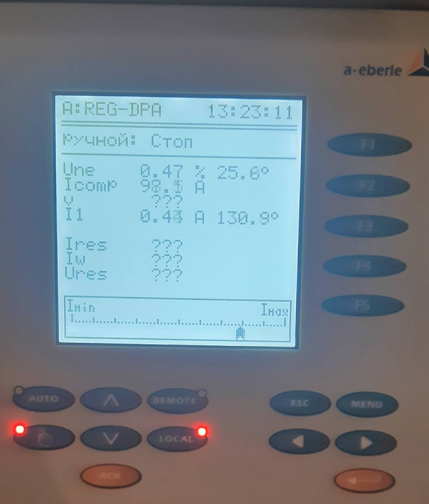
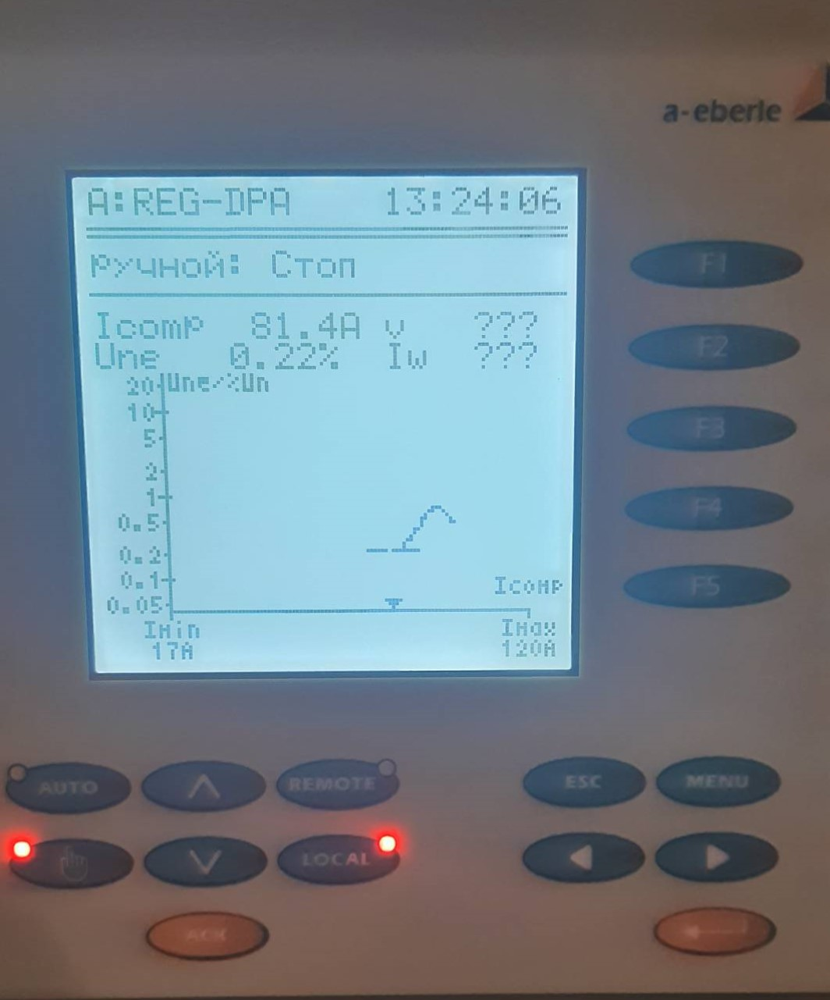

.. include:: ТехнологическаяЦДС.rst

ДГК 2с 10кВ
-----------

Оборудование ДГК состоит из катушки ДГК (распологаемой на ОРУ) и шкафа автоматики (распологаемым в ОПУ панель № 31).

Данные для настройки ДГК в резонанс мультиконтроллер получает с сигнальной обмотки ДГК U0.
Для отоброжения световой индикации замыкания на землю (ОРУ 110кВ РДГК) измерения 3U0 производится с ТН-2с 10кВ .

Автоматика ДГК 2с.10кВ выполнена на базе мультиконтроллера :ref:`REG-DP`.
 
**Описание интерфейса шкафа управления**

.. image:: media/image7.jpeg

* защитная дверь;
* индикаторы уровня масла;
* индикатор сигнализации режима ОЗЗ;
* амперметр для индикации тока компенсации ДГР;
* индикатор сигнализации "Авария привода" неисправности привода ДГР;
* индикаторы температуры масла;
* переключатель режимов ручной/автоматический;
* индикаторы сигнализации крайних положений плунжера ДГР;
* кнопки ручного управления привода ДГР.

Питание шкафа автоматики REG-DPA осуществляется через автоматический выключатель SF1 (ОПУ панель №31).
Питание привода ДГК осуществлякется  через автоматический выключатель SF1 (ОРУ шкаф ДГК2с10кВ).

Перевод в ручной или в автоматический режим осуществляется как ключем управления режимами SAC1 (Ручн/Авт) так и клавишами на лицевой стороне мультиконтроллера(hend/auto).

Управление с панели мультиконтроллера:

Нажав клавишу hend (переведя автоматику в ручной режим), управление реактором производится клавишами обозначенными стрелками (вверх/вниз)тем самым увеличивая ток ДГК или уменьшая его. 
Положение ключа SAC1 в этом случае необходимо перевести в автоматический.

Управление с лицевой стороны шкафа автоматики:

При переводе ключа SAC1 в ручной режим, осуществляется блокировка ручного управление с панели мультиконтроллера и управление реактором возможно только с лицевой стороны шкафа автоматики. 
Переведя ключ управления с автоматического режима в ручной, управление реактором осуществляется кнопками SB1 "Уменьшение тока" и SB2 "Увеличение тока".
При достижении крайнего верхнего положения загорается лампа "Максимальный ток", при достижении крайнего нижнего положения загорается лампа "Минимальный ток".

Для настройки ДГК в режим резонанса в ручном режиме управлиния настройка производится по показаниям Une(текущее значение напряжения U0) для этого необходимо прогнать ДГК во всем диапазоне регулирования и оставить на максимальном значении Une.

Сигнализация:

Блинкер KH1-отключен автоматический выключатель SF1.

Коммутационные аппараты (шкаф автоматики в ОПУ П.31):

Автоматический выключатель SF1- питаение шкафа автоматики;
Автоматический выключатель SF2- сервисные цепи.

Коммутационные аппараты (шкаф ДГК 2с10кВ ОРУ):

Автоматический выключатель SF1-питание привода ДГК;
Автоматический выключатель SF2-обогрев шкафа;
Автоматический выключатель SF3-обогрев привода;
Автоматический выключатель SF4-питание регулятора температуры;