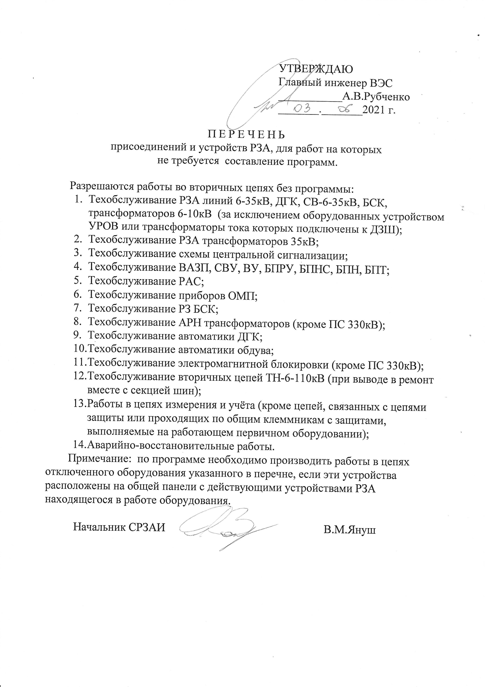
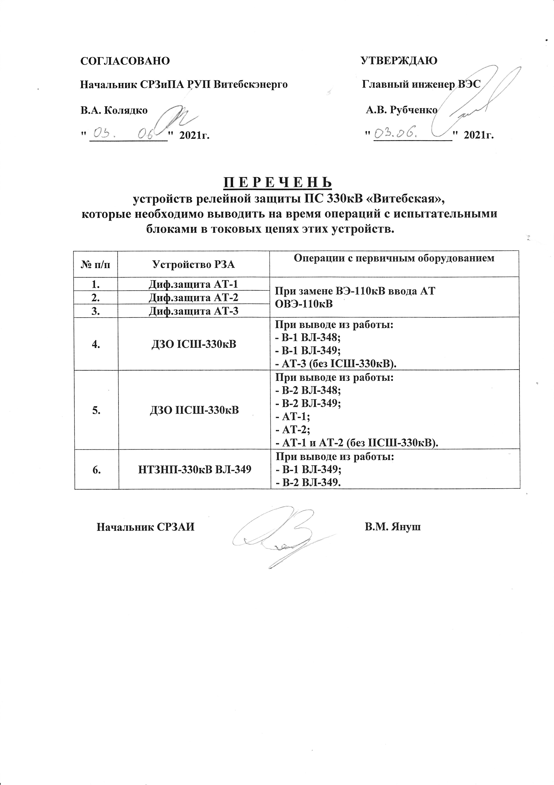
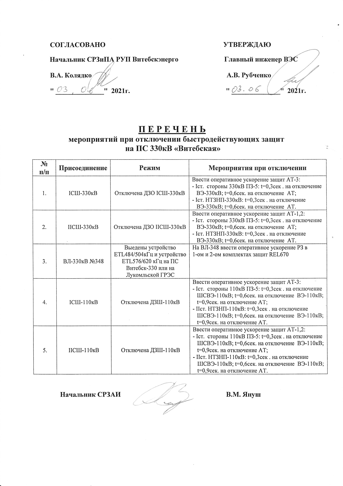
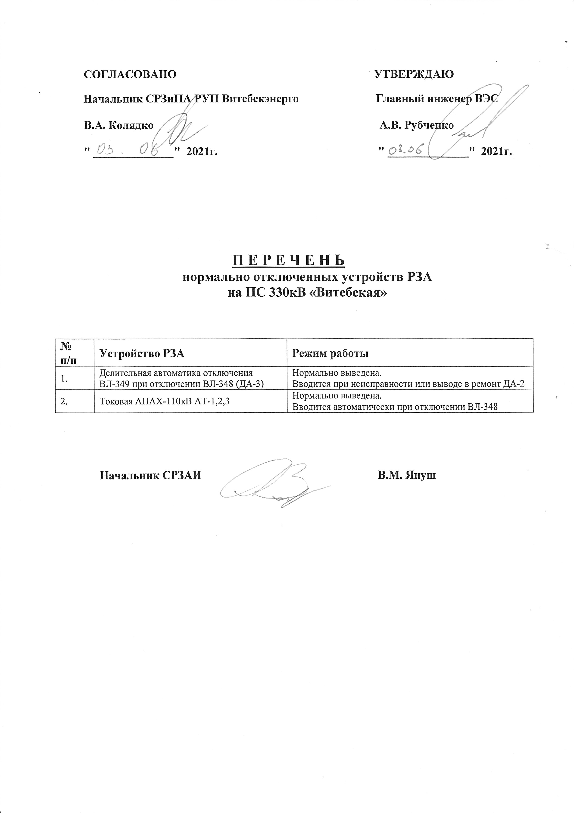
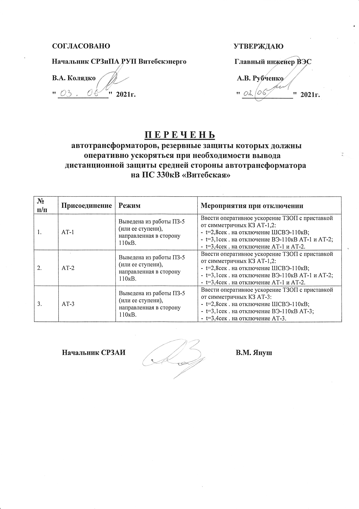

Перечень инструкций для рабочего места диспетчера ЦДС
~~~~~~~~~~~~~~~~~~~~~~~~~~~~~~~~~~~~~~~~~~~~~~~~~~~~~~~

.. csv-filter:: 
   :header-rows: 1
   :included_cols: 0, 1, 2, 3, 4
   :file: Инструкции.csv
   :delim: ;
   :include: {5: '1'}

Перечень инструкций для рабочего места диспетчера ОДС
~~~~~~~~~~~~~~~~~~~~~~~~~~~~~~~~~~~~~~~~~~~~~~~~~~~~~~

.. 0-Инструкция;1-РЗА;2-Объект;3-Дата ввода в действие;4-Дата пересмотра;5-ЦДС;6-ОДС;7-ПС 330;8-ВГЭС;9-ВГРЭС;10-ВСРЭС;11-БРЭС;12-ШРЭС;13-РРЭС;14-ЛРЭС;15-ГРЭС

.. csv-filter:: 
   :header-rows: 1
   :included_cols: 0, 1, 2, 3, 4
   :file: Инструкции.csv
   :delim: ;
   :include: {6: '1'}

Перечень инструкций для рабочего места диспетчера ПС 330-Витебская
~~~~~~~~~~~~~~~~~~~~~~~~~~~~~~~~~~~~~~~~~~~~~~~~~~~~~~~~~~~~~~~~~~

.. csv-filter:: 
   :header-rows: 1
   :included_cols: 0, 1, 2, 3, 4
   :file: Инструкции.csv
   :delim: ;
   :include: {7: '1'}

Перечень инструкций для рабочего места начальника смены ВГЭС
~~~~~~~~~~~~~~~~~~~~~~~~~~~~~~~~~~~~~~~~~~~~~~~~~~~~~~~~~~~~

.. csv-filter:: 
   :header-rows: 1
   :included_cols: 0, 1, 2, 3, 4
   :file: Инструкции.csv
   :delim: ;
   :include: {8: '1'}

Перечень инструкций для рабочего места диспетчера ВСРЭС
~~~~~~~~~~~~~~~~~~~~~~~~~~~~~~~~~~~~~~~~~~~~~~~~~~~~~~~

.. csv-filter:: 
   :header-rows: 1
   :included_cols: 0, 1, 2, 3, 4
   :file: Инструкции.csv
   :delim: ;
   :include: {10: '1'}

Перечень инструкций для рабочего места диспетчера ВГРЭС
~~~~~~~~~~~~~~~~~~~~~~~~~~~~~~~~~~~~~~~~~~~~~~~~~~~~~~~

.. csv-filter:: 
   :header-rows: 1
   :included_cols: 0, 1, 2, 3, 4
   :file: Инструкции.csv
   :delim: ;
   :include: {9: '1'}

Перечень инструкций для рабочего места диспетчера РРЭС
~~~~~~~~~~~~~~~~~~~~~~~~~~~~~~~~~~~~~~~~~~~~~~~~~~~~~~~

.. csv-filter:: 
   :header-rows: 1
   :included_cols: 0, 1, 2, 3, 4
   :file: Инструкции.csv
   :delim: ;
   :include: {13: '1'}

Перечень инструкций для рабочего места диспетчера БРЭС
~~~~~~~~~~~~~~~~~~~~~~~~~~~~~~~~~~~~~~~~~~~~~~~~~~~~~~~

.. csv-filter:: 
   :header-rows: 1
   :included_cols: 0, 1, 2, 3, 4
   :file: Инструкции.csv
   :delim: ;
   :include: {11: '1'}

Перечень инструкций для рабочего места диспетчера ШРЭС
~~~~~~~~~~~~~~~~~~~~~~~~~~~~~~~~~~~~~~~~~~~~~~~~~~~~~~~

.. csv-filter:: 
   :header-rows: 1
   :included_cols: 0, 1, 2, 3, 4
   :file: Инструкции.csv
   :delim: ;
   :include: {12: '1'}

Перечень инструкций для рабочего места диспетчера ЛРЭС
~~~~~~~~~~~~~~~~~~~~~~~~~~~~~~~~~~~~~~~~~~~~~~~~~~~~~~~

.. csv-filter:: 
   :header-rows: 1
   :included_cols: 0, 1, 2, 3, 4
   :file: Инструкции.csv
   :delim: ;
   :include: {14: '1'}

Перечень инструкций для рабочего места диспетчера ГРЭС
~~~~~~~~~~~~~~~~~~~~~~~~~~~~~~~~~~~~~~~~~~~~~~~~~~~~~~~

.. csv-filter:: 
   :header-rows: 1
   :included_cols: 0, 1, 2, 3, 4
   :file: Инструкции.csv
   :delim: ;
   :include: {15: '1'}

Перечень присоединений и устройств РЗА, для работ на которых не требуется  составление программ (документация инженера ОДС)
~~~~~~~~~~~~~~~~~~~~~~~~~~~~~~~~~~~~~~~~~~~~~~~~~~~~~~~~~~~~~~~~~~~~~~~~~~~~~~~~~~~~~~~~~~~~~~~~~~~~~~~~~~~~~~~~~~~~~~~~~~~~

.. согласно ТНПА не требуется выдавать оперативному персоналу но Ершов попросил для инженера ОДС

Перечень устройств релейной защиты ПС 330кВ «Витебская», которые необходимо выводить на время операций с испытательными блоками в токовых цепях этих устройств (документация ПС 330кВ "Витебска")
~~~~~~~~~~~~~~~~~~~~~~~~~~~~~~~~~~~~~~~~~~~~~~~~~~~~~~~~~~~~~~~~~~~~~~~~~~~~~~~~~~~~~~~~~~~~~~~~~~~~~~~~~~~~~~~~~~~~~~~~~~~~~~~~~~~~~~~~~~~~~~~~~~~~~~~~~~~~~~~~~~~~~~~~~~~~~~~~~~~~~~~~~~~~~~~~~

.. СТП 33243.353600-16 п.5.2.21 и 5.3.9

Перечень мероприятий при отключении быстродействующих защит на ПС 330кВ «Витебская» (документация ПС 330кВ "Витебска")
~~~~~~~~~~~~~~~~~~~~~~~~~~~~~~~~~~~~~~~~~~~~~~~~~~~~~~~~~~~~~~~~~~~~~~~~~~~~~~~~~~~~~~~~~~~~~~~~~~~~~~~~~~~~~~~~~~~~~~

.. СТП 33243.353600-16 п.5.3.11 и СТП 09110.35.520-07 п.12.8

Перечень нормально отключенных устройств РЗА на ПС 330кВ «Витебская» (документация ПС 330кВ "Витебска")
~~~~~~~~~~~~~~~~~~~~~~~~~~~~~~~~~~~~~~~~~~~~~~~~~~~~~~~~~~~~~~~~~~~~~~~~~~~~~~~~~~~~~~~~~~~~~~~~~~~~~~~

.. СТП 33243.353600-16 п.5.3.10

Перечень автотрансформаторов, резервные защиты которых должны оперативно ускоряться при необходимости вывода дистанционной защиты средней стороны автотрансформатора на ПС 330кВ «Витебская» (документация ПС 330кВ "Витебска")
~~~~~~~~~~~~~~~~~~~~~~~~~~~~~~~~~~~~~~~~~~~~~~~~~~~~~~~~~~~~~~~~~~~~~~~~~~~~~~~~~~~~~~~~~~~~~~~~~~~~~~~~~~~~~~~~~~~~~~~~~~~~~~~~~~~~~~~~~~~~~~~~~~~~~~~~~~~~~~~~~~~~~~~~~~~~~~~~~~~~~~~~~~~~~~~~~~~~~~~~~~~~~~~~~~~~~~~~~~~~~~~~~~~~~~~

Перечень нормально отключенных устройств РЗА на подстанциях 35-110кВ Витебских электросетей
~~~~~~~~~~~~~~~~~~~~~~~~~~~~~~~~~~~~~~~~~~~~~~~~~~~~~~~~~~~~~~~~~~~~~~~~~~~~~~~~~~~~~~~~~~~~~~~~~~~~

:download:`Перечень нормально отключенных устройств РЗА на подстанциях 35-110кВ Витебских электросетей <../_download/Перечень_норм_отключ_РЗА.PDF>`
